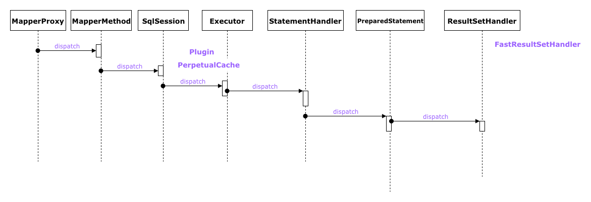

# mybatis

## index

- [ ] [mybatis-cache.md](mybatis-cache.md)
- [ ] [mybatis-configuration.md](mybatis-configuration.md)
- [x] [mybatis-executor.md](mybatis-executor.md)
- [x] [mybatis-interceptor.md](mybatis-interceptor.md)
- [x] [mybatis-mapper-proxy.md](mybatis-mapper-proxy.md)
- [x] [mybatis-mapper-scanner-configurer.md](mybatis-mapper-scanner-configurer.md)
- [ ] [mybatis-pooled-data-source.md](mybatis-pooled-data-source.md)
- [ ] [mybatis-spring.md](mybatis-spring.md)
- [x] [mybatis-sql-session.md](mybatis-sql-session.md)
- [x] [mybatis-sql-session-factory-bean.md](mybatis-sql-session-factory-bean.md)
- [x] [mybatis-sql-session-template.md](mybatis-sql-session-template.md)
- [ ] [mybatis-statement-handler.md](mybatis-statement-handler.md)
- [ ] [mybatis-xml-statement-builder.md](mybatis-xml-statement-builder.md)
- [x] [mybatis-mapper-method.md](mybatis-mapper-method.md)

## mybatis 代码执行图

## Link

- [http://www.mybatis.org/mybatis-3/getting-started.html](http://www.mybatis.org/mybatis-3/getting-started.html)
