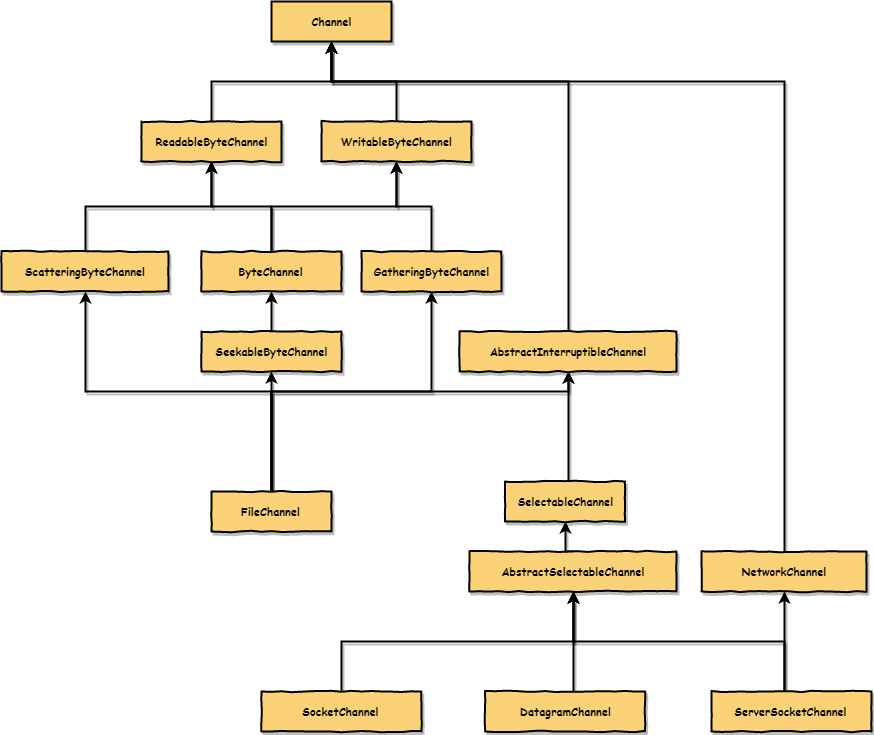
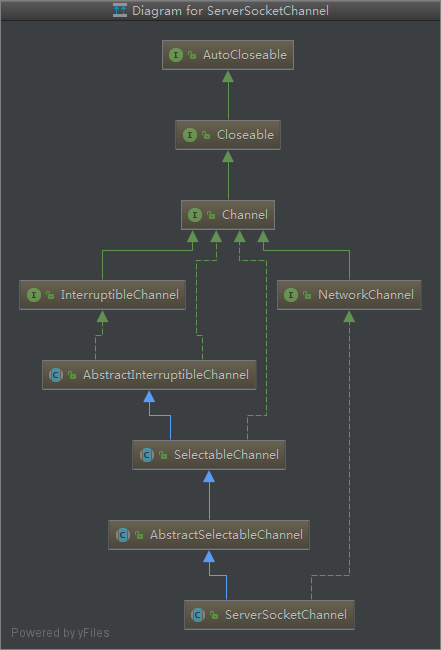
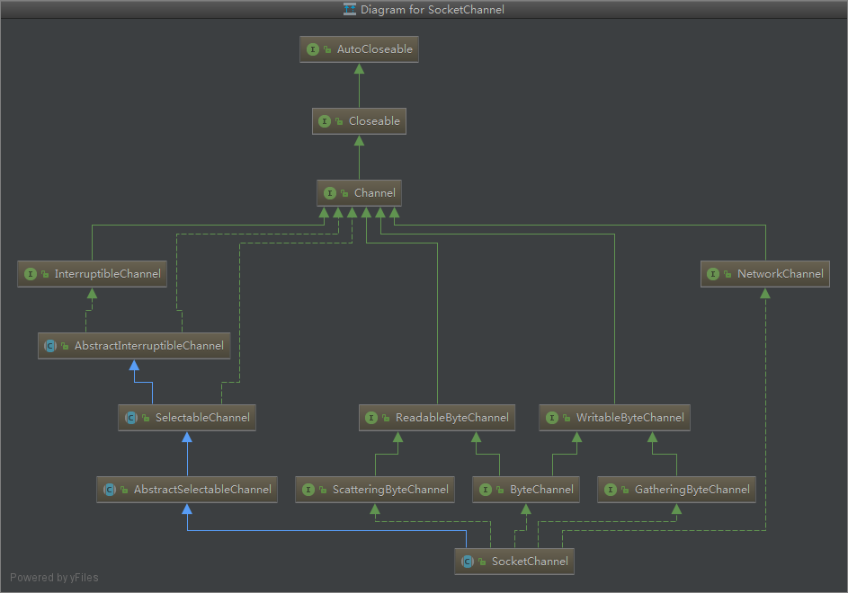

# Channel

继承关系



`java.nio.channels.Channel`

A channel represents an open connection to an entity such as a hardware
device, a file, a network socket, or a program component that is capable of
performing one or more distinct I/O operations, for example reading or writing.

## FileChannel

## ServerSocketChannel



### accept method

```java
public abstract SocketChannel accept() throws IOException;
```

The socket channel for the new connection,
or `null` if this channel is in non-blocking mode
and no connection is available to be accepted

## SocketChannel

