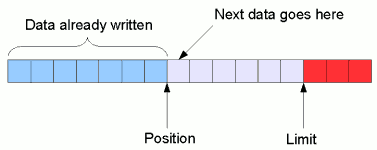

# nio

## books

- [nio book](https://github.com/web1992/books/tree/master/java-nio)

## The Layout of a NIO buffer

- [nio_buffer_layout](https://www.javamex.com/tutorials/io/nio_buffer_layout.shtml)



## NIO buffer types

`ByteBuffer`

## Reading from and writing to a ByteBuffer

- [Reading from and writing to a ByteBuffer](https://www.javamex.com/tutorials/io/bytebuffer_reading_writing.shtml)

## Reading and writing non-byte types in a ByteBuffer

- [Reading and writing non-byte types in a ByteBuffer](https://www.javamex.com/tutorials/io/bytebuffer_reading_writing_data_types.shtml)

## Reading and writing arrays to a NIO buffer

- [Reading and writing arrays to a NIO buffer](https://www.javamex.com/tutorials/io/nio_buffers_arrays.shtml)

## Reading and writing primitive arrays to a NIO buffer: wrapper buffers

- [Reading and writing primitive arrays to a NIO buffer: wrapper buffers](https://www.javamex.com/tutorials/io/nio_buffers_arrays_2.shtml)

## NIO Channels

- [NIO Channels](https://www.javamex.com/tutorials/io/nio_channels.shtml)

## flip rewind

```java
public final Buffer flip() {
        limit = position;
        position = 0;// diff
        mark = -1;
        return this;
    }
```

`rewind`比`flip`方法少了`position = 0;`,比如在buffer中填满了数据，就可以使用`rewind`
因为此时`limit = position`(`limit`已经等于`position`了)

```java
public final Buffer rewind() {
        position = 0;
        mark = -1;
        return this;
    }
```