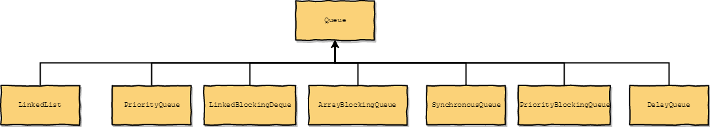
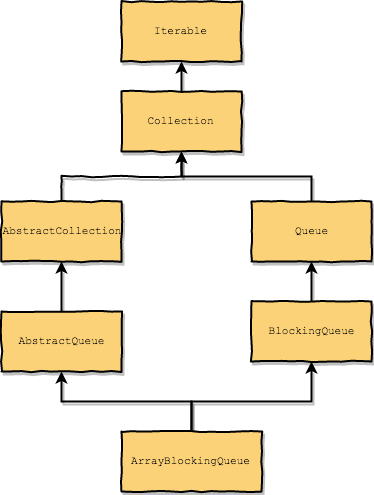
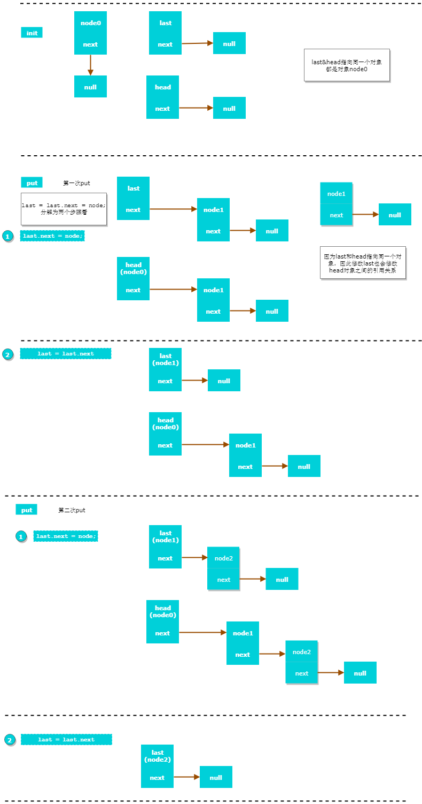

# Queue

## 参考文档

- [Queue (from oracle docs)](https://docs.oracle.com/javase/tutorial/collections/implementations/queue.html)

## queue的实现类



## BlockingQueue Method list

||Throws exception|Special value|Blocks|Times out
------|----------|-------------|------|----------
Insert|add(e)|offer(e)|put(e)|offer(e, time, unit)
Remove|remove()|poll()|take()|poll(time, unit)
Examine(检查)|element()|peek()|not applicable|not applicable

## ArrayBlockingQueue



- FIFO (first-in-first-out)先进先出
- 底层实现是数组
- 线程安全，只使用一个可重入锁来来控制线程访问
- 添加元素总是在队列末部
- 删除元素总是在队列头部
- 基于数组,大小在初始化时固定不变
- 如果queue满了，`put`方法继续添加元素的时候，就会阻塞
- 如果qu2ue是空的，`take`方法会阻塞一直到有数据插入

put 方法

```java
    public void put(E e) throws InterruptedException {
        checkNotNull(e);
        final ReentrantLock lock = this.lock;
        lock.lockInterruptibly();
        try {
            while (count == items.length)
                notFull.await();
            enqueue(e);
        } finally {
            lock.unlock();
        }
    }
```

take 方法

```java
    public E take() throws InterruptedException {
        final ReentrantLock lock = this.lock;
        lock.lockInterruptibly();
        try {
            while (count == 0)
                notEmpty.await();
            return dequeue();
        } finally {
            lock.unlock();
        }
    }
```

## LinkedBlockingQueue

- FIFO (first-in-first-out)
- 底层使用链表而非数组存储元素
- 添加元素总是在队列末部
- 删除元素总是在队列头部
- 使用两个锁来控制线程访问，这样队列可以同时进行put和take的操作，因此吞吐量相对ArrayBlockingQueue就高
- 可以不指定队列大小，此时默认大小为Integer.MAX_VALUE (无边际的队列，会导致内存泄漏)

初始化

```java
    public LinkedBlockingQueue(int capacity) {
        if (capacity <= 0) throw new IllegalArgumentException();
        this.capacity = capacity;
        // last head 都指向同一个node
        // 因此enqueue，dequeue操作的都是同一个对象new Node<E>
        // last,head可以理解为初始化时候new Node<E>的两个别名
        last = head = new Node<E>(null);
    }
```

插入元素

```java
    private void enqueue(Node<E> node) {
        // assert putLock.isHeldByCurrentThread();
        // assert last.next == null;
        //  last和last.next 都指向node
        last = last.next = node;
    }
```

取出元素

```java
    private E dequeue() {
        // assert takeLock.isHeldByCurrentThread();
        // assert head.item == null;
        // 从队列的头部取元素
        Node<E> h = head;
        Node<E> first = h.next;
        h.next = h; // help GC
        head = first;
        E x = first.item;
        first.item = null;
        return x;
    }
```

`LinkedBlockingQueue`插入的图解[源文件(可导入draw.io进行编辑)](./draw.io/linked-bloking-queue.xml)

下面的图分为3部分:

1. init
2. 第一次put
3. 第二次put



下面是demo,里面的方法参考`LinkedBlockingQueue`中实现

```java
   public static void main(String[] args) {

        Node<String> node = new Node<>(null);
        Node<String> last = null;
        Node<String> head = null;
        last = head = node;
        System.out.println("last = " + last);
        System.out.println("head = " + head);

        Node<String> node1 = new Node<>("1");

        last = last.next = node1;//入队第一次）
        System.out.println("last = " + last);
        System.out.println("head = " + head);


        Node<String> node2 = new Node<>("2");

        last = last.next = node2;//入队（第二次）
        System.out.println("last = " + last);
        System.out.println("head = " + head);


        {   // 模拟出队（第一次）
            Node<String> h = head;
            Node<String> first = h.next;
            h.next = h; // help GC
            head = first;
            String x = first.item;
            first.item = null;

            System.out.println("last = " + last);
            System.out.println("head = " + head);
        }

        {   // 模拟出队（第二次）
            Node<String> h = head;
            Node<String> first = h.next;
            h.next = h; // help GC
            head = first;
            String x = first.item;
            first.item = null;

            System.out.println("last = " + last);
            System.out.println("head = " + head);

        }
    }


    static class Node<E> {
        E item;
        Node next;

        public Node(E item) {
            this.item = item;
        }

        @Override
        public String toString() {
            return "Node{" + "item=" + item + ", next=" + next + '}';
        }
    }
```

执行结果

```log
last = Node{item=null, next=null}
head = Node{item=null, next=null}
last = Node{item=1, next=null}
head = Node{item=null, next=Node{item=1, next=null}}
last = Node{item=2, next=null}
head = Node{item=null, next=Node{item=1, next=Node{item=2, next=null}}}
last = Node{item=2, next=null}
head = Node{item=null, next=Node{item=2, next=null}}
last = Node{item=null, next=null}
head = Node{item=null, next=null}
```

## help GC

```java
h.next = h; // help GC 参考下面的文档
```

-[help GC(stackoverflow)](https://stackoverflow.com/questions/10106191/openjdks-linkedblockingqueue-implementation-node-class-and-gc)

总结：

`LinkedBlockingQueue`中使用`last`&`head`二个变量实现了链表,`last`用于插入新的节点,`head`用于维护链表&实现`FIFO`
`last`&`head`在初始化的是都是指向同一个对象，因此修改了`last`同时也会影响`head`的中的对象

## SynchronousQueue