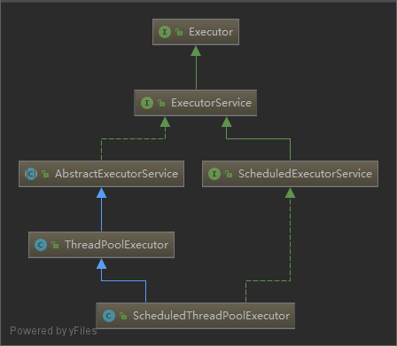
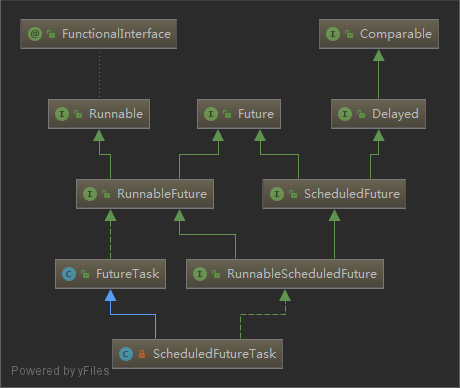
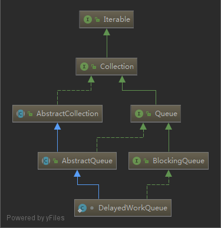

# ScheduledThreadPoolExecutor

- [ScheduledThreadPoolExecutor](#scheduledthreadpoolexecutor)
  - [java doc](#java-doc)
  - [scheduleAtFixedRate](#scheduleatfixedrate)
  - [scheduleWithFixedDelay](#schedulewithfixeddelay)
  - [ScheduledFutureTask](#scheduledfuturetask)
    - [变量](#%E5%8F%98%E9%87%8F)
    - [run](#run)
    - [getDelay](#getdelay)
  - [DelayedWorkQueue](#delayedworkqueue)
    - [offer](#offer)
    - [poll](#poll)
    - [take](#take)

1. `ScheduledThreadPoolExecutor` 支持周期性执行某一个任务
2. 包装 `Runnable` `Callable` 为 ScheduledFutureTask
3. 使用自定义的 `DelayedWorkQueue` 执行任务

`ScheduledThreadPoolExecutor` = `ThreadPoolExecutor`+`ScheduledExecutorService`



## java doc

 This class specializes `ThreadPoolExecutor` implementation by

 1. Using a custom task type, `ScheduledFutureTask` for
    tasks, even those that don't require scheduling (i.e.,
    those submitted using `ExecutorService` execute, not
    `ScheduledExecutorService` methods) which are treated as
    delayed tasks with a delay of zero.

 2. Using a custom queue (`DelayedWorkQueue`), a variant of
    unbounded DelayQueue. The lack of capacity constraint and
    the fact that corePoolSize and `maximumPoolSize` are
    effectively identical simplifies some execution mechanics
    (see `delayedExecute`) compared to ThreadPoolExecutor.

 3. Supporting optional run-after-shutdown parameters, which
    leads to overrides of shutdown methods to remove and cancel
    tasks that should NOT be run after shutdown, as well as
    different recheck logic when task (re)submission overlaps
    with a shutdown.

 4. Task decoration methods to allow interception and
    instrumentation, which are needed because subclasses cannot
    otherwise override submit methods to get this effect. These
    don't have any impact on pool control logic though.

## scheduleAtFixedRate

```java
public ScheduledFuture<?> scheduleAtFixedRate(Runnable command,
                                              long initialDelay,
                                              long period,
                                              TimeUnit unit) {
    if (command == null || unit == null)
        throw new NullPointerException();
    if (period <= 0)
        throw new IllegalArgumentException();
    ScheduledFutureTask<Void> sft =
        new ScheduledFutureTask<Void>(command,
                                      null,
                                      triggerTime(initialDelay, unit),
                                      unit.toNanos(period));// 不同点
    RunnableScheduledFuture<Void> t = decorateTask(command, sft);
    sft.outerTask = t;
    delayedExecute(t);
    return t;
}
```

`scheduleAtFixedRate` 与 `scheduleWithFixedDelay` 不同点在这个方法

```java
unit.toNanos(period));// scheduleAtFixedRate
unit.toNanos(-delay));// scheduleWithFixedDelay

// 这个值会被当做 ScheduledFutureTask 的成员变量 period
// 用来区分 scheduleAtFixedRate scheduleWithFixedDelay
// 用 setNextRunTime 计算下次执行的时间
```

## scheduleWithFixedDelay

```java
public ScheduledFuture<?> scheduleWithFixedDelay(Runnable command,
                                                 long initialDelay,
                                                 long delay,
                                                 TimeUnit unit) {
    if (command == null || unit == null)
        throw new NullPointerException();
    if (delay <= 0)
        throw new IllegalArgumentException();
    ScheduledFutureTask<Void> sft =
        new ScheduledFutureTask<Void>(command,
                                      null,
                                      triggerTime(initialDelay, unit),
                                      unit.toNanos(-delay));// 不同点
    RunnableScheduledFuture<Void> t = decorateTask(command, sft);
    sft.outerTask = t;
    delayedExecute(t);
    return t;
}
```

## ScheduledFutureTask



### 变量

```java
/** Sequence number to break ties FIFO */
private final long sequenceNumber;
/** The time the task is enabled to execute in nanoTime units */
private long time;// 任务执行的时间
/**
 * Period in nanoseconds for repeating tasks.  A positive
 * value indicates fixed-rate execution.  A negative value
 * indicates fixed-delay execution.  A value of 0 indicates a
 * non-repeating task.
 */
 // period > 0 fixed-rate
 // period < 0 fixed-delay
private final long period;
/** The actual task to be re-enqueued by reExecutePeriodic */
RunnableScheduledFuture<V> outerTask = this;
/**
 * Index into delay queue, to support faster cancellation.
 */
int heapIndex;
```

### run

```java
public void run() {
    boolean periodic = isPeriodic();
    if (!canRunInCurrentRunState(periodic))
        cancel(false);
    else if (!periodic)
        ScheduledFutureTask.super.run();// 不是周期性的任务，直接执行这个任务
    else if (ScheduledFutureTask.super.runAndReset()) {
        // 更新下次要执行时间
        setNextRunTime();
        // 把任务从新添加到 queue 队列中，从而可以周期性的执行这个任务
        reExecutePeriodic(outerTask);
    }
}

public boolean isPeriodic() {
    return period != 0;
}

// 如果 period > 0 认为是 scheduleAtFixedRate 类型的任务 tiem = tiem + period
// 而 period < 0 认为是 scheduleWithFixedDelay 类型的任务 tiem = now() + period
// 在这些方法执行已经执行了 isPeriodic 方法 因此 period !=0
private void setNextRunTime() {
    long p = period;
    if (p > 0)// scheduleAtFixedRate
        time += p;
    else
        time = triggerTime(-p);// scheduleWithFixedDelay
}

long triggerTime(long delay) {
    return now() +
        ((delay < (Long.MAX_VALUE >> 1)) ? delay : overflowFree(delay));
}

// 任务执行之后，被重新放进了队列中
void reExecutePeriodic(RunnableScheduledFuture<?> task) {
    if (canRunInCurrentRunState(true)) {
        super.getQueue().add(task);
        if (!canRunInCurrentRunState(true) && remove(task))
            task.cancel(false);
        else
            ensurePrestart();
    }
}
```

### getDelay

```java
// getDelay 获取还需要等待的时间
// getDelay 方法 在 DelayedWorkQueue#take 和 DelayedWorkQueue#poll 中调用
// 如果返回的值大于0，就会执行 available.awaitNanos(nanos); 阻塞 nanos 纳秒
public long getDelay(TimeUnit unit) {
    return unit.convert(time - now(), NANOSECONDS);
}
```

## DelayedWorkQueue



`DelayedWorkQueue` 是基于数组实现的一个队列,初始大小是 16

使用 `ReentrantLock` 控制并发,重写了 `offer`,`take`,`poll` 方法

### offer

```java
// offer 向 DelayedWorkQueue 维护的数组中添加一个任务
// 如果空间不足就扩容
public boolean offer(Runnable x) {
    if (x == null)
        throw new NullPointerException();
    RunnableScheduledFuture<?> e = (RunnableScheduledFuture<?>)x;
    final ReentrantLock lock = this.lock;
    lock.lock();
    try {
        int i = size;
        if (i >= queue.length)
            grow();// 扩容
        size = i + 1;
        if (i == 0) {
            queue[0] = e;
            setIndex(e, 0);
        } else {
            siftUp(i, e);
        }
        if (queue[0] == e) {
            leader = null;
            available.signal();
        }
    } finally {
        lock.unlock();
    }
    return true;
}
```

### poll

```java
public RunnableScheduledFuture<?> poll(long timeout, TimeUnit unit)
    throws InterruptedException {
    long nanos = unit.toNanos(timeout);
    final ReentrantLock lock = this.lock;
    lock.lockInterruptibly();
    try {
        for (;;) {
            RunnableScheduledFuture<?> first = queue[0];
            if (first == null) {// 数据中没有可执行的任务
                if (nanos <= 0)// 等待了nanos 时间后，依然没可执行的任务，返回空
                    return null;
                else// 等待 timeout 时间后，继续执行 for 循环，就会再次 检查 first 是否有数据，如果没有继续等待
                    nanos = available.awaitNanos(nanos);// 同时更新 nanos
            } else {
                // 走到这里，说明 queue 中肯定是有任务的
                // 检查 delay 是否需要执行了,如果需要执行了
                // 直接返回该任务(其实就是提交给线程池，进行任务执行)
                long delay = first.getDelay(NANOSECONDS);
                if (delay <= 0)
                    return finishPoll(first);
                if (nanos <= 0)// 看下面 nanos -= delay - timeLeft; 的处理
                    return null;
                first = null; // don't retain ref while waiting
                if (nanos < delay || leader != null)
                    nanos = available.awaitNanos(nanos);
                else {
                    Thread thisThread = Thread.currentThread();
                    leader = thisThread;
                    try {
                        long timeLeft = available.awaitNanos(delay);
                        nanos -= delay - timeLeft;
                    } finally {
                        if (leader == thisThread)
                            leader = null;
                    }
                }
            }
        }
    } finally {
        if (leader == null && queue[0] != null)
            available.signal();
        lock.unlock();
    }
}

```

### take

```java
public RunnableScheduledFuture<?> take() throws InterruptedException {
    final ReentrantLock lock = this.lock;
    lock.lockInterruptibly();
    try {
        for (;;) {
            RunnableScheduledFuture<?> first = queue[0];
            // 如果没有数据等待,如果其他线程执行了 offer 提交了任务
            // 会执行 available.signal(); 唤醒 take （也就是线程池的线程）
            if (first == null)
                available.await();
            else {
                // 计算延迟的时间 delay = time - now()
                long delay = first.getDelay(NANOSECONDS);
                if (delay <= 0)// 小于 0 说明时间到了,返回这个 Runnable
                    return finishPoll(first);// 这里保证了 queue 一定是有一个任务的
                first = null; // don't retain ref while waiting
                if (leader != null)
                    available.await();
                else {
                    Thread thisThread = Thread.currentThread();
                    leader = thisThread;
                    try {
                        // 等待 delay 纳秒时间，其实就是在 delay 纳秒之后返回 Runnable
                        // 然后提交给 queue 执行任务
                        // 这样就实现了 周期性任务 的执行
                        // awaitNanos 方法会使当前线程阻塞，等待唤醒（不会占用CPU）
                        available.awaitNanos(delay);
                    } finally {
                        if (leader == thisThread)
                            leader = null;
                    }
                }
            }
        }
    } finally {
        if (leader == null && queue[0] != null)
            available.signal();
        lock.unlock();
    }
}

// time 是任务要执行的时间点
// time - now() < 0 说明已经超过了当前时间
// 立即执行
public long getDelay(TimeUnit unit) {
    return unit.convert(time - now(), NANOSECONDS);
}

/**
* Performs common bookkeeping for poll and take: Replaces
* first element with last and sifts it down.  Call only when
* holding lock.
* @param f the task to remove and return
*/
// 这里是从数据中拿到下一个需要执行的任务
private RunnableScheduledFuture<?> finishPoll(RunnableScheduledFuture<?> f) {
    int s = --size;// 下一个
    RunnableScheduledFuture<?> x = queue[s];
    queue[s] = null;
    if (s != 0)
        siftDown(0, x);
    setIndex(f, -1);// 更新 heapIndex 方便后续排序使用
    return f;
}
```