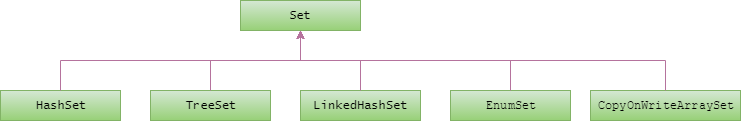

# set

- [set(from oracle docs)](https://docs.oracle.com/javase/tutorial/collections/implementations/set.html)

## TreeSet

- [TreeSet (form java doc)](https://docs.oracle.com/javase/8/docs/api/java/util/TreeSet.html)
