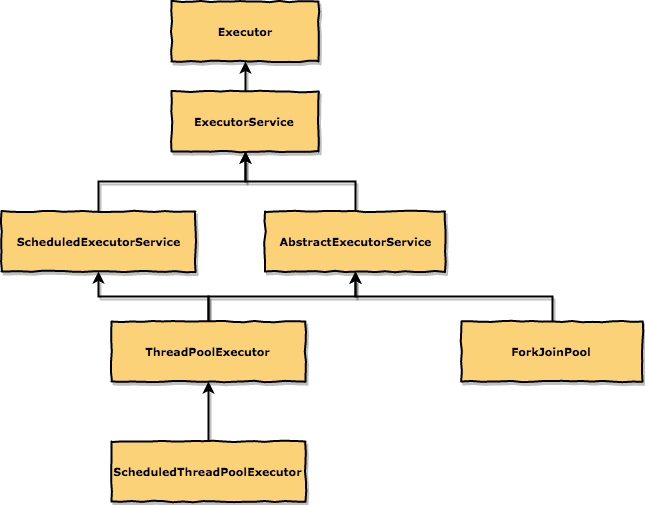

# ThreadPoolExecutor

- [draw.io file](./draw.io/ThreadPoolExecutor.xml)
- [from oracle](https://docs.oracle.com/javase/8/docs/api/java/util/concurrent/ThreadPoolExecutor.html)

## 类图



## 设计目的

- 执行异步任务(主要)
- 维护线程资源
- 统计信息

## Core and maximum pool sizes

线程池大小策略

- 当前线程数 < `corePoolSize` # 创建新的线程
- `corePoolSize`  < 当前线程数 < `maximumPoolSize` & queue.isFll # 创建新的线程
- `corePoolSize` = `maximumPoolSize` #线程固定大小

## On-demand construction

默认情况下，只有当任务提交到了，才会创建线程，当然可以改变这个规则。

## Creating new threads

thread 构造策略
使用`ThreadFactory`来指定线程的Group,名称，优先级等其他设置

## Keep-alive times

线程存活策略
如果一个线程在`Keep-alive times`内没有被使用，则被会被销毁

## Queuing

队列策略

## Rejected tasks

异常策略，当Queuing有边界时(如果queue是没有边界的则不会触发)，超过queue大小的任务，如何处理

demo

```java
public static void main(String[] args) throws InterruptedException {
        RejectedExecutionHandler reh = (Runnable r, ThreadPoolExecutor executor) -> {
            System.err.println("the task " + r.toString() + " is rejected ... poll status " + executor.toString());
        };
        // new LinkedBlockingDeque<>(2) // 有边界的queue
        ThreadPoolExecutor tpe = new ThreadPoolExecutor(5, 5, 1, TimeUnit.SECONDS, new LinkedBlockingDeque<>(2), reh);
        System.out.println(tpe.toString());
        IntStream.range(0, 10).forEach(
                index -> {
                    tpe.execute(() -> {
                        try {
                            TimeUnit.SECONDS.sleep(1L);
                        } catch (InterruptedException e) {
                            e.printStackTrace();
                        }
                        System.out.println("run = " + index);
                    });
                }
        );

        System.out.println("end");
        System.out.println(tpe);
        tpe.shutdown();
    }
```

## Hook methods

钩子方法，可以在任务执行之前（之后），之后做一些操作，如：统计信息

## Queue maintenance

Method `getQueue()` 为了调试设计,其他忽用

## Finalization

## Executors

`Executors`中一些常用方法的说明，如果理解这些方法的`作用`和`不同点`，可以避免使用中的坑
如`newFixedThreadPool`和`newSingleThreadExecutor`都使用`LinkedBlockingQueue`来存储多余的任务，如果线程处理的速度小于任务创建的速度，那么无法处理的任务都会放入`Queue`中,随着队列的无限增大会导致内存资源耗尽

下面`Executors`提供的几个方法，底层的Queue都是没有边界的，使用时候请注意内存泄露

`ThreadPoolExecutor`使用`BlockingQueue`来存储多余的任务，那为什么不使用`ArrayList`,`LinkedList`呢？

1. `ArrayList`,`LinkedList`不是线程安全，如过使用这些来存储任务，会增加API的设计难度，而`BlockingQueue`天生为多线程而生
2. 暂时没想到😂

- 创建固定大小的线程池

```java
public static ExecutorService newFixedThreadPool(int nThreads) {
        return new ThreadPoolExecutor(nThreads, nThreads,
                                      0L, TimeUnit.MILLISECONDS,
                                      new LinkedBlockingQueue<Runnable>());
}
```

- 创建一个只包含一个线程的线程池

```java
public static ExecutorService newSingleThreadExecutor() {
        return new FinalizableDelegatedExecutorService
            (new ThreadPoolExecutor(1, 1,
                                    0L, TimeUnit.MILLISECONDS,
                                    new LinkedBlockingQueue<Runnable>()));
}
```

- newCachedThreadPool

如果没有可以使用的线程，就创建新的，如果有则复用之前的线程
如果一个线程在60秒内没有被使用，则被从cache中删除

```java
public static ExecutorService newCachedThreadPool() {
        return new ThreadPoolExecutor(0, Integer.MAX_VALUE,
                                      60L, TimeUnit.SECONDS,
                                      new SynchronousQueue<Runnable>());
}
```

可以看到 上面的三个方法都使用`LinkedBlockingQueue`作用queue，那么为什么不使用`ArrayBlockingQueue`呢？

如果知道了`ArrayList`与`LinkedList` 的区别，那么就很容易知道，基于链表实现的集合，插入和删除元素的速度更快
而`LinkedList`只需要改变链接元素之间的指向，速度当然快,而`ThreadPoolExecutor`中的queue就是用了存储任务的，
必定存在频繁的`插入`和`删除`操作，因此使用`LinkedBlockingQueue`

## 参考

- [ArrayList vs LinkedList](https://github.com/web1992/read/blob/master/java/list.md)