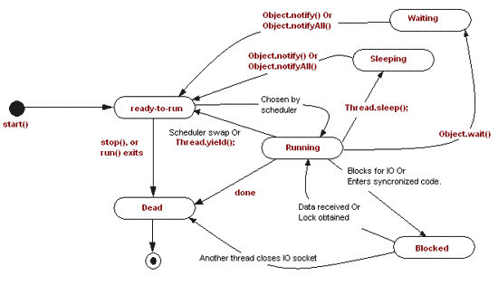

# Thread

- [Thread](#thread)
  - [ThreadFactory](#threadfactory)
  - [ThreadGroup](#threadgroup)
  - [start](#start)
  - [run](#run)
  - [interrupt](#interrupt)
  - [join](#join)
  - [yield](#yield)
  - [sleep](#sleep)
  - [InterruptedException](#interruptedexception)
  - [stop](#stop)
  - [线程的状态转化](#%E7%BA%BF%E7%A8%8B%E7%9A%84%E7%8A%B6%E6%80%81%E8%BD%AC%E5%8C%96)
  - [创建线程的方式](#%E5%88%9B%E5%BB%BA%E7%BA%BF%E7%A8%8B%E7%9A%84%E6%96%B9%E5%BC%8F)
  - [好文连接](#%E5%A5%BD%E6%96%87%E8%BF%9E%E6%8E%A5)

对于 `Thread` 的理解，需要明白 `Thread` 中的所有常用的方法的含义，使用场景

## ThreadFactory

可以方便的定义 thread name，daemon status，priority, thread Group

一个默认的实现`java.util.concurrent.Executors.DefaultThreadFactory`

## ThreadGroup

## start

```java
    Thread t = new Thread(() -> System.out.println(Thread.currentThread().getName()+" start ..."));
    t.start();// 启动这个新的线程
```

`start` 会调用一个`start0`方法，让 jvm 启用一个线程

Causes this thread to begin execution; the Java Virtual Machine
calls the `run` method of this thread.

## run

```java
    // 这个 run 方法其实是在我们调用 Thread#start 方法之后，由 JVM 使用新的线程调用的
    // JVM 保证在线程创建之后，会调用 Thread#run 方法
    // 如果我们自己在代码中直接调用 Thread#run 方法，run 方法也会执行，但不是在新的线程中执行的
    @Override
    public void run() {
        if (target != null) {
            target.run();
        }
    }
```

## interrupt

- [Interrupts](https://docs.oracle.com/javase/tutorial/essential/concurrency/interrupt.html)

我们知道启动一个线程是用`start()`方法，但是如何关闭（安全的）一个线程呢？

使用 `volatile` 标记 + `interrupt`

- volatile 变量,如果线程检查到的状态是关闭的，那么次变量不接受新的任务即可
- volatile 变量,保证可见性（一个线程修改变量的结果，对其他线程可见）
- interrupt 使阻塞（blocked）状态的线程，出现`InterruptedException`异常，终止线程

## join

> Waits for this thread to die.

- 一个线程等待另一个线程完成后，该线程继续执行
- join 实现的是 `wait()` + `notifyAll`(`notify`)

```java
    public static void main(String[] args) throws Exception {
        Runnable r = () -> {
            System.out.println("run ...");
            try {
                Thread.sleep(3 * 1000);
            } catch (InterruptedException e) {
                e.printStackTrace();
            }
            System.out.println("run end ...");
        };
        Thread thread1 = new Thread(r);

        Runnable r2 = () -> {

            try {
                System.out.println("run2 ...");
                //thread1.join();
                System.out.println("run2 end ...");
            } catch (Exception e) {
                e.printStackTrace();
            }
        };

        Thread thread2 = new Thread(r2);

        thread1.start();
        thread2.start();
    }
```

```log
        // t2 在t1之前结束
        // run ...
        // run2 ...
        // run2 end ...
        // run end ...

        // use thread1.join();
        // t2必在t1完成后结束(t2一直等待t1结束)
        // run ...
        // run2 ...
        // run end ...
        // run2 end ...
```

## yield

- [thread yield](https://www.javamex.com/tutorials/threads/yield.shtml)

线程让出 cpu（别用）

## sleep

```java
    // use TimeUnit
    TimeUnit.MILLISECONDS.sleep(200);
    // use Thread
    Thread.sleep(200);
```

## InterruptedException

`InterruptedException` 是如何产生的 demo

如果一个线程在`sleep`状态（wait,join,sleep），调用 interrupt 会出现`InterruptedException`异常

```java
    public static void main(String[] args) throws InterruptedException {

        Runnable r = () -> {
            try {
                System.out.println("[I am " + Thread.currentThread().getName() + "] thread");
                Thread.sleep(2 * 1000);
            } catch (InterruptedException e) {
                e.printStackTrace();
            }
        };

        Thread t = new Thread(r);
        t.start();
        // throw InterruptedException
        System.out.println("[I am " + Thread.currentThread().getName() + "] thread");
        t.interrupt();
    }
```

日志：

```txt
[I am main] thread
[I am Thread-0] thread
java.lang.InterruptedException: sleep interrupted
    at java.lang.Thread.sleep(Native Method)
    at java.lang.Thread.run(Thread.java:748)
```

## stop

如何正确的终止一个线程，也是一门艺术 😂

- [Thread stop](http://forward.com.au/javaProgramming/HowToStopAThread.html)
- [Thread stop](http://www.java67.com/2015/07/how-to-stop-thread-in-java-example.html)
- [threadPrimitiveDeprecation](https://docs.oracle.com/javase/1.5.0/docs/guide/misc/threadPrimitiveDeprecation.html)

## 线程的状态转化



线程的状态在多数情况下对我们来说是无感知的。但是再遇到线程问题，如死锁等，需要通过 `jstack` 命令生成线程快照
排查问题的时候，是十分有帮助的。

`jstack` 日志片段：

[ExecutorsDemo 代码](https://github.com/web1992/javas/blob/master/tools/src/main/java/cn/web1992/utils/demo/executor/ExecutorsDemo.java)

```log

"pool-1-thread-2" #12 prio=5 os_prio=0 tid=0x000000005b486000 nid=0x460 waiting on condition [0x000000005bd2f000]
   java.lang.Thread.State: WAITING (parking)
        at sun.misc.Unsafe.park(Native Method)
        - parking to wait for  <0x00000000d62af108> (a java.util.concurrent.locks.AbstractQueuedSynchronizer$ConditionObject)
        at java.util.concurrent.locks.LockSupport.park(LockSupport.java:175)
        at java.util.concurrent.locks.AbstractQueuedSynchronizer$ConditionObject.await(AbstractQueuedSynchronizer.java:2039)
        at java.util.concurrent.LinkedBlockingQueue.take(LinkedBlockingQueue.java:442)
        at java.util.concurrent.ThreadPoolExecutor.getTask(ThreadPoolExecutor.java:1074)
        at java.util.concurrent.ThreadPoolExecutor.runWorker(ThreadPoolExecutor.java:1134)
        at java.util.concurrent.ThreadPoolExecutor$Worker.run(ThreadPoolExecutor.java:624)
        at java.lang.Thread.run(Thread.java:748)

"pool-1-thread-1" #11 prio=5 os_prio=0 tid=0x000000005b49d000 nid=0x3624 waiting on condition [0x000000005b01e000]
   java.lang.Thread.State: WAITING (parking)
        at sun.misc.Unsafe.park(Native Method)
        - parking to wait for  <0x00000000d62af108> (a java.util.concurrent.locks.AbstractQueuedSynchronizer$ConditionObject)
        at java.util.concurrent.locks.LockSupport.park(LockSupport.java:175)
        at java.util.concurrent.locks.AbstractQueuedSynchronizer$ConditionObject.await(AbstractQueuedSynchronizer.java:2039)
        at java.util.concurrent.LinkedBlockingQueue.take(LinkedBlockingQueue.java:442)
        at java.util.concurrent.ThreadPoolExecutor.getTask(ThreadPoolExecutor.java:1074)
        at java.util.concurrent.ThreadPoolExecutor.runWorker(ThreadPoolExecutor.java:1134)
        at java.util.concurrent.ThreadPoolExecutor$Worker.run(ThreadPoolExecutor.java:624)
        at java.lang.Thread.run(Thread.java:748)

```

上面的 `ExecutorsDemo` 中，我们使用 `Executors.newFixedThreadPool(2)` 方法创建了二个线程，从上面的日志，我们可以快速的看到

代码由于 `LinkedBlockingQueue.take` 方法造成阻塞.

## 创建线程的方式

1. 实现 Runnable 接口
2. 继承 Thread 类，重写 run 方法

```java
public class ThreadTest {
    public static void main(String[] args) {

        new Thread(() -> System.out.println("run")).start();

        new ThreadRun().start();

    }

}

class ThreadRun extends Thread {
    @Override
    public void run() {
        System.out.println("ThreadRun");
    }
}
```

## 好文连接

- [Java 8 threads](http://winterbe.com/posts/2015/04/07/java8-concurrency-tutorial-thread-executor-examples/)
