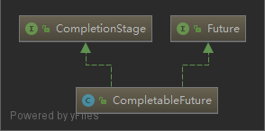

# CompletableFuture

- [CompletableFuture](#completablefuture)
  - [Summary](#summary)
  - [CompletionStage](#completionstage)
    - [completedFuture](#completedfuture)
    - [thenApply](#thenapply)
    - [thenApplyAsync](#thenapplyasync)
    - [thenAccept](#thenaccept)
    - [thenAcceptAsync](#thenacceptasync)
    - [applyToEither](#applytoeither)
    - [thenCombine](#thencombine)
    - [thenCompose](#thencompose)
    - [anyOf](#anyof)
    - [allOf](#allof)
    - [CompletableFuture-join](#completablefuture-join)
    - [CompletableFuture-getNow](#completablefuture-getnow)
  - [Link](#link)

## Summary

1. 异步的执行任务，同时提供了同步(`non-async`)和异步(`async`)的方法
2. 默认使用的是 `ForkJoinPool`,可以指定自定义的 `Executor`(默认是一个任务一个线程)

## CompletionStage

### completedFuture

### thenApply

### thenApplyAsync

### thenAccept

### thenAcceptAsync

### applyToEither

### thenCombine

### thenCompose

### anyOf

### allOf

### CompletableFuture-join

### CompletableFuture-getNow

## Link

- [https://www.ibm.com/developerworks/cn/java/j-cf-of-jdk8/index.html](https://www.ibm.com/developerworks/cn/java/j-cf-of-jdk8/index.html)
