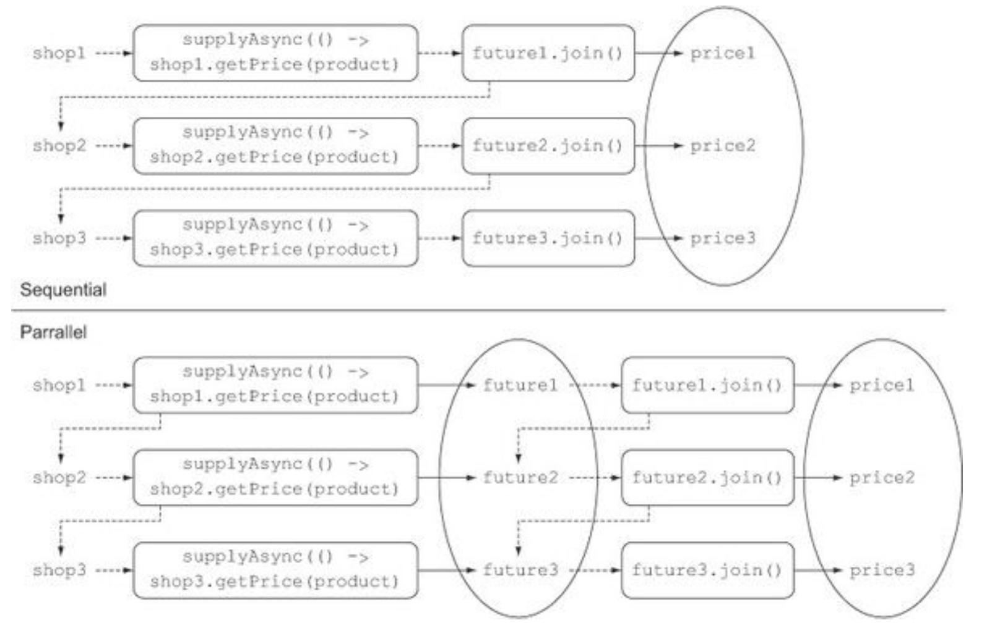

# CompletableFuture

- [CompletableFuture](#completablefuture)
  - [New Further](#new-further)
  - [UML](#uml)
  - [Summary](#summary)
  - [AsynchronousCompletionTask](#asynchronouscompletiontask)
  - [CompletionStage](#completionstage)
    - [Method List](#method-list)
  - [CompletableFuture Method](#completablefuture-method)
    - [CompletableFuture join](#completablefuture-join)
  - [Customer Thread Pool Size](#customer-thread-pool-size)
    - [CompletableFuture-getNow](#completablefuture-getnow)
    - [CompletableFuture- completedFuture](#completablefuture--completedfuture)
  - [Link](#link)

## New Further

> 对 `Further` 进行扩展

- Combining two asynchronous computations in one—both when they’re independent and when the second depends on the result of the first
- Waiting for the completion of all tasks performed by a set of Futures
- Waiting for the completion of only the quickest task in a set of Futures (possibly because they’re trying to calculate the same value in different ways) and retrieving its result
- Programmatically completing a Future (that is, by manually providing the result of the asynchronous operation)
- Reacting to a Future completion (that is, being notified when the completion happens and then having the ability to perform a further action using the result of the Future, instead of being blocked waiting for its result)

## UML


## Summary

1. 异步的执行任务，同时提供了同步(`non-async`)和异步(`async`)的方法
2. 默认使用的是 `ForkJoinPool`,可以指定自定义的 `Executor`(默认是一个任务一个线程)

## AsynchronousCompletionTask

> 所有的任务都会被 `AsynchronousCompletionTask` 包装，方便调试和追踪问题

## CompletionStage

### Method List

| Method          | Desc |
| --------------- | ---- |
| exceptionally   |      |
| thenApply       |      |
| thenApplyAsync  |      |
| thenAccept      |      |
| thenAcceptAsync |      |
| applyToEither   |      |
| thenCombine     |      |
| thenCompose     |      |
| anyOf           |      |
| allOf           |      |

## CompletableFuture Method

### CompletableFuture join

```java
public List<String> findPricesFuture(String product) {
    List<CompletableFuture<String>> priceFutures =
            shops.stream()
            .map(shop -> CompletableFuture.supplyAsync(() -> shop.getName() + " price is "
                    + shop.getPrice(product), executor))
            .collect(Collectors.toList());
    // List ComplateableFuature -> List
    List<String> prices = priceFutures.stream()
            .map(CompletableFuture::join)
            .collect(Collectors.toList());
    return prices;
}
```

> Why Stream's laziness causes a sequential computation and
how to avoid it



## Customer Thread Pool Size

```java
Nthreads = NCPU * UCPU * (1 + W/C)
```

- NCPU is the number of cores, available through Runtime.getRuntime().availableProcessors()
- UCPU is the target CPU utilization (between 0 and 1), and
- W/C is the ratio of wait time to compute time

### CompletableFuture-getNow

### CompletableFuture- completedFuture

## Link

- [https://www.ibm.com/developerworks/cn/java/j-cf-of-jdk8/index.html](https://www.ibm.com/developerworks/cn/java/j-cf-of-jdk8/index.html)
