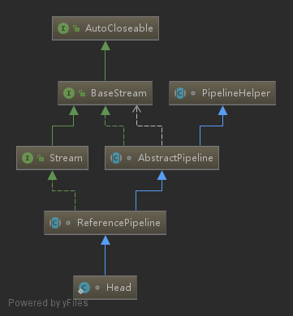

# stream

- [stream](#stream)
  - [Feature](#feature)
  - [uml](#uml)
  - [Method List](#method-list)
    - [filter](#filter)
    - [distinct](#distinct)
    - [limit](#limit)
    - [skip](#skip)
    - [map](#map)
    - [flatMap](#flatmap)
    - [sorted](#sorted)
    - [anyMatch](#anymatch)
    - [noneMatch](#nonematch)
    - [allMatch](#allmatch)
    - [findAny](#findany)
    - [findFirst](#findfirst)
    - [forEach](#foreach)
    - [collect](#collect)
    - [reduce](#reduce)
    - [count](#count)

## Feature

- 声明式 更简洁，更易读
- 可复合 更灵活
- 可并行 性能更好
- 只遍历一次

## uml

`ReferencePipeline.Head` 是 `Stream` 的默认实现



```java
// Collection
// stream 方法是在 Collection 中定义的
// 默认实现是 ReferencePipeline.Head
default Stream<E> stream() {
    return StreamSupport.stream(spliterator(), false);
}
// StreamSupport
public static <T> Stream<T> stream(Spliterator<T> spliterator, boolean parallel) {
    Objects.requireNonNull(spliterator);
    return new ReferencePipeline.Head<>(spliterator,
                                        StreamOpFlag.fromCharacteristics(spliterator),
                                        parallel);
}
```

## Method List

`Person` 类型定义

```java
static class Person{
    public Person(String name, Integer age) {
        this.name = name;
        this.age = age;
    }
    @Override
    public String toString() {
        return "Person{" + "name='" + name + '\'' + ", age=" + age + '}';
    }
    private String name;
    private Integer age;
    public Integer getAge() {
        return age;
    }
    public void setAge(Integer age) {
        this.age = age;
    }
    public String getName() {
        return name;
    }
    public void setName(String name) {
        this.name = name;
    }
}
```

### filter

```java
List<String> list= Arrays.asList("java","stream","filter");
List<String> afterList = list
                    .stream()
                    .filter(str -> str.length() > 4)
                    .collect(toList());
System.out.println(afterList);
// [stream, filter]
```

### distinct

```java
List<String> wordList = Arrays.asList("stream", "java", "java8", "stream", "lambda");
List<String> collect = wordList.stream().distinct().collect(Collectors.toList());
System.out.println(collect);
// [stream, java, java8, lambda]
```

### limit

```java
List<String> wordList = Arrays.asList("stream", "java", "java8", "stream", "lambda");
List<String> collect = wordList.stream().limit(3).collect(Collectors.toList());
System.out.println(collect);
// [stream, java, java8]
```

### skip

```java
List<String> wordList = Arrays.asList("stream", "java", "java8", "stream", "lambda");
List<String> collect = wordList.stream().skip(2).collect(Collectors.toList());
System.out.println(collect);
// [java8, stream, lambda]]
```

### map

```java
// 统计字符串的长度
List<String> wordList = Arrays.asList("stream", "java", "java8", "stream", "lambda");
List<Integer> collect = wordList.stream().map(String::length).collect(Collectors.toList());
System.out.println(collect);
// [6, 4, 5, 6, 6]
```

### flatMap

```java
<R> Stream<R> flatMap(Function<? super T, ? extends Stream<? extends R>> mapper);
```

### sorted

```java
// 自然顺序
List<String> wordList = Arrays.asList("6", "2", "3", "3", "5");
List<String> collect = wordList.stream().sorted().collect(Collectors.toList());
System.out.println(collect);
// [2, 3, 3, 5, 6]
// sorted use Comparator
List<Person> wordList = Arrays.asList(new Person("Bill Gates",63),new Person("Steve Jobs",56),new Person("web1992",25));
List<Person> collect = wordList.stream().sorted(Comparator.comparing(Person::getAge)).collect(Collectors.toList());
System.out.println(collect);
// [Person{name='web1992', age=25}, Person{name='Steve Jobs', age=56}, Person{name='Bill Gates', age=63}]
```

### anyMatch

```java
boolean anyMatch(Predicate<? super T> predicate);
```

> demo

```java
List<String> wordList = Arrays.asList("web1992", "java", "java8", "stream", "biu biu biu ...");
boolean result = wordList.stream().anyMatch(item -> item.contains("java"));
boolean result2 = wordList.stream().anyMatch(item -> item.contains("javascript"));
System.out.println(result);
System.out.println(result2);
// output:
// true
// false
```

### noneMatch

```java
 boolean noneMatch(Predicate<? super T> predicate);
```

> demo

```java
List<String> wordList = Arrays.asList("web1992", "java", "java8", "stream", "biu biu biu ...");
boolean result3 = wordList.stream().noneMatch(item -> item.contains("javascript"));
System.out.println(result3);
// output:
// true
```

### allMatch

```java
boolean allMatch(Predicate<? super T> predicate);
```

### findAny

```java
 Optional<T> findAny();
```

### findFirst

```java
Optional<T> findFirst();
```

### forEach

```java
void forEach(Consumer<? super T> action);
```

### collect

- [@see Collectors](collectors.md)

```java
<R, A> R collect(Collector<? super T, A, R> collector);
```

> demo

```java
List<String> wordList = Arrays.asList("web1992", "java", "java8", "stream", "biu biu biu ...");
List<Integer> lengthList = wordList.stream().map(String::length).collect(Collectors.toList());
System.out.println(lengthList);
// output
// [7, 4, 5, 6, 15]
```

### reduce

```java
T reduce(T identity, BinaryOperator<T> accumulator);
```

like this:

```java
T result = identity;
for (T element : this stream)
    result = accumulator.apply(result, element)
    return result;
```

`Optional<T> reduce(BinaryOperator<T> accumulator);`

like this:

```java
boolean foundAny = false;
T result = null;
for (T element : this stream) {
     if (!foundAny) {
         foundAny = true;
          result = element;
      }
      else{
       result = accumulator.apply(result, element);
      }
 }
return foundAny ? Optional.of(result) : Optional.empty();
```

### count

```java
List<String> wordList = Arrays.asList("web1992", "java", "java8", "stream", "biu biu biu ...");
long count = wordList.stream().count();
System.out.println(count);
// output:
// 5
```