# 第二章 启动

> 概要

- HotSpot内核模块
- 启动器Launcher和启动过程
- JVM初始化过程
- 全局模块初始化

> 关键字 

- OOP-Klass 二分模型
- ***oopDesc
- JVM_ENTRY JVM_END
- ALL_JAVA_THREADS
- inline 内联函数
- 内部锁 **_lock
- VM 选项
- 配置类
- 调优类
- 性能监控类
- 内部校验类
- 调试跟踪类
- -XX:PrintFlagsWithComments 
- JVMTI Java Virtual Machine Tool Interface
- Services JMX Java Management Extensions
- HPROF
- Runtime 模块
- VmThread 模块 VMOperationQueue
- vmOperations.hpp
- safepoint:阻塞，进入安全点，
- no_safepoint:阻塞，非进入安全点。
- concurrent:非阻塞，非进入安全点
- async_safepoint: 非阻塞，进入安全点。
- Launcher
- 选项(option)是传递给VM的参数
- 参数( argument)是传递给main方法的参数
- 标准的VM选项 -verbose:gc
- 非标准的VM选项 -X
- 隐藏的非标准的VM选项 -XX
- JNI_CreateJavaVM()
- Threads::create_vm
- JavaVM  JavaVM类型是一个结构体。它拥有一组少而精的函数指针
- JNIEnv 
- InvocationFunctions
- JavaCalls
- Threads::create_vm()
- JMX
- Management 模块
- RuntimeService
- ThreadService
- ClassLoadingService
- Code Cache

## Runtime 模块

## create_vm

- (5)可以说，create_vm()函数是JVM启动过程的精华部分，它初始化了JVM系统中绝大多数的模块。
- (6)调用add()函数，将线程加入线程队列。
- (7)调用create()函数，创建虚拟机线程“VMThread”;
- (8)调用vm_init_globals()函数， 初始化全局数据结构:
- (9)调用init_globals()函数， 初始化全局模块;
- (10)调用LoadClass()函数，加载应用程序主类;
- (11)调用jni_CallStaticVoidMethod()函数，实现对Java应用程序主方法的调用;
- (12)调用jni_DetachCurrentThread()函数;
- (13)调用jni_DestroyJavaVM()函数， 销毁JVM后退出。

## main 函数的流程

- (6)主方法执行完毕，等待非守护线程结束(非守护线程结束自己结束)。

## Links

- [JavaMain](https://github.com/openjdk/jdk18/blob/master/src/java.base/share/native/libjli/java.c#L389)