# ZGC

关键字：

- 读屏障、染色指针和内存多重映射
- 无暂停 GC 与 CMS、Scanvenge 等传统算法不同，它的停顿时间不会随着堆大小的增加而线性增加
- ZGC 与 G1 的区别在于：它可以做到并发转移（拷贝）对象。
- 并发转移关键技术
- 活跃对象不被漏标，三色标记算法
- read barrier
- 染色指针（colored pointer）
- Marked0 地址视图
- Marked1 地址视图
- Remapped 地址视图
- Finalizable 地址视图
- 地址视图
- 地址视图的巧妙之处就在于，一个在物理内存上存放的对象，被映射在了三个虚拟地址上。
- Mark 阶段负责标记活跃对象
- Relocate 阶段负责活跃对象转移
- ReMap 阶段负责地址视图统一

## 概述

从下面几个方面去理解ZGC回收。

- 内存布局
- 内存分配
- 内存回收
- 关键技术

## 内存布局

## 内存分配

TLAB

## 内存回收

核心过程 Mark、Relocate 和 Remap

## 关键技术

- 染色指针(colored pointer)
- read barrier

## Mark 阶段

Mark 阶段修改对象的标记：

在 GC 开始之前，地址视图是 Remapped。那么在 Mark 阶段需要做的事情是，将遍历到的对象地址视图变成 Marked0，也就是修改地址的第 42 位为 1。前面我们讲过，三个地址视图映射的物理内存是相同的，所以修改地址视图不会影响对象的访问。

视图变化：Remapped -> Marked0（Marked0 地址视图的是存活对象）

事实上，ZGC 也不是完全没有 STW 的。在进行初始标记时，它也需要进行短暂的 STW。不过在这个阶段，ZGC 只会扫描 root，之后的标记工作是并发的，所以整个初始标记阶段停顿时间很短。也正是因为这一点，ZGC 的最大停顿时间是可控的，也就是说停顿时间不会随着堆的增大而增加。

## Relocate 阶段

Relocate 阶段的主要任务是搬移对象，在经过 Mark 阶段之后，活跃对象的视图为 Marked0。搬移工作要做两件事情：
- 选择一块区域，将其中的活跃对象搬移到另一个区域；
- 将搬移的对象放到 forwarding table。

(没有做地址视图的修改，但是如果对象被访问了，会做地址修正。此外，对象搬移之后，这块地址就可以被回收了。)

新对象视图：Remapped
历史对象：Marked0 -> Remapped

在 Relocate 阶段，应用线程新创建的对象地址视图标记为 Remapped。如果应用线程访问到一个地址视图是 Marked0 的对象，说明这个对象还没有被转移，那么就需要将这个对象进行转移，转移之后再加入到 forwarding table，然后再对这个对象的引用直接指向新地址，完成自愈。这些动作都是发生在 read barrier 中的，是由应用线程完成的。当 GC 线程遍历到一个对象，如果对象地址视图是 Marked0，就将其转移，同时将地址视图置为 Remapped，并加入到 forwarding table ；如果访问到一个对象地址视图已经是 Remapped，就说明已经被转移了，也就不做处理了。

## Remap 阶段

Remap 阶段主要是对地址视图和对象之间的引用关系做修正。因为在 Relocate 阶段，GC 线程会将活跃对象快速搬移到新的区域，但是却不会同时修复对象之间的引用（请注意这一点，这是 ZGC 和以前我们遇到的所有基于 copy 的 GC 算法的最大不同）。这就导致还有大量的指针停留在 Marked0 视图。这样就会导致活跃视图不统一，需要再对对象的引用关系做一次全面的调整，这个过程也是要遍历所有对象的。不过，因为 Mark 阶段也需要遍历所有对象，所以，可以把当前 GC 周期的 Remap 阶段和下一个 GC 周期的 Mark 阶段复用。但是由于 Remap 阶段要处理上一轮的 Marked0 视图指针，又要同时标记下一轮的活跃对象，为了区分，可以再引入一个 Mark 标记，这就是 Marked1 标志。可以想象，Marked0 和 Marked1 视图在每一轮 GC 中是交替使用的。

从功能原理上看，无暂停 GC 与 CMS、Scanvenge 等传统算法不同，它的停顿时间不会随着堆大小的增加而线性增加。以 ZGC 为例，它的最大停顿时间不超过 10ms ，注意不是平均，也不是随机，而是最大不超过 10ms

很多垃圾回收算法中，在进行对象转移时都是需要 “世界停止”（Stop The World，STW）的，而对象转移往往是垃圾回收过程最耗时的一个环节，并且随着堆的增大，这个时间也会跟着增加。ZGC 则不同，在应用线程运行的同时，GC 线程也可以进行对象转移，这样就相当于把整个 GC 最耗时的环节放在应用线程后台默默执行，不需要一个长时间的 STW 来等待。这也正是 ZGC 停顿时间很小的主要原因。

## 并发转移关键技术 read barrier

请你试想一下，当应用线程去读一个对象时，GC 线程刚好正在搬移这个对象。如果 GC 线程没有搬移完成，那么应用线程可以去读这个对象的旧地址；如果这个对象已经搬移完成，那么可以去读这个对象的新地址。那么判断这个对象是否搬移完成的动作就可以由 read barrier 来完成。

## ZGC的内存布局

- 小型Region（Small Region）：容量固定为2MB，用于放置小于256KB的小对象。
- 中型Region（Medium Region）：容量固定为32MB，用于放置大于等于256KB但小于4MB的对象。
- 大型Region（Large Region）：容量不固定，可以动态变化，但必须为2MB的整数倍，用于放置4MB或以上的大对象

（复制一个大对象的代价非常高昂）

## 染色指针

通过这些标志位，虚拟机可以直接从指针中看到其引用对象的三色标记状态、是否进入了重分配集（即被移动过）、是否只能通过finalize()方法才能被访问到

染色指针可以使得一旦某个Region的存活对象被移走之后，这个Region立即就能够被释放和重用掉，而不必等待整个堆中所有指向该Region的引用都被修正后才能清理

## Links

- [ZGC 美团技术](https://tech.meituan.com/2020/08/06/new-zgc-practice-in-meituan.html)
