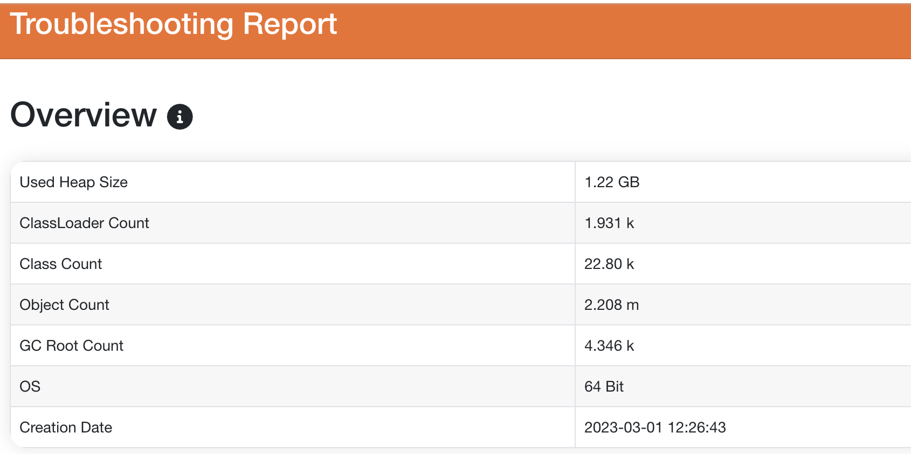
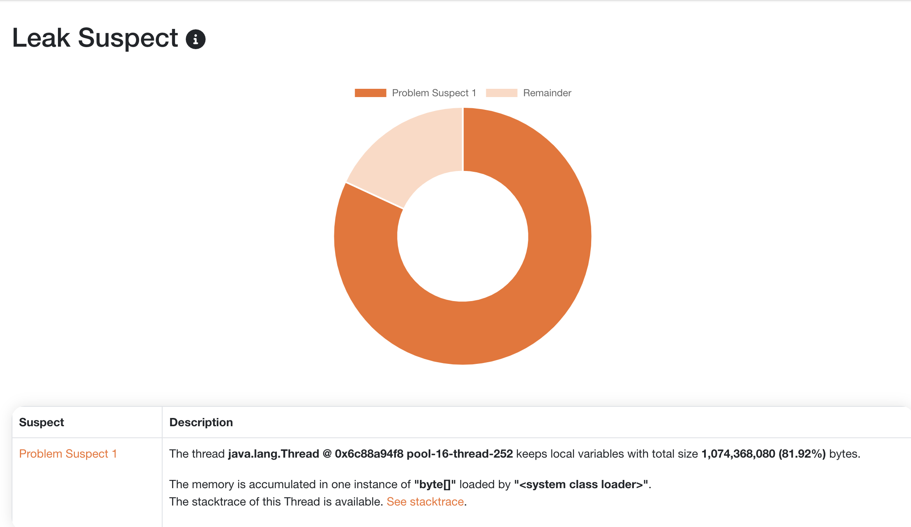
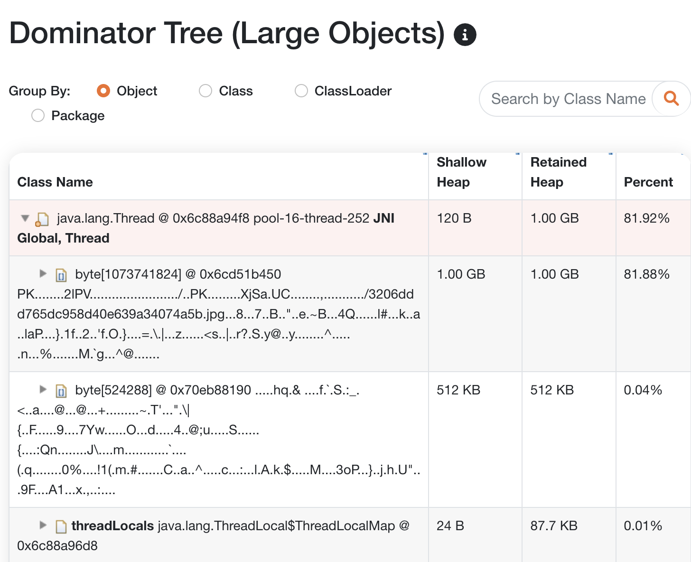
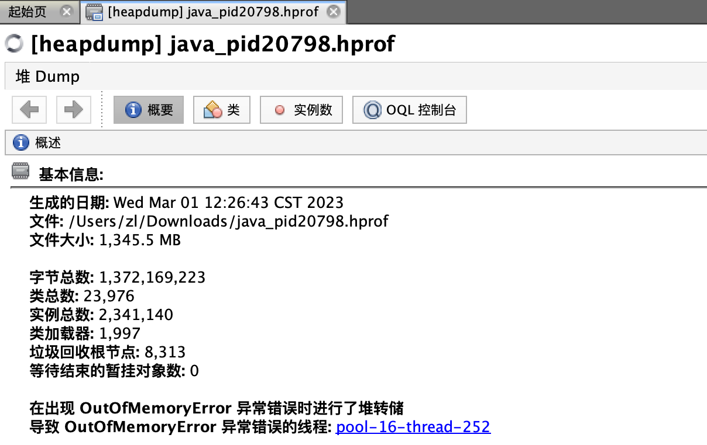
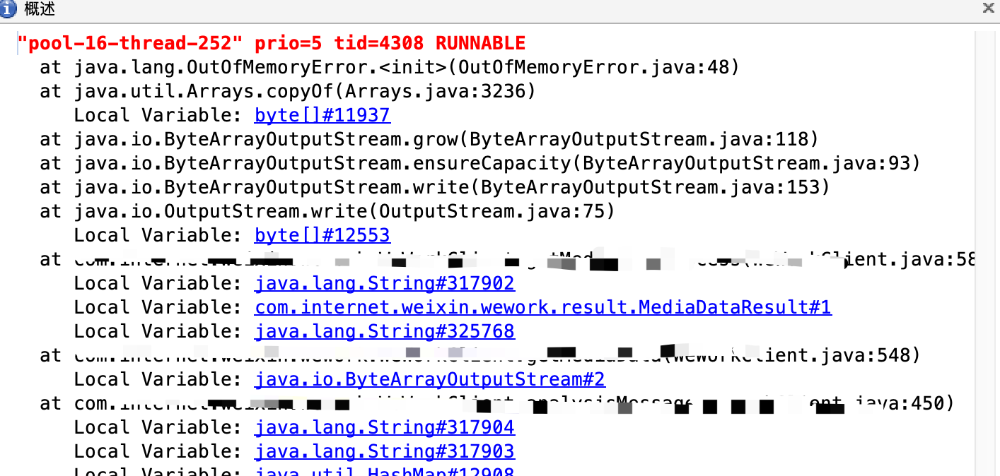

# JVM 内存

查询JVM 内存占用情况
```sh
jcmd pid GC.heap_info
jmap -heap pid

# jcmd pid help
```

## 案例

一次`大文件`读取导致的OOM

> JVM 需要配置下面的参数
```java
-XX:+HeapDumpOnOutOfMemoryError
-XX:HeapDumpPath=/data/dumplogs
```

配置参数，生成的dump文件`java_pid20798.hprof`

使用此网址进行分析 [https://heaphero.io/](https://heaphero.io/)

> 下面的内存分析报告：

> 概述



> 可能的内存泄漏（可以看到一个byte对象,占用了1GB的内存，后续排查业务是一个大文件的读取）



> 占用大内存对象




> 在 visualvm 中看到那个线程内存OOM了




点击 `pool-16-thread-252` 可以找到堆栈信息。



## 资料

- [java-memory-layout(字节对齐)](https://www.baeldung.com/java-memory-layout)
- [ObjectHeader.txt](https://gist.github.com/arturmkrtchyan/43d6135e8a15798cc46c)
- [深入理解堆外内存 Metaspace](https://www.javadoop.com/post/metaspace)