# 第 3 章　转移

- SATB 队列集合主要用来记录标记过程中对象之间引用关系的变化
- 而转移专用记忆集合则用来记录区域之间的引用关系
- G1GC 是通过卡表（card table）来实现转移专用记忆集合的

## 转移专用记忆集合

通过使用转移专用记忆集合，在转移时即使不扫描所有区域内的对象，也可以查到待转移对象所在区域内的对象被其他区域引用的情况，从而简化单个区域的转移处理

## 卡表

## 卡表和记忆集

每个区域都有一个转移专用记忆集合，它是通过散列表实现的。图中对象 b 引用了对象 a，因此对象 b 所对应的卡片索引就被记录在了区域 A 的转移专用记忆集合中。
