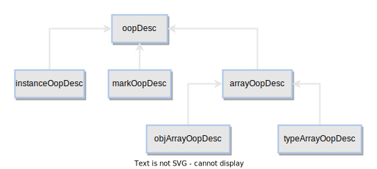
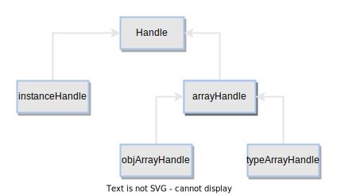

# 第2章 二分模型

- kclass
- markOop
- oopDesc oop
- markOopDesc 类
- Handle
- HandleMark

## kclass

Java类通过Klass来表示。简单来说Klass就是Java类在HotSpot中的C++对等体，主要用于描述Java对象的具体类型。一般而言，HotSpot VM在加载Class文件时会在元数据区创建Klass，表示类的元数据，通过Klass可以获取类的常量池、字段和方法等信息。

Metadata是元数据类的基类，除了Klass类会直接继承Metadata基类以外，表示方法的Method类与表示常量池的ConstantPool类也会直接继承Metadata基类。


Klass继承体系中涉及的C++类主要提供了两个功能：

- 提供C++层面的Java类型（包括Java类和Java数组）表示方式，也就是用C++类的对象来描述Java类型；
- 方法分派。

一个C++的Klass类实例表示一个Java类的元数据（相当于java.lang.Class对象），主要提供两个功能：

- 实现Java语言层面的类；
- 提供对多态方法的支持，即通过vtbl指针实现多态。

在HotSpot中，Java对象使用oop实例来表示，不提供任何虚函数的功能。oop实例保存了对应Klass的指针，通过Klass完成所有的方法调用并获取类型信息，Klass基于C++的虚函数提供对Java多态的支持。

```c++
class Klass : public Metadata {
  friend class VMStructs;
 protected:
  enum { _primary_super_limit = 8 };
  jint        _layout_helper;
  juint       _super_check_offset;
  Symbol*     _name;
  Klass*      _secondary_super_cache;
  Array<Klass*>* _secondary_supers;
  Klass*      _primary_supers[_primary_super_limit];
  oop       _java_mirror;
  Klass*      _super;
  Klass*      _subklass;
  Klass*      _next_sibling;
  Klass*      _next_link;
  ClassLoaderData* _class_loader_data;
  jint        _modifier_flags;  // Processed access flags, for use by Class.getModifiers.
  AccessFlags _access_flags;    // Access flags. The class/interface distinction is stored here.
  jlong    _last_biased_lock_bulk_revocation_time;
  markOop  _prototype_header;   // Used when biased locking is both enabled and disabled for this type
  jint     _biased_lock_revocation_count;
  JFR_ONLY(DEFINE_TRACE_ID_FIELD;)
  // Remembered sets support for the oops in the klasses.
  jbyte _modified_oops;             // Card Table Equivalent (YC/CMS support)
  jbyte _accumulated_modified_oops; // Mod Union Equivalent (CMS support)

private:
  jshort _shared_class_path_index;

  friend class SharedClassUtil;
protected:
  // ...
}
```
## oopDesc

```c++
class oopDesc {
  ...
private:
  volatile markOop _mark;
  union _metadata {
   Klass*      _klass;
   narrowKlass _compressed_klass;
  } _metadata;
  ...
}
```



Java对象的header信息可以存储在oopDesc类中定义的_mark和_metadata属性中，而Java对象的fields没有在oopDesc类中定义相应的属性来存储，因此只能申请一定的内存空间，然后按一定的布局规则进行存储。对象字段存放在紧跟着oopDesc实例本身占用的内存空间之后，在获取时只能通过偏移来取值。

## markOopDesc类

markOopDesc类的实例可以表示Java对象的头信息Mark Word，包含的信息有哈希码、GC分代年龄、偏向锁标记、线程持有的锁、偏向线程ID和偏向时间戳等

markOopDesc类的实例并不能表示一个具体的Java对象，而是通过一个字的各个位来表示Java对象的头信息。对于32位平台来说，一个字为32位，对于64位平台来说，一个字为64位。

## instanceOopDesc类

> oopDesc 内存布局



- 对象头 
 对象头分为两部分，一部分是Mark Word，另一部分是存储指向元数据区对象类型数据的指针_klass或_compressed_klass。它们两个在介绍oopDesc类时详细讲过，这里不再赘述。 

 - 对象字段数据 

 Java对象中的字段数据存储了Java源代码中定义的各种类型的字段内容，具体包括父类继承及子类定义的字段。 
 
 存储顺序受HotSpot VM布局策略命令-XX:FieldsAllocationStyle和字段在Java源代码中定义的顺序的影响，
 默认布局策略的顺序为long/double、int、short/char、boolean、oop（对象指针，32位系统占用4字节，64位系统占用8字节），相同宽度的字段总被分配到一起。 
 如果虚拟机的-XX:+CompactFields参数为true，则子类中较窄的变量可能插入空隙中，以节省使用的内存空间。
 例如，当布局long/double类型的字段时，由于对齐的原因，可能会在header和long/double字段之的空隙中。

- 对齐填充 

对齐填充不是必需的，只起到占位符的作用，没有其他含义。HotSpot VM要求对象所占的内存必须是8字节的整数倍，对象头刚好是8字节的整数倍，
因此填充是对实例数据没有对齐的情况而言的。对象所占的内存如果是以8字节对齐，那么对象在内存中进行线性分配时，对象头的地址就是以8字节对齐的，
这时候就为对象指针压缩提供了条件，可以将地址缩小8倍进行存储


## Handle

对oop直接引用时，如果oop的地址发生变化，那么所有的引用都要更新，图2-14中有3处引用都需要更新；当通过Handle对oop间接引用时，如果oop的地址发生变化，那么只需要更新Handle中保存的对oop的引用即可。

> Handle 类的继承关系



> 使用 Handle 引用对象


另外还需要知道，Handle被分配在本地线程的HandleArea中，这样在进行垃圾回收时只需要扫描每个线程的HandleArea即可找出所有Handle，进而找出所有引用的活跃对象。

## HandleArea类与Chunk类之间的关系


## HandleMark

每一个Java线程都有一个私有的句柄区_handle_area用来存储其运行过程中的句柄信息，这个句柄区会随着Java线程的栈帧而变化。
Java线程每调用一个Java方法就会创建一个对应的HandleMark保存创建的对象句柄，然后等调用返回后释放这些对象句柄，此时释放的仅是调用当前方法创建的句柄，
因此HandleMark只需要恢复到调用方法之前的状态即可。


## Link

- [klass.hpp](https://github.com/openjdk/jdk8u/blob/master/hotspot/src/share/vm/oops/klass.hpp)