# 第3章 类的加载

- 引导类加载器/启动类加载器（Bootstrap ClassLoader
- 扩展类加载器（Extension ClassLoader）
- 应用类加载器/系统类加载器（Application ClassLoader）
- ClassLoaderData 实例
- Launcher
- parseClassFile
- _java_system_loader
- 双亲委派
- loadClass + findClass + defineClass
- Thread.currentThread().setContextClassLoader

类加载器可以装载类，这些类被HotSpot VM装载后都以InstanceKlass实例表示（其实还可能是更具体的InstanceRefKlass、InstanceMirrorKlass和InstanceClassLoaderKlass实例）。主要的类加载器有引导类加载器/启动类加载器（Bootstrap ClassLoader）、扩展类加载器（Extension ClassLoader）、应用类加载器/系统类加载器（Application ClassLoader）。

引导类加载器由ClassLoader类实现，这个ClassLoader类是用C++语言编写的，负责将<JAVA_HOME>/lib目录、-Xbootclasspath选项指定的目录和系统属性`sun.boot.class.path`指定的目录下的核心类库加载到内存中。

## 引导类加载器

引导类加载器由ClassLoader类实现，这个ClassLoader类是用C++语言编写的，负责将<JAVA_HOME>/lib目录、-Xbootclasspath选项指定的目录和系统属性`sun.boot.class.path`指定的目录下的核心类库加载到内存中。

## 扩展类加载器

扩展类加载器由`sun.misc.Launcher$ExtClassLoader`类实现，负责将<JAVA_HOME >/lib/ext目录或者由系统变量`-Djava.ext.dir`指定的目录中的类库加载到内存中。

## 应用类加载器/系统类加载器

应用类加载器由sun.misc.Launcher$AppClassLoader类实现，负责将系统环境变量-classpath、-cp和系统属性`java.class.path`指定的路径下的类库加载到内存中。

在Launcher类的构造方法中实例化应用类加载器AppClassLoader时，会调用getAppClassLoader()方法获取应用类加载器，传入的参数是一个扩展类加载器ExtClassLoader对象，这样应用类加载器的父加载器就变成了扩展类加载器（与父加载器并非继承关系）。用户自定义的无参类加载器的父类加载器默认是AppClassLoader类加载器

## ClassLoaderData

每个类加载器都对应一个ClassLoaderData实例，通过ClassLoaderData::the_null_class_loader_data()函数获取引导类加载器对应的ClassLoaderData实例

## parseClassFile

parseClassFile()函数首先解析Class文件中的类、字段和常量池等信息，然后将其转换为C++内部的对等表示形式，如将类元信息存储在InstanceKlass实例中，将常量池信息存储在ConstantPool实例中。parseClassFile()函数解析Class文件的过程会在第4章中介绍。最后调用add_package()函数保存已经解析完成的类，避免重复加载解析。

## Launcher类

在Launcher类的构造方法中创建ExtClassLoader与AppClassLoader对象，而loader变量被初始化为AppClassLoader对象，最终在initSystemClassLoader()函数中调用getClassLoader()方法返回的就是这个对象。HotSpot VM可以通过`_java_system_loader`属性获取AppClassLoader对象，通过AppClassLoader对象中的parent属性获取`ExtClassLoader`对象。

## ClassLoader

```java
protected Class<?> loadClass(String name, boolean resolve)
        throws ClassNotFoundException
    {
        synchronized (getClassLoadingLock(name)) {
            // First, check if the class has already been loaded
            Class<?> c = findLoadedClass(name);
            if (c == null) {
                long t0 = System.nanoTime();
                try {
                    if (parent != null) {
                        c = parent.loadClass(name, false);
                    } else {// 只有引导（Bootstrap）类加载器parent才会为空，才会走到这里
                        c = findBootstrapClassOrNull(name);
                    }
                } catch (ClassNotFoundException e) {
                    // ClassNotFoundException thrown if class not found
                    // from the non-null parent class loader
                }

                if (c == null) {
                    // If still not found, then invoke findClass in order
                    // to find the class.
                    long t1 = System.nanoTime();
                    c = findClass(name);
                    // ...
                }
            }
            if (resolve) {
                resolveClass(c);
            }
            return c;
        }
    }
```

## 类的双亲委派机制

各个类加载器之间并不是继承关系，而是表示`工作过程`，具体说就是，对于一个加载类的具体请求，首先要委派给自己的父类加载器去加载，只有父类加载器无法完成加载请求时子类加载器才会尝试加载，这就叫`双亲委派`

当父类无法完成加载请求也就是c为null时，当前类加载器会调用findClass()方法尝试自己完成类加载的请求。

loadClass + findClass 的源码+调用时机。

## loadClass

> java.lang.ClassLoader#loadClass(java.lang.String, boolean)

Loads the class with the specified binary name. The default implementation of this method searches for classes in the following order:
- Invoke findLoadedClass(String) to check if the class has already been loaded.
- Invoke the loadClass method on the parent class loader. If the parent is null the class loader built-in to thevirtual machine is used, instead.
- Invoke the findClass(String) method to find the class.

## findClass

Finds the class with the specified binary name. This method should be overridden by class loader implementations that follow the delegation model for loading classes, and will be invoked by the loadClass method after checking the parent class loader for the requested class. The default implementation throws a `ClassNotFoundException`.

## defineClass

## 构造类加载器实例

HotSpot VM在启动的过程中会在<JAVA_HOME>/lib/rt.jar包里的sun.misc.Launcher类中完成扩展类加载器和应用类加载器的实例化，并会调用C++语言编写的ClassLoader类的initialize()函数完成应用类加载器的初始化。

```c++
//源代码位置：openjdk/hotspot/src/share/vm/classfile/systemDictionary.cpp
oop  SystemDictionary::_java_system_loader  =  NULL;
```

> 调用链路：

```
JavaMain()                                  java.c
InitializeJVM()                             java.c
JNI_CreateJavaVM()                          jni.cpp
Threads::create_vm()                        thread.cpp
SystemDictionary::compute_java_system_loader()  systemDictionary.cpp
```

```c++
//源代码位置：openjdk/hotspot/src/share/vm/classfile/systemDictionary.cpp
void SystemDictionary::compute_java_system_loader(TRAPS) {
  KlassHandle  system_klass(THREAD, WK_KLASS(ClassLoader_klass));
  JavaValue    result(T_OBJECT);

  // 调用java.lang.ClassLoader类的getSystemClassLoader()方法
  JavaCalls::call_static(
   &result,             // 调用Java静态方法的返回值，并将其存储在result中
    // 调用的目标类为java.lang.ClassLoader
    KlassHandle(THREAD, WK_KLASS(ClassLoader_klass)),
    // 调用目标类中的目标方法为getSystemClassLoader()

    vmSymbols::getSystemClassLoader_name(),
        vmSymbols::void_classloader_signature(),      // 调用目标方法的方法签名
        CHECK
    );

    // 获取调用getSystemClassLoader()方法的返回值并将其保存到_java_system_loader
    // 属性中
    // 初始化属性为应用类加载器/AppClassLoader
    _java_system_loader = (oop)result.get_jobject();
}
```

```
getSystemClassLoader
    -> initSystemClassLoader
    -> Launcher.getLauncher()
    -> Launcher()
```

```java
// 源代码位置：openjdk/jdk/src/share/classes/sun/misc/Launcher.java
private ClassLoader loader;

public Launcher() {
       // 首先创建扩展类加载器
       ClassLoader extcl;
       try {
          extcl = ExtClassLoader.getExtClassLoader();
       } catch (IOException e) {
          throw new InternalError("Could not create extension class loader", e);
       }

       // 以ExtClassloader为父加载器创建AppClassLoader
       try {
          loader = AppClassLoader.getAppClassLoader(extcl);
       } catch (IOException e) {
          throw new InternalError("Could not create application class loader", e);
       }

       // 设置默认线程上下文加载器为AppClassloader
       Thread.currentThread().setContextClassLoader(loader);
}

public ClassLoader getClassLoader() {
       return loader;
}

```

在Launcher类的构造方法中创建ExtClassLoader与AppClassLoader对象，而loader变量被初始化为AppClassLoader对象，最终在initSystemClassLoader()函数中调用getClassLoader()方法返回的就是这个对象。HotSpot VM可以通过_java_system_loader属性获取AppClassLoader对象，通过AppClassLoader对象中的parent属性获取ExtClassLoader对象。



需要注意的是，图中的各个类加载器之间并不是继承关系，而是表示工作过程，具体说就是，对于一个加载类的具体请求，首先要委派给自己的父类加载器去加载，只有父类加载器无法完成加载请求时子类加载器才会尝试加载，这就叫“双亲委派”。具体的委派逻辑在java.lang.ClassLoader类的loadClass()方法中实现

先调用findLoadedClass()方法查找此类是否已经被加载了，如果没有，则优先调用父类加载器去加载。除了用C++语言实现的引导类加载器需要通过调用findBootstrapClassOrNull()方法加载以外，其他用Java语言实现的类加载器都有parent字段（定义在java.lang.ClassLoader类中的字段），可直接调用parent的loadClass()方法委派加载请求。除了引导类加载器之外，其他加载器都继承了java.lang.ClassLoader基类。


当父类无法完成加载请求也就是c为null时，当前类加载器会调用findClass()方法尝试自己完成类加载的请求。

```java
import java.net.URL;
import java.net.URLClassLoader;

public class UserClassLoader extends URLClassLoader {

   public UserClassLoader(URL[] urls) {
       super(urls);
   }

   @Override
   protected Class<?> loadClass(String name, boolean resolve) throws ClassNotFoundException {
       return super.loadClass(name, resolve);
   }
}
```

UserClassLoader类继承了URLClassLoader类并覆写了loadClass()方法，调用super.loadClass()方法其实就是在调用java.lang.ClassLoader类中实现的loadClass()方法。

在UserClassLoader类的构造函数中，调用super()方法会设置当前类加载器的parent字段值为AppClassLoader对象，因此也会严格遵守双亲委派逻辑。


- findBootstrapClassOrNull()方法用于请求引导类加载器完成类的加载请求，该方法会调用本地函数findBootstrapClass()


```c++
源代码位置：openjdk/hotspot/src/share/vm/classfile/systemDictionary.cpp

// “双亲委派”机制体现，只要涉及类的加载，都会调用这个函数
instanceKlassHandle SystemDictionary::load_instance_class(
Symbol* class_name,
Handle class_loader, TRAPS
) {
  instanceKlassHandle nh = instanceKlassHandle();      // 空的Handle
  if (class_loader.is_null()) {         // 使用引导类加载器加载类

   // 在共享系统字典中搜索预加载到共享空间中的类，默认不使用共享空间，因此查找的结果
   // 为NULL
   instanceKlassHandle k;
   {
     k = load_shared_class(class_name, class_loader, THREAD);
   }

   if (k.is_null()) {
     // 使用引导类加载器进行类加载
     k = ClassLoader::load_classfile(class_name, CHECK_(nh));
   }
   // 调用SystemDictionary::find_or_define_instance_class->SystemDictionary::
   // update_dictionary -> Dictionary::add_klass()将生成的Klass实例保存起来
   // Dictionary的底层是Hash表数据结构，使用开链法解决Hash冲突
   if (!k.is_null()) {
     // 支持并行加载，也就是允许同一个类加载器同时加载多个类
     k = find_or_define_instance_class(class_name, class_loader, k, CHECK_(nh));
   }
   return k;
  }
  // 使用指定的类加载器加载，最终会调用java.lang.ClassLoader类中的loadClass()
  // 方法执行类加载
else {

   JavaThread* jt = (JavaThread*) THREAD;

   Handle s = java_lang_String::create_from_symbol(class_name, CHECK_(nh));
}
```


## 触发类的装载

首先来介绍一下类加载的时机。下面5种情况下会导致类初始化，因此必须在发生这5种情况之前对类进行加载。

当虚拟机启动时加载主类，3.3节已经详细介绍过主类的加载过程。
- 使用java.lang.reflect包的方法对类进行反射调用时，如果类还没有初始化，则需要进行初始化。
- new一个类的对象，调用类的静态成员（除了由final修饰的常量外）和静态方法，无论是解析执行还是编译执行的情况下，都会在处理new、getstatic、putstatic或invokestatic字节码指令时对类进行初始化。使用new字节码指令创建对象的过程，其中就会有触发类装载的逻辑判断。
- 当初始化一个类时，如果其父类没有被初始化，则先初始化其父类。后续在介绍函数InstanceKlass::initialize_impl()时会看到这个判断逻辑。
- 在使用JDK 7的动态语言支持时，如果一个java.lang.invoke.MethodHandle对象最后的解析结果是 REF_getStatic、REF_putStatic和REF_invokeStatic的方法句柄，并且这个方法句柄所对应的类没有进行初始化，则需要先进行初始化。