# 第10章 垃圾回收

- 转发指针
- Serial收集器
- 卡表
- GenRemSet 记忆集

OpenJDK 8版本中的垃圾收集器都采用了分代垃圾回收机制，根据对象存活周期的不同将内存划分为几个内存代并采用不用的垃圾收集算法进行回收。

一般把Java堆分为新生代和老年代，这样就可以根据各个分代的特点采用最适当的收集算法。在新生代中，如果每次垃圾收集时发现有大批对象死去，只有少量存活，那就选用复制算法，只需要付出少量存活对象的复制成本就可以完成垃圾收集。老年代中因为对象存活率高，没有额外的空间对它分配担保，必须使用“标记-清除”和“标记-整理”算法进行回收。

本节只介绍Serial和Serial Old垃圾收集器。Serial垃圾收集器回收年轻代空间，采用的是复制算法，老年代使用的是Serial Old垃圾收集器，采用的是“标记-整理”算法。

## Serial收集器

1. Serial收集器（串行收集器）

Serial收集器是一个单线程的收集器，采用“复制”算法。单线程的意义一方面指它只会使用一个CPU或一条收集线程去完成垃圾收集工作，另一方面指在进行垃圾收集时必须暂停其他的工作线程，直到收集结束。

> Serial收集器只负责年轻代的垃圾回收，触发YGC时一般都是由此收集器负责垃圾回收。

2. Serial Old收集器

Serial Old收集器也是一个单线程收集器，使用“标记-整理”算法。当使用Serial Old进行垃圾收集时必须暂停其他的工作线程，直到收集结束。

> Serial Old收集器不但会回收老年代的内存垃圾，也会回收年轻代的内存垃圾，因此一般触发FGC时都是由此收集器负责回收的。

## 常用的垃圾回收算法有以下4种：

- 复制算法；
- “标记-整理”算法；
- “标记-清除”算法；
- 分代收集算法。

HotSpot VM中的所有垃圾收集器采用的都是分代收集算法，针对年轻代通常采用的是复制算法，老年代可以采用“标记-清除”或“标记-整理”算法。Serial收集器采用的是复制算法，而Serial Old收集器采用的是“标记-整理”算法。

## 复制算法

最简单的复制（Copying）算法就是将可用内存按容量划分为大小相等的两块，每次只使用其中的一块。当这一块内存用完后，将活的对象标记出来，然后把这些活对象复制到另外一块空闲区域上，最后再把已使用过的内存空间完全清理掉。这样每次都是对整个半区进行内存回收，内存分配时也不用考虑内存碎片等复杂情况，只要移动堆顶指针，按顺序分配内存即可，实现方法简单，运行高效。但是这种算法的代价是将内存缩小了一半。

由于系统中大部分对象的生命周期非常短暂，所以并不需要按照1:1的比例来划分内存空间，而是将内存分为一块较大的Eden空间和两块较小的Survivor空间（即From Survivor空间和To Survivor空间），每次使用Eden和From Survivor空间。当回收时，将Eden和From Survivor空间中还存活的对象一次性地复制到To Survivor空间，最后清理Eden和From Survivor空间。HotSpot VM默认Eden:Survivor为8:1，也就是每次新生代中可用内存空间为整个新生代容量的90%（其中一块Survivor不可用），只有10%的内存会被“浪费”。

当然，大部分的对象可回收只是针对一般场景中的数据而言的，我们没有办法保证每次回收时只有不多于10%的对象存活，当To Survivor空间不够用时，需要依赖其他内存（这里指老年代）进行分配担保（Handle Promotion）。

## “标记-整理”算法

复制算法在对象存活率较高时需要进行较多的复制操作，效率将会变低，更关键的是如果不想浪费过多的内存空间，就需要有额外的空间进行分配担保，以应对被使用的内存中对象存活过多的情况，因此老年代一般不能直接选用复制算法。

老年代中一般是一些生命周期较长的对象，Serial Old收集器采用“标记-整理”（Mark-Compact）算法进行回收，标记过程与“标记-清除”算法一样，但后续步骤不是直接对可回收对象进行清理，而是让所有存活的对象都向一端移动，然后直接清理端边界以外的内存，这样能够避免产生更多的内存碎片。在分配内存时可直接移动堆顶指针，按顺序分配内存，同时也容易为大对象找到可分配的内存，但复制会降低内存回收效率。

- 1）初始引用状态。
- 2）标记活跃对象。
- 3）计算压缩-整理后的地址
- 4）复制对象到新的地址。

## 卡表

为了支持高频率的新生代回收，HotSpot VM使用了一种叫作卡表（Card Table）的数据结构。卡表是一个字节的集合，每一个字节可以用来表示老年代某一区域中的所有对象是否持有新生代对象的引用。我们可以根据卡表将堆空间划分为一系列2次幂大小的卡页（Card Page），卡表用于标记卡页的状态，每个卡表项对应一个卡页，HotSpot VM的卡页（Card Page）大小为512字节，卡表为一个简单的字节数组，即卡表的每个标记项为1个字节。

当老年代中的某个卡页持有了新生代对象的引用时，HotSpot VM就把这个卡页对应的卡表项标记为dirty。这样在进行YGC时，可以不用全量扫描所有老年代对象或不用全量标记所有活跃对象来确定对年轻代对象的引用关系，只需要扫描卡表项为dirty的对应卡页，而卡表项为非dirty的区域一定不包含对新生代的引用。这样可以提高扫描效率，减少YGC的停顿时间。

在实际应用中，仅靠卡表是无法完成具体扫描任务的，还需要与偏移表、屏障等配合才能更好地完成标记卡表项及扫描卡页中的对象等操作。
