# 第 3 章　垃圾收集器与内存分配策略

- GC 那些对象需要回收，什么时候回收，如何回收
- 引用计数法
- 可达性分析算法 (Reachability Analysis） GC Roots
- 局部回收（分区回收）
- 分代收集(理论)
- Minor GC (Young GC)
- Major GC
- Full GC
- Mixed GC (G1)
- 新生代收集（Minor GC/Young GC）：指目标只是新生代的垃圾收集
- 老年代收集（Major GC/Old GC）：指目标只是老年代的垃圾收集。目前只有CMS收集器会有单独收集老年代的行为。另外请注意“Major GC”这个说法现在有点混淆，在不同资料上常有不同所指，读者需按上下文区分到底是指老年代的收集还是整堆收集
- 混合收集（Mixed GC）：指目标是收集整个新生代以及部分老年代的垃圾收集。目前只有G1收集器会有这种行为
- 整堆收集（Full GC）：收集整个Java堆和方法区的垃圾收集
- 标记-清除算法 （Mark-Sweep)
- 标记清除算法，随着对象堆的增大，垃圾耗时就越就越来越长，此外会产生垃圾碎片
- 标记-复制算法，会浪费“一半”的内存用于复制
- HotSpot虚拟机默认Eden和Survivor的大小比例是8∶1
- 分配担保（Handle Promotion）
- 内存的分配担保，如果另外一块Survivor空间没有足够空间存放上一次新生代收集下来的存活对象，这些对象便将通过分配担保机制直接进入老年代
- 标记整理算法 Mark-Compact
- 标记复制算法
- 标记清除算法
- 标记整理算法
- 移动式的回收算
- 分区空闲分配链表
- 赋值器 Mutator
- 收集器 
- GC Roots
- CMS 收集器
- 安全点
- 安全区
- 记忆集 Remembered Set
- 记忆集是一种用于记录从非收集区域指向收集区域的指针集合的抽象数据结构
- 卡表 Card Table
- 卡表最简单的形式可以只是一个字节数组
- 写屏障
- 写前屏障 Pre-Write Barrier
- 写后屏障 Post-Write Barrier
- 应用写屏障后，虚拟机就会为所有赋值操作生成相应的指令
- 三色标记 Tri-color Marking
- Serial 收集器
- ConcurrentMarkSweep（CMS） 收集器 + ParNew 收集器
- GarbageFirst（G1）收集器
- Shenandoah 收集器
- ZGC 收集器
- ParNew 收集器
- ParallelScavenge 新生代收集器
- SerialOld 收集器 老年代版本，它同样是一个单线程收集器，使用标记整理算法
- ParallelOld 收集器
- CMS 收集器
- IncrementalConcurrentMarkSweep/iCMS 的 CMS 收集器变种
- CMS Concurrent Mode Failure
- GarbageFirst 收集器 G1
- 衡量垃圾收集器的三项最重要的指标是：内存占用（Footprint）、吞吐量（Throughput）和延迟（Latency）

## 分代GC收集器

## 吞吐量

如果虚拟机完成某个任务，用户代码加上垃圾收集总共耗费了100分钟，其中垃圾收集花掉1分钟，那吞吐量就是99%。停顿时间越短就越适合需要与用户交互或需要保证服务响应质量的程序，良好的响应速度能提升用户体验；而高吞吐量则可以最`高效率地利用处理器资源`，尽快完成程序的运算任务，主要适合在后台运算而不需要太多交互的分析任务。

## 伪共享问题

伪共享是处理并发底层细节时一种经常需要考虑的问题，现代中央处理器的缓存系统中是以缓存行（Cache Line）
为单位存储的，当多线程修改互相独立的变量时，如果这些变量恰好共享同一个缓存行，就会彼此影响（写回、无效化或者同步）而导致性能降低，这就是伪共享问题。

## 三色标记

- 白色：表示对象尚未被垃圾收集器访问过。显然在可达性分析刚刚开始的阶段，所有的对象都是白色的，若在分析结束的阶段，仍然是白色的对象，即代表不可达。
- 黑色：表示对象已经被垃圾收集器访问过，且这个对象的所有引用都已经扫描过。黑色的对象代表已经扫描过，它是安全存活的，如果有其他对象引用指向了黑色对象，无须重新描一遍。黑色对象不可能直接（不经过灰色对象）指向某个白色对象。
- 灰色：表示对象已经被垃圾收集器访问过，但这个对象上至少存在一个引用还没有被扫描过

## 标记清除

- 标记-清除算法 （Mark-Sweep)
- 标记清除算法，随着对象堆的增大，垃圾耗时就越就越来越长，此外会产生垃圾碎片

## 标记复制

- 标记-复制算法，会浪费“一半”的内存用于复制
- HotSpot虚拟机默认Eden和Survivor的大小比例是8∶1
- 分配担保（Handle Promotion）
- 内存的分配担保，如果另外一块Survivor空间没有足够空间存放上一次新生代收集下来的存活对象，这些对象便将通过分配担保机制直接进入老年代

## 标记整理

- 标记整理算法 Mark-Compact

标记-整理 （Mark-Compact）算法，其中的标记过程仍然与“标记-清除”算法一样，但后续步骤不是直接对可
回收对象进行清理，而是让所有存活的对象都向内存空间一端移动，然后直接清理掉边界以外的内存如果移动存活对象，
尤其是在老年代这种每次回收都有大量对象存活区域，移动存活对象并更新所有引用这些对象的地方将会是一种极为负重的操作，
而且这种对象移动操作必须全程暂停用户应用程序才能进行，这就更加让使用者不得不小心翼翼地权衡其弊端了，
像这样的停顿被最初的虚拟机设计者形象地描述为“Stop The World”。

但如果跟标记-清除算法那样完全不考虑移动和整理存活对象的话，弥散于堆中的存活对象导致的空间碎片化问题就只能依赖更为复杂的内存分配器和内存访问器来解决。
譬如通过“分区空闲分配链表”来解决内存分配问题（计算机硬盘存储大文件就不要求物理连续的磁盘空间，能够在碎片化的硬盘上存储和访问就是通过硬盘分区表实现的）。内存的访问是用户程序最频繁的操作，甚至都没有之一，假如在这个环节上增加了额外的负担，势必会直接影响应用程序的吞吐量。

基于以上两点，是否移动对象都存在弊端，移动则内存回收时会更复杂，不移动则内存分配时会更复杂。
从垃圾收集的停顿时间来看，不移动对象停顿时间会更短，甚至可以不需要停顿，但是从整个程序的吞吐量来看，移动对象会更划算。
此语境中，吞吐量的实质是赋值器（Mutator，可以理解为使用垃圾收集的用户程序，本书为便于理解，多数地方用“用户程序”或“用户线程”代替）与收集器的效率总和。
即使不移动对象会使得收集器的效率提升一些，但因内存分配和访问相比垃圾收集频率要高得多，这部分的耗时增加，总吞吐量仍然是下降的。
HotSpot虚拟机里面关注吞吐量的ParallelScavenge收集器是基于标记-整理算法的，而关注延迟的CMS收集器则是基于标记-清除算法的，这也从侧面印证这点。

## ParallelScavenge

Parallel Scavenge 收集器的特点是它的关注点与其他收集器不同，CMS 等收集器的关注点是尽可能地缩短垃圾收集时用户线程的停顿时间

## CMS 收集器

- 初始标记
- 并发标记
- 重新标记
- 并发清除
- 并行会占用CPU 导致应用线程响应边慢
- 产生浮动垃圾
- 产生碎片
- 对象分配过快，会导致并发清除失败，那么就需要执行FULL GC 会导致STW (如果太频繁就会导致性能下降)

CMS（ConcurrentMarkSweep）收集器是一种以获取最短回收停顿时间为目标的收集器。目前很大一部分的 Java 应用集中在互联网网站或者基于浏览器的 B/S 系统的服务端上，
这类应用通常都会较为关注服务的响应速度，希望系统停顿时间尽可能短，以给用户带来良好的交互体验。CMS 收集器就非常符合这类应用的需求。

从名字（包含“MarkSweep”）上就可以看出 CMS 收集器是基于标记清除算法实现的，它的运作过程相对于前面几种收集器来说要更复杂一些，整个过程分为四个步骤，包括：1）初始标记（CMSinitialmark）2）并发标记（CMSconcurrentmark）3）重新标记（CMSremark）4）并发清除（CMSconcurrentsweep）其中初始标记、重新标记这两个步骤仍然需要“StopTheWorld”。初始标记仅仅只是标记一下 GCRoots 能直接关联到的对象，速度很快；并发标记阶段就是从 GCRoots 的直接关联对象开始遍历整个对象图的过程，这个过程耗时较长但是不需要停顿用户线程，可以与垃圾收集线程一起并发运行；而重新标记阶段则是为了修正并发标记期间，因用户程序继续运作而导致标记产生变动的那一部分对象的标记记录（详见 3.4.6 节中关于增量更新的讲解），这个阶段的停顿时间通常会比初始标记阶段稍长一些，但也远比并发标记阶段的时间短；最后是并发清除阶段，清理删除掉标记阶段判断的已经死亡的对象，由于不需要移动存活对象，所以这个阶段也是可以与用户线程同时并发的。

由于在整个过程中耗时最长的并发标记和并发清除阶段中，垃圾收集器线程都可以与用户线程一起工作，所以从总体上来说，CMS 收集器的内存回收过程是与用户线程一起并发执行的。

首先，CMS 收集器对处理器资源非常敏感。事实上，面向并发设计的程序都对处理器资源比较敏感。在并发阶段，它虽然不会导致用户线程停顿，但却会因为占用了一部分线程（或者说处理器的计算能力）而导致应用程序变慢，降低总吞吐量。CMS 默认启动的回收线程数是（处理器核心数量+3）/4，也就是说，如果处理器核心数在四个或以上，并发回收时垃圾收集线程只占用不超过 25%的处理器运算资源，并且会随着处理器核心数量的增加而下降。但是当处理器核心数量不足四个时，CMS 对用户程序的影响就可能变得很大。如果应用本来的处理器负载就很高，还要分出一半的运算能力去执行收集器线程，就可能导致用户程序的执行速度忽然大幅降低。为了缓解这种情况，虚拟机提供了一种称为“增量式并发收集器”（IncrementalConcurrentMarkSweep/iCMS）的 CMS 收集器变种，所做的事情和以前单核处理器年代 PC 机操作系统靠抢占式多任务来模拟多核并行多任务的思想一样，是在并发标记、清理的时候让收集器线程、用户线程交替运行，尽量减少垃圾收集线程的独占资源的时间，这样整个垃圾收集的过程会更长，但对用户程序的影响就会显得较少一些，直观感受是速度变慢的时间更多了，但速度下降幅度就没有那么明显。实践证明增量式的 CMS 收集器效果很一般，从 JDK7 开始，CMS 模式已经被声明为“deprecated”，即已过时不再提倡用户使用，到 JDK9 发布后 CMS 模式被完全废弃。

然后，由于 CMS 收集器无法处理“浮动垃圾”（FloatingGarbage），有可能出现`Concurrent Mode Failure`失败进而导致另一次完全`StopTheWorld`的 FullGC 的产生。在 CMS 的并发标记和并发清理阶段，用户线程是还在继续运行的，程序在运行自然就还会伴随有新的垃圾对象不断产生，但这一部分垃圾对象是出现在标记过程结束以后，CMS 无法在当次收集中处理掉它们，只好留待下一次垃圾收集时再清理掉。这一部分垃圾就称为“浮动垃圾”。同样也是由于在垃圾收集阶段用户线程还需要持续运行，那就还需要预留足够内存空间提供给用户线程使用，因此 CMS 收集器不能像其他收集器那样等待到老年代几乎完全被填满了再进行收集，必须预留一部分空间供并发收集时的程序运作使用。在 JDK5 的默认设置下，CMS 收集器当老年代使用了 68%的空间后就会被激活，这是一个偏保守的设置，如果在实际应用中老年代增长并不是太快，可以适当调高参数 XX：CMSInitiatingOccupancyFraction 的值来提高 CMS 的触发百分比，降低内存回收频率，获取更好的性能。到了 JDK6 时，CMS 收集器的启动阈值就已经默认提升至 92%。但这又会更容易面临另一种风险：要是 CMS 运行期间预留的内存无法满足程序分配新对象的需要，就会出现一次“并发失败”（ConcurrentModeFailure），这时候虚拟机将不得不启动后备预案：冻结用户线程的执行，临时启用 SerialOld 收集器来重新进行老年代的垃圾收集，但这样停顿时间就很长了。所以参数 XX：CMSInitiatingOccupancyFraction 设置得太高将会很容易导致大量的并发失败产生，性能反而降低，用户应在生产环境中根据实际应用情况来权衡设置。

## G1

- 基于Region

[ZGC](../jvm-gc-g1.md)

# Link

- [内存管理设计精要](https://draveness.me/system-design-memory-management/)
