# 第二章 字节码基础

- 加载指令
- 存储指令


如果加上 `lac` 指令是这样的



- ldc load constant
- bipush byte immediate push
- sipush short immediate push

## tableswitch

```java
// pc指的是PC寄存器，PC寄存器用来存储指向下一条指令的地址，也即将要执行的指令代码。由执行引擎读取下一条指令
int val =pop()
if(val < low || val > high){
    pc += defualt;
}else{
    pc += table[val-low]
}
```

demo 代码

```java

public class SwitchTest {
    public static void main(String[] args) {

        int value = 1;
        int b = 1;

        switch (value) {

            case 1: {
                b = 1;
                break;
            }

            case 2: {
                b = 2;
                break;
            }

            case 3: {
                b = 3;
                break;
            }

            default: {
                b = -1;
            }
        }
    }
}

// javap -v SwitchTest
public class SwitchTest {
  public SwitchTest();
    Code:
       0: aload_0
       1: invokespecial #1                  // Method java/lang/Object."<init>":()V
       4: return

  public static void main(java.lang.String[]);
    Code:
       0: iconst_1
       1: istore_1
       2: iconst_1
       3: istore_2
       4: iload_1
       5: tableswitch   { // 1 to 3
                     1: 32
                     2: 37
                     3: 42
               default: 47
          }
      32: iconst_1
      33: istore_2
      34: goto          49
      37: iconst_2
      38: istore_2
      39: goto          49
      42: iconst_3
      43: istore_2
      44: goto          49
      47: iconst_m1
      48: istore_2
      49: return
}
```

## Links

- [PC Register](https://www.cnblogs.com/niugang0920/p/12424671.html)