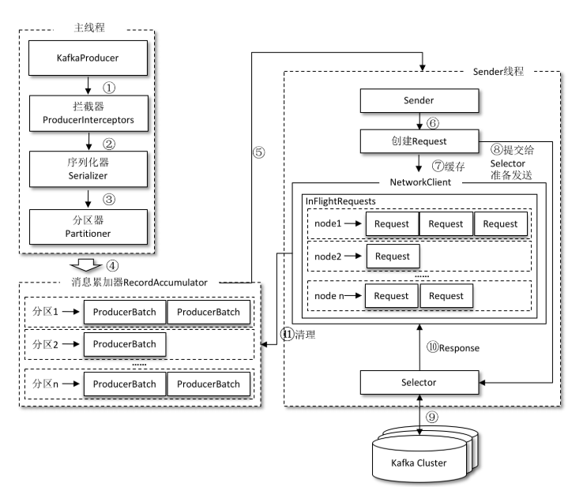

# 第2章 生产者

- ProducerRecord
- bootstrap.servers 该参数用来指定生产者客户端连接Kafka集群所需的broker地址清单
- key.serializer 和 value.serializer 这两个参数无默认值
- org.apache.kafka.common.serialization.StringSerializer
- client.id
- max.request.size
- interceptor.classes
- ProducerConfig
- KafkaProducer 是线程安全的
- 发送消息主要有三种模式：发后即忘（fire-and-forget）、同步（sync）及异步（async）
- 发后即忘（fire-and-forget）
- 同步（sync）
- 异步（async）
- RecordMetadata 当前消息的主题、分区号、分区中的偏移量（offset）、时间戳
- retries 参数，默认是0
- Future对象
- Callback的方式
- org.apache.kafka.clients.producer.Callback
- Deserializer
- org.apache.kafka.clients.producer.Partitioner
- MurmurHash2算法，具备高运算性能及低碰撞率
- 拦截器（Interceptor）
- Kafka一共有两种拦截器：生产者拦截器和消费者拦截器
- ProducerInterceptor interceptor.classes
- RecordAccumulator，也称为消息收集器
- InFlightRequests


## ProducerRecord

其中topic和partition字段分别代表消息要发往的主题和分区号。headers字段是消息的头部，Kafka 0.11.x版本才引入这个属性，它大多用来设定一些与应用相关的信息，如无需要也可以不用设置。key是用来指定消息的键，它不仅是消息的附加信息，还可以用来计算分区号进而可以让消息发往特定的分区。前面提及消息以主题为单位进行归类，而这个key可以让消息再进行二次归类，同一个key的消息会被划分到同一个分区中，详情参见2.1.4节。有key的消息还可以支持日志压缩的功能，详情参见5.4节。value是指消息体，一般不为空，如果为空则表示特定的消息—墓碑消息，详情参见5.4节。timestamp是指消息的时间戳，它有CreateTime和LogAppendTime两种类型，前者表示消息创建的时间，后者表示消息追加到日志文件的时间。


## KafkaProducer 异常

KafkaProducer中一般会发生两种类型的异常：可重试的异常和不可重试的异常。常见的可重试异常有：NetworkException、LeaderNotAvailableException、UnknownTopicOrPartitionException、NotEnoughReplicasException、NotCoordinatorException 等。比如NetworkException 表示网络异常，这个有可能是由于网络瞬时故障而导致的异常，可以通过重试解决；又比如LeaderNotAvailableException表示分区的leader副本不可用，这个异常通常发生在leader副本下线而新的 leader 副本选举完成之前，重试之后可以重新恢复。不可重试的异常，比如 1.4 节中提及的RecordTooLargeException异常，暗示了所发送的消息太大，KafkaProducer对此不会进行任何重试，直接抛出异常。

## Callback

```java
public interface Callback {
    void onCompletion(RecordMetadata metadata, Exception exception);
}
```

## 分区器

消息在通过send（）方法发往broker的过程中，有可能需要经过拦截器（Interceptor）、序列化器（Serializer）和分区器（Partitioner）的一系列作用之后才能被真正地发往 broker。拦截器（下一章会详细介绍）一般不是必需的，而序列化器是必需的。消息经过序列化之后就需要确定它发往的分区，如果消息ProducerRecord中指定了partition字段，那么就不需要分区器的作用，因为partition代表的就是所要发往的分区号。

如果消息ProducerRecord中没有指定partition字段，那么就需要依赖分区器，根据key这个字段来计算partition的值。分区器的作用就是为消息分配分区。

## 拦截器

如果拦截链中的某个拦截器的执行需要依赖于前一个拦截器的输出，那么就有可能产生“副作用”。设想一下，如果前一个拦截器由于异常而执行失败，那么这个拦截器也就跟着无法继续执行。在拦截链中，如果某个拦截器执行失败，那么下一个拦截器会接着从上一个执行成功的拦截器继续执行。

## 实现




## RecordAccumulator

RecordAccumulator 主要用来缓存消息以便 Sender 线程可以批量发送，进而减少网络传输的资源消耗以提升性能。RecordAccumulator 缓存的大小可以通过生产者客户端参数buffer.memory 配置，默认值为 33554432B，即 32MB。如果生产者发送消息的速度超过发送到服务器的速度，则会导致生产者空间不足，这个时候KafkaProducer的send（）方法调用要么被阻塞，要么抛出异常，这个取决于参数max.block.ms的配置，此参数的默认值为60000，即60秒。

主线程中发送过来的消息都会被追加到RecordAccumulator的某个双端队列（Deque）中，在 RecordAccumulator 的内部为每个分区都维护了一个双端队列，队列中的内容就是ProducerBatch，即 Deque＜ProducerBatch＞。消息写入缓存时，追加到双端队列的尾部；Sender读取消息时，从双端队列的头部读取。注意ProducerBatch不是ProducerRecord，ProducerBatch中可以包含一至多个 ProducerRecord。通俗地说，ProducerRecord 是生产者中创建的消息，而ProducerBatch是指一个消息批次，ProducerRecord会被包含在ProducerBatch中，这样可以使字节的使用更加紧凑。与此同时，将较小的ProducerRecord拼凑成一个较大的ProducerBatch，也可以减少网络请求的次数以提升整体的吞吐量。

