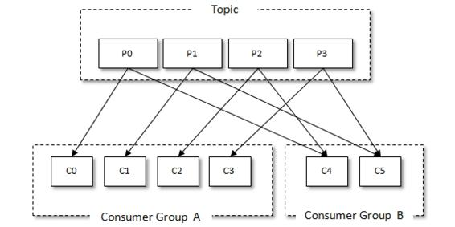
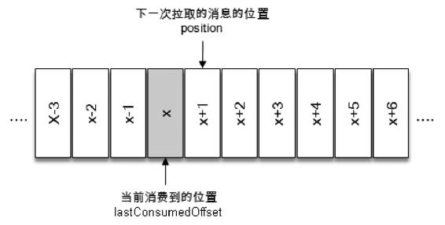

# 第3章 消费者

- KafkaConsumer
- 消费者和消费组
- partition.assignment.strategy 
- ConsumerRebalanceListener
- subscribe
- assign
- unsubscribe
- 订阅状态：AUTO_TOPICS、AUTO_PATTERN和USER_ASSIGNED
- 阅状态为NONE
- org.apache.kafka.clients.consumer.ConsumerRecords#partitions
- poll
- 位移提交
- committed offset 它表示已经提交过的消费位
- enable.auto.commit
- 定期提交，默认值为5秒
- 手动提交
- commitAsync
- commitSync
- pause 和 resume
- auto.offset.reset
- seek
- assignment


##  消费者与消费组

消费者（Consumer）负责订阅Kafka中的主题（Topic），并且从订阅的主题上拉取消息。与其他一些消息中间件不同的是：在Kafka的消费理念中还有一层消费组（Consumer Group）的概念，每个消费者都有一个对应的消费组。当消息发布到主题后，只会被投递给订阅它的每个消费组中的一个消费者。




如图3-1所示，某个主题中共有4个分区（Partition）：P0、P1、P2、P3。有两个消费组A和B都订阅了这个主题，消费组A中有4个消费者（C0、C1、C2和C3），消费组B中有2个消费者（C4和C5）。按照Kafka默认的规则，最后的分配结果是消费组A中的每一个消费者分配到1个分区，消费组B中的每一个消费者分配到2个分区，两个消费组之间互不影响。每个消费者只能消费所分配到的分区中的消息。换言之，每一个分区只能被一个消费组中的一个消费者所消费。

## 消息投递模式

对于消息中间件而言，一般有两种消息投递模式：点对点（P2P，Point-to-Point）模式和发布/订阅（Pub/Sub）模式。点对点模式是基于队列的，消息生产者发送消息到队列，消息消费者从队列中接收消息。发布订阅模式定义了如何向一个内容节点发布和订阅消息，这个内容节点称为主题（Topic），主题可以认为是消息传递的中介，消息发布者将消息发布到某个主题，而消息订阅者从主题中订阅消息。主题使得消息的订阅者和发布者互相保持独立，不需要进行接触即可保证消息的传递，发布/订阅模式在消息的一对多广播时采用。Kafka 同时支持两种消息投递模式，而这正是得益于消费者与消费组模型的契合：

- 如果所有的消费者都隶属于同一个消费组，那么所有的消息都会被均衡地投递给每一个消费者，即每条消息只会被一个消费者处理，这就相当于点对点模式的应用。
- 如果所有的消费者都隶属于不同的消费组，那么所有的消息都会被广播给所有的消费者，即每条消息会被所有的消费者处理，这就相当于发布/订阅模式的应用

消费组是一个逻辑上的概念，它将旗下的消费者归为一类，每一个消费者只隶属于一个消费组。每一个消费组都会有一个固定的名称，消费者在进行消费前需要指定其所属消费组的名称，这个可以通过消费者客户端参数group.id来配置，默认值为空字符串。

消费者并非逻辑上的概念，它是实际的应用实例，它可以是一个线程，也可以是一个进程。同一个消费组内的消费者既可以部署在同一台机器上，也可以部署在不同的机器上。

## 消息消费

Kafka中的消费是基于拉模式的。消息的消费一般有两种模式：推模式和拉模式。推模式是服务端主动将消息推送给消费者，而拉模式是消费者主动向服务端发起请求来拉取消息。

```java
// org.apache.kafka.clients.consumer.ConsumerRecord
public class ConsumerRecord<K, V> {

    private final String topic;
    private final int partition;
    private final long offset;
    private final long timestamp;
    private final TimestampType timestampType;
    private final int serializedKeySize;
    private final int serializedValueSize;
    private final Headers headers;
    private final K key;
    private final V value;
    // ...
}
```

- topic 和 partition 这两个字段分别代表消息所属主题的名称和所在分区的编号。
- offset 表示消息在所属分区的偏移量。
- timestamp 表示时间戳，与此对应的timestampType 表示时间戳的类型。timestampType 有两种类型：CreateTime 和LogAppendTime，分别代表消息创建的时间戳和消息追加到日志的时间戳。
- headers表示消息的头部内容。
- key 和 value 分别表示消息的键和消息的值，一般业务应用要读取的就是value，比如使用2.1.3节中的CompanySerializer序列化了一个Company对象，然后将其存入Kafka，那么消费到的消息中的 value 就是经过 CompanyDeserializer 反序列化后的 Company对象。
- serializedKeySize和serializedValueSize分别表示key和value经过序列化之后的大小，如果key为空，则serializedKeySize值为-1。同样，如果value为空，则serializedValueSize的值也会为-1。


到目前为止，可以简单地认为poll（）方法只是拉取一下消息而已，但就其内部逻辑而言并不简单，它涉及消费位移、消费者协调器、组协调器、消费者的选举、分区分配的分发、再均衡的逻辑、心跳等内容，在后面的章节中会循序渐进地介绍这些内容。


## 位移提交

对于Kafka中的分区而言，它的每条消息都有唯一的offset，用来表示消息在分区中对应的位置。对于消费者而言，它也有一个offset的概念，消费者使用offset来表示消费到分区中某个消息所在的位置。单词“offset”可以翻译为“偏移量”，也可以翻译为“位移”，读者可能并没有过多地在意这一点：在很多中文资料中都会交叉使用“偏移量”和“位移”这两个词，并没有很严谨地进行区分。笔者对offset做了一些区分：对于消息在分区中的位置，我们将offset称为“偏移量”；对于消费者消费到的位置，将 offset 称为“位移”，有时候也会更明确地称之为“消费位移”。做这一区分的目的是让读者在遇到 offset 的时候可以很容易甄别出是在讲分区存储层面的内容，还是在讲消费层面的内容，如此也可以使“偏移量”和“位移”这两个中文词汇具备更加丰富的意义。当然，对于一条消息而言，它的偏移量和消费者消费它时的消费位移是相等的，在某些不需要具体划分的场景下也可以用“消息位置”或直接用“offset”这个单词来进行表述。

在每次调用poll（）方法时，它返回的是还没有被消费过的消息集（当然这个前提是消息已经存储在Kafka 中了，并且暂不考虑异常情况的发生），要做到这一点，就需要记录上一次消费时的消费位移。并且这个消费位移必须做持久化保存，而不是单单保存在内存中，否则消费者重启之后就无法知晓之前的消费位移。再考虑一种情况，当有新的消费者加入时，那么必然会有再均衡的动作，对于同一分区而言，它可能在再均衡动作之后分配给新的消费者，如果不持久化保存消费位移，那么这个新的消费者也无法知晓之前的消费位移。

在旧消费者客户端中，消费位移是存储在ZooKeeper中的。而在新消费者客户端中，消费位移存储在Kafka内部的主题__consumer_offsets中。这里把将消费位移存储起来（持久化）的动作称为“提交”，消费者在消费完消息之后需要执行消费位移的提交。




```java
org.apache.kafka.clients.consumer.KafkaConsumer#position(org.apache.kafka.common.TopicPartition)
org.apache.kafka.clients.consumer.KafkaConsumer#committed(org.apache.kafka.common.TopicPartition)
```
