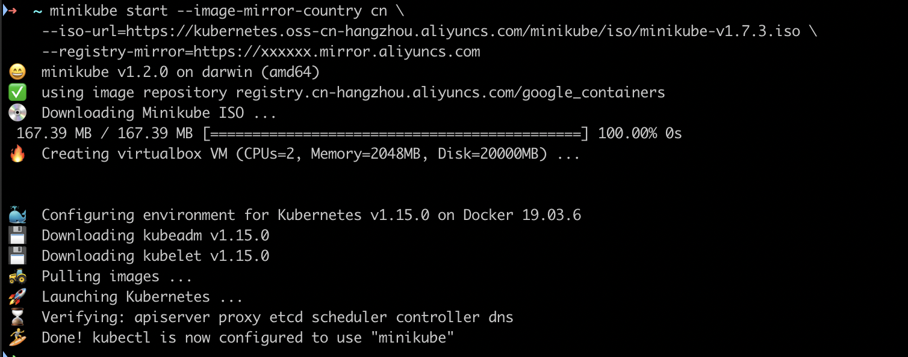

# Minikube

## 安装

- [https://www.cnblogs.com/sanshengshui/p/11228985.html](https://www.cnblogs.com/sanshengshui/p/11228985.html)
- [配置](https://yq.aliyun.com/articles/221687?spm=5176.10731542.0.0.7fcc20beaaCVkP)

```sh
## 安装
curl -Lo minikube http://kubernetes.oss-cn-hangzhou.aliyuncs.com/minikube/releases/v1.2.0/minikube-darwin-amd64 && chmod +x minikube && sudo mv minikube /usr/local/bin/

# 配置
minikube start --image-mirror-country cn \
    --iso-url=https://kubernetes.oss-cn-hangzhou.aliyuncs.com/minikube/iso/minikube-v1.7.3.iso \
    --registry-mirror=https://xxxxxx.mirror.aliyuncs.com

## 打开 dashboard
minikube dashboard
```

效果图:

