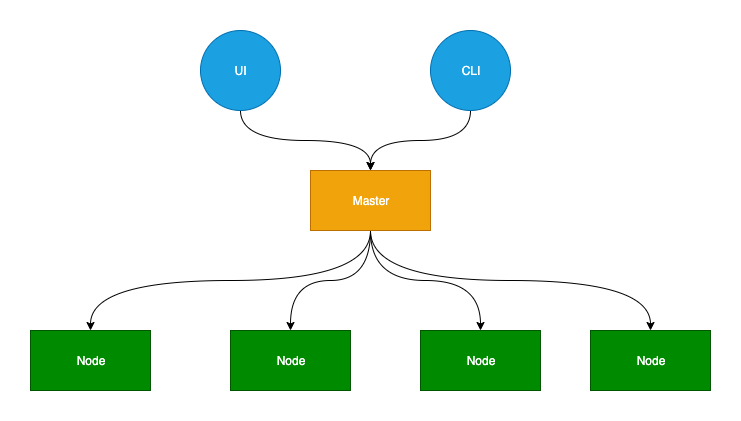
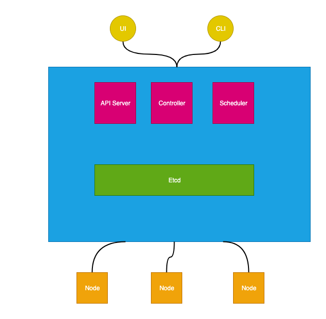
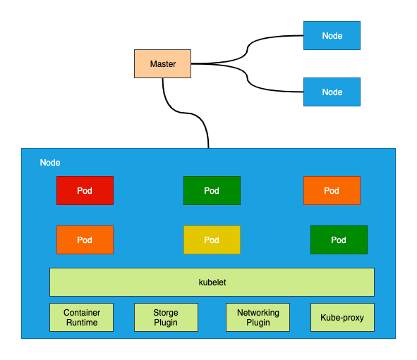
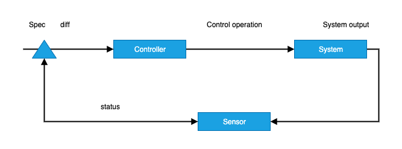

# Kubernetes

- [Kubernetes](#kubernetes)
  - [Kubernetes 设计目的](#kubernetes-设计目的)
  - [核心功能](#核心功能)
  - [kubernets 架构](#kubernets-架构)
    - [Master](#master)
    - [Node](#node)
    - [Pod](#pod)
    - [Pod 类型](#pod-类型)
      - [Deployment](#deployment)
      - [Service](#service)
      - [NameSpace](#namespace)
      - [Job CronJob](#job-cronjob)
      - [Daemon Set](#daemon-set)
    - [ConfigMap](#configmap)
    - [Sidecar](#sidecar)
  - [kubernets 资源](#kubernets-资源)
  - [kubernets 控制运行](#kubernets-控制运行)
  - [Pod Volumes](#pod-volumes)
  - [Pod 配置管理](#pod-配置管理)
  - [Pod 健康监控](#pod-健康监控)
  - [Pod 调度](#pod-调度)
    - [Pod 与 Pod](#pod-与-pod)
    - [Pod 与 Node](#pod-与-node)
    - [Node 标记/容忍](#node-标记容忍)
  - [Links](#links)

## Kubernetes 设计目的

自动化容器编排平台

- 部署
- 弹性
- 管理

## 核心功能

- 服务发现与负载均衡
- 容器自动装箱
- 存储编排
- 自动容器恢复
- 自动发布与回滚
- 配置与密文管理
- 批量执行
- 水平伸缩

- 调度
- 自动恢复
- 水平伸缩

## kubernets 架构

### Master

### Node

### Pod

Pod 解决的核心问题：容器之间高效的共享某些`资源`和`数据`

- 共享网络 Infra container
- 共享存储 Volumes shared-data

例子：War + Tomcat 应用部署

InitContainer(复制war) + Volumes(共享war) + Tomcat(使用war)

InitContainer 在其他容器启动之前启动

### Pod 类型

#### Deployment

- 维护pod 数量
- Pod 的更新升级
- ReplicaSet

#### Service

- ClusterIP
- NodePort
- LoadBalancer

#### NameSpace

一个集群内部的逻辑隔离（鉴权。资源控制）

#### Job CronJob

#### Daemon Set

### ConfigMap

- Secret
- ServiceAccount
- Ressource
- Qos
- SecuityContext
- InitContainer

### Sidecar

容器的设计模式

场景：

- 应用日志收集
- 代理容器
- 适配器容器

设计模式的本质：解耦和重用

## kubernets 资源

- label
- annotations
- OwnerReference

- Spec
- Status
- Metadata
  - Labels
  - Annotations
  - OwnerReference

## kubernets 控制运行

status -> spec

## Pod Volumes

- 数据不丢失
- 数据共享

Persistent Volumes (PV)

Persistent Volumes Cliam (PVC)

## Pod 配置管理

| 配置类型                                   | 描述     |
| ------------------------------------------ | -------- |
| ConfigMap                                  | 可变配置 |
| Secret                                     | 敏感信息 |
| ServiceAccount                             | 身份认证 |
| Spec.Containers[].Resource.limits/requests | 资源配置 |
| Spec.Contaniers[].SecutiryContext          | 安全管控 |
| Spec.InitContainers                        | 前置校验 |

- ConfigMap 环境编码，命令行参数等等

## Pod 健康监控

- Liveness
- Readiness

探测方式：

- HttpGet
- Exec
- TcPSocket  ip+port

探测结果：

- Success
- Failure
- Unknown
  
## Pod 调度

### Pod 与 Pod

- 亲和调度 PodAffinity
- Pod反亲和调度 PodAntiAffinity

Operator: In/NotIn/Exists/DoesNotExist

### Pod 与 Node

- NodeSelector
- NodeAffinity

Operator: In/NotIn/Exists/DoesNotExist/Gl/Lt

### Node 标记/容忍

限制调度到某些 Node 上面

## Links

- [https://kubernetes.io/docs/concepts/overview/what-is-kubernetes/](https://kubernetes.io/docs/concepts/overview/what-is-kubernetes/)
- [https://kubernetes.io/docs/concepts/architecture](https://kubernetes.io/docs/concepts/architecture)
- [kubernetes.md](kubernetes.md)
- [谈 Kubernetes 的架构设计与实现原理](https://mp.weixin.qq.com/s/R-ltInkLTM4NgLQgx8Mg1w)
- [kubernetes-handbook](https://jimmysong.io/kubernetes-handbook/cloud-native/cloud-native-philosophy.html)
- [阿里云的云原生公开课](https://edu.aliyun.com/roadmap/cloudnative)
