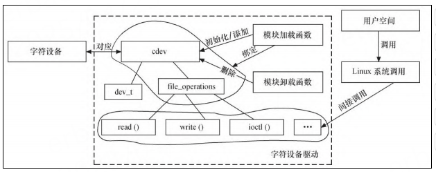

# 第6章 字符设备驱动

- seek
- cdev_add cdev_del
- register_chrdev_region
- alloc_chrdev_region
- file_operations结构体
- llseek
- read
- write
- read（）和write（）如果返回0，则暗示end-of file（EOF）。
- unlocked_ioctl
- fcntl
- ioctl
- mmap
- open
- release
- poll
- 字符设备驱动模块加载与卸载函数
- ENOTTY
- copy_from_user和copy_to_user
- put_user 和 get_user
- access_ok
- SET_BAUDRATE是一道设置波特率的命令
- globalmem虚拟设备
- _IO（）、_IOR（）、_IOW（）和 _IOWR
- ioctl函数
- 字符设备是3大类设备（字符设备、块设备和网络设备）中的一类，

## poll

poll（）函数一般用于询问设备是否可被非阻塞
地立即读写。当询问的条件未触发时，用户空间进行
select（）和poll（）系统调用将引起进程的阻塞。

## aio_read和aio_write

aio_read（）和aio_write（）函数分别对与文件
描述符对应的设备进行异步读、写操作。设备实现这
两个函数后，用户空间可以对该设备文件描述符执行
SYS_io_setup、SYS_io_submit、SYS_io_getevents、
SYS_io_destroy等系统调用进行读写。

## 字符设备驱动模块加载与卸载函数

在字符设备驱动模块加载函数中应该实现设备号
的申请和cdev的注册，而在卸载函数中应实现设备号
的释放和cdev的注销

# file_operations结构体

file_operations结构体中的成员函数是字符设备
驱动与内核虚拟文件系统的接口，是用户空间对Linux
进行系统调用最终的落实者。大多数字符设备驱动会
实现read（）、write（）和ioctl（）函数，

设备驱动的读函数中，filp是文件结构体指针，
buf是用户空间内存的地址，该地址在内核空间不宜直
接读写，count是要读的字节数，f_pos是读的位置相
对于文件开头的偏移。

- 字符设备驱动基本模板（含 read/write/ioctl）  https://github.com/web1992/Favorites/issues/65

## 总结

字符设备是3大类设备（字符设备、块设备和网络
设备）中的一类，其驱动程序完成的主要工作是初始
化、添加和删除cdev结构体，申请和释放设备号，以
及填充file_operations结构体中的操作函数，实现
file_operations结构体中的read（）、write（）和
ioctl（）等函数是驱动设计的主体工作。