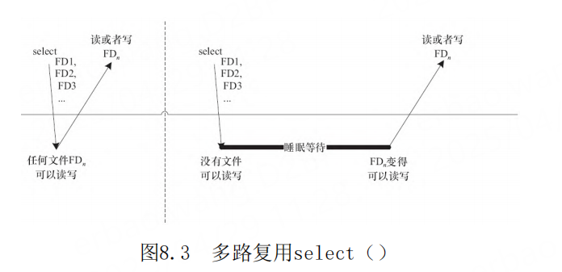

# 第8章 Linux设备驱动中的阻塞与非阻塞I/O

- P593
- 阻塞与非阻塞I/O
- 使用O_NONBLOCK标记打开文件
- O_RDWR
- ioctl 和 fcntl
- fcntl（fd，F_SETFL，O_NONBLOCK）
- Wait Queue
- wait_queue_head_t my_queue;
- select（）和poll（）
- epoll
- 
-
-
-
-
-
-
- 
-
-
-
-
-
-
- 
-
-
-
-
-
-
- 
-
-
-
-
-
-


## 阻塞与非阻塞I/O


阻塞操作是指在执行设备操作时，若不能获得资
源，则挂起进程直到满足可操作的条件后再进行操
作。被挂起的进程进入睡眠状态，被从调度器的运行
队列移走，直到等待的条件被满足。而非阻塞操作的
进程在不能进行设备操作时，并不挂起，它要么放
弃，要么不停地查询，直至可以进行操作为止。
驱动程序通常需要提供这样的能力：当应用程序
进行read（）、write（）等系统调用时，若设备的资
源不能获取，而用户又希望以阻塞的方式访问设备，
驱动程序应在设备驱动的xxx_read（）、
xxx_write（）等操作中将进程阻塞直到资源可以获
取，此后，应用程序的read（）、write（）等调用才
返回，整个过程仍然进行了正确的设备访问，用户并
没有感知到；若用户以非阻塞的方式访问设备文件，
则当设备资源不可获取时，设备驱动的
xxx_read（）、xxx_write（）等操作应立即返回，
read（）、write（）等系统调用也随即被返回，应用
程序收到-EAGAIN返回值。


## select

```c
int select(int numfds, fd_set *readfds, fd_set *writefds,
fd_set *exceptfds,
struct timeval *timeout);
```

其中readfds、writefds、exceptfds分别是被
select（）监视的读、写和异常处理的文件描述符集
合，numfds的值是需要检查的号码最高的fd加1。
readfds文件集中的任何一个文件变得可读，
select（）返回；同理，writefds文件集中的任何一
个文件变得可写，select也返回。


，第一次对n个文件进行select（）
的时候，若任何一个文件满足要求，select（）就直
接返回；第2次再进行select（）的时候，没有文件满
足读写要求，select（）的进程阻塞且睡眠。由于调
用select（）的时候，每个驱动的poll（）接口都会
被调用到，实际上执行select（）的进程被挂到了每
个驱动的等待队列上，可以被任何一个驱动唤醒。如
果FDn变得可读写，select（）返回。


