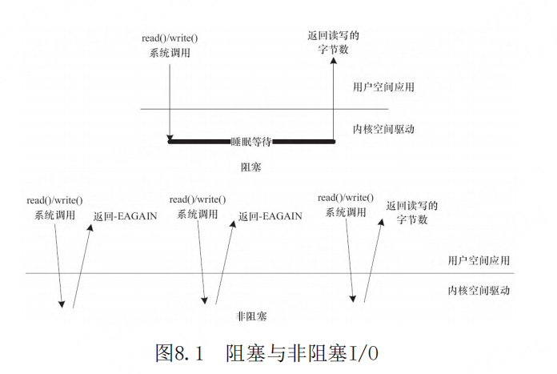
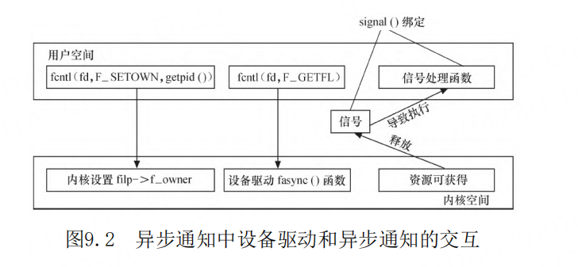

# 第9章 Linux设备驱动中的异步通知与异步I/O

- P640
- O_NONBLOCK 标记
- fcntl（fd，F_SETFL，O_NONBLOCK）
- 等待队列 Wait Queue
- wait_queue_head_t my_queue;
- DECLARE_WAIT_QUEUE_HEAD (name)
- DECLARE_WAITQUEUE(name, tsk)
- init_waitqueue_head(&my_queue);
- add_wait_queue
- remove_wait_queue
- fasync_struct
- fasync_helper
- kill_fasync
- 支持异步通知的globalfifo驱动
- Linux异步I/O
- int aio_read( struct aiocb *aiocbp )
- int aio_write( struct aiocb *aiocbp )
- int aio_error( struct aiocb *aiocbp )
- aio_return
- aio_suspend
- aio_cancel
- lio_listio
- Linux内核AIO与libaio

## 异步通知的概念与作用

阻塞与非阻塞访问、poll（）函数提供了较好的
解决设备访问的机制，但是如果有了异步通知，整套
机制则更加完整了。

异步通知的意思是：一旦设备就绪，则主动通知
应用程序，这样应用程序根本就不需要查询设备状
态，这一点非常类似于硬件上“中断”的概念，比较
准确的称谓是“信号驱动的异步I/O”。信号是在软件
层次上对中断机制的一种模拟，在原理上，一个进程
收到一个信号与处理器收到一个中断请求可以说是一
样的。信号是异步的，一个进程不必通过任何操作来
等待信号的到达，事实上，进程也不知道信号到底什
么时候到达。

阻塞I/O意味着一直等待设备可访问后再访问，非
阻塞I/O中使用poll（）意味着查询设备是否可访问，
而异步通知则意味着设备通知用户自身可访问，之后
用户再进行I/O处理。由此可见，这几种I/O方式可以
相互补充。

## 等待队列

在Linux驱动程序中，可以使用等待队列（Wait
Queue）来实现阻塞进程的唤醒。等待队列很早就作为
一个基本的功能单位出现在Linux内核里了，它以队列
为基础数据结构，与进程调度机制紧密结合，可以用
来同步对系统资源的访问，第7章中所讲述的信号量在
内核中也依赖等待队列来实现。

## fasync

## Linux的AIO

Linux的AIO有多种实现，其中一种实现是在用户
空间的glibc库中实现的，它本质上是借用了多线程模
型，用开启新的线程以同步的方法来做I/O，新的AIO
辅助线程与发起AIO的线程以
pthread_cond_signal（）的形式进行线程间的同步。
glibc的AIO主要包括如下函数。