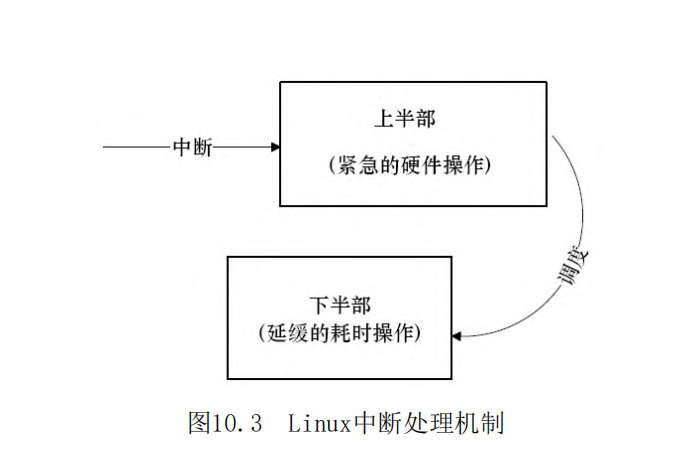

# 第10章 中断与时钟

- P691
- 中断控制器（PIC）
- GIC（Generic Interrupt Controller）
- SGI（Software Generated Interrupt）
- Linux中断处理程序架构
- 中断MASK寄存器
- 中断PEND寄存器
- 可编程间隔定时器（PIT）的工作原理
-  GIC Generic Interrupt Controller
- SGI（Software Generated Interrupt）：软件产生的中断 可以用于多核的核间通信
- /proc/interrupts
- request_irq（）和free_irq（）函数
- Linux中断编程
- request_irq
- devm_request_irq
- 此函数与request_irq（）的区别是devm_开头的 API申请的是内核“managed”的资源，一般不需要在出错处理和remove（）接口里再显式的释放。
- irq_handler_t
- free_irq
- disable_irq_nosync 与 disable_irq
- Linux实现底半部的机制主要有tasklet、工作队列、软中断和线程化irq。
- work_struct 工作队列
- schedule_work
- 软中断（Softirq）
- threaded_irq
- 数thread_fn
- GPIO按键的中断
- container_of
- 中断共享
- IRQF_SHARED标志
- 内核定时器
- timer_list
- 对hrtimer
- 内核中延迟的工作delayed_work
- ndelay（）、udelay（）和mdelay（）
- schedule_timeout
- schedule_timeout_uninterruptible
- schedule_timeout_interruptible
-

## 中断与定时器

所谓中断是指CPU在执行程序的过程中，出现了某
些突发事件急待处理，CPU必须暂停当前程序的执行，
转去处理突发事件，处理完毕后又返回原程序被中断
的位置继续执行。

根据中断的来源，中断可分为内部中断和外部中
断，内部中断的中断源来自CPU内部（软件中断指令、
溢出、除法错误等，例如，操作系统从用户态切换到
内核态需借助CPU内部的软件中断），外部中断的中断
源来自CPU外部，由外设提出请求。

根据中断是否可以屏蔽，中断可分为可屏蔽中断
与不可屏蔽中断（NMI），可屏蔽中断可以通过设置中
断控制器寄存器等方法被屏蔽，屏蔽后，该中断不再
得到响应，而不可屏蔽中断不能被屏蔽。

根据中断入口跳转方法的不同，中断可分为向量
中断和非向量中断。采用向量中断的CPU通常为不同的
中断分配不同的中断号，当检测到某中断号的中断到
来后，就自动跳转到与该中断号对应的地址执行。不
同中断号的中断有不同的入口地址。非向量中断的多
个中断共享一个入口地址，进入该入口地址后，再通
过软件判断中断标志来识别具体是哪个中断。也就是
说，向量中断由硬件提供中断服务程序入口地址，非
向量中断由软件提供中断服务程序入口地址。

## PIC

嵌入式系统以及x86PC中大多包含可编程中断控制
器（PIC），许多MCU内部就集成了PIC。如在80386
中，PIC是两片i8259A芯片的级联。通过读写PIC的寄
存器，程序员可以屏蔽/使能某中断及获得中断状态，
前者一般通过中断MASK寄存器完成，后者一般通过中
断PEND寄存器完成。

SGI（Software Generated Interrupt）：软件产
生的中断，可以用于多核的核间通信，一个CPU可以通
过写GIC的寄存器给另外一个CPU产生中断。多核调度
用的IPI_WAKEUP、IPI_TIMER、IPI_RESCHEDULE、
IPI_CALL_FUNC、IPI_CALL_FUNC_SINGLE、
IPI_CPU_STOP、IPI_IRQ_WORK、IPI_COMPLETION都是
由SGI产生的。

PPI（Private Peripheral Interrupt）：某个
CPU私有外设的中断，这类外设的中断只能发给绑定的
那个CPU。
SPI（Shared Peripheral Interrupt）：共享外
设的中断，这类外设的中断可以路由到任何一个CPU。

## Linux中断处理程序架构

设备的中断会打断内核进程中的正常调度和运
行，系统对更高吞吐率的追求势必要求中断服务程序
尽量短小精悍。但是，这个良好的愿望往往与现实并
不吻合。在大多数真实的系统中，当中断到来时，要
完成的工作往往并不会是短小的，它可能要进行较大
量的耗时处理。

## top half



顶半部用于完成尽量少的比较紧急的功能，它往
往只是简单地读取寄存器中的中断状态，并在清除中
断标志后就进行“登记中断”的工作。“登记中断”
意味着将底半部处理程序挂到该设备的底半部执行队
列中去。这样，顶半部执行的速度就会很快，从而可
以服务更多的中断请求。

现在，中断处理工作的重心就落在了底半部的头
上，需用它来完成中断事件的绝大多数任务。底半部
几乎做了中断处理程序所有的事情，而且可以被新的
中断打断，这也是底半部和顶半部的最大不同，因为
顶半部往往被设计成不可中断。底半部相对来说并不
是非常紧急的，而且相对比较耗时，不在硬件中断服
务程序中执行。
尽管顶半部、底半部的结合能够改善系统的响应
能力，但是，僵化地认为Linux设备驱动中的中断处理
一定要分两个半部则是不对的。如果中断要处理的工
作本身很少，则完全可以直接在顶半部全部完成。


其他操作系统中对中断的处理也采用了类
似于Linux的方法，真正的硬件中断服务程序都应该尽
量短。因此，许多操作系统都提供了中断上下文和非
中断上下文相结合的机制，将中断的耗时工作保留到
非中断上下文去执行。例如，在VxWorks中，网络设备
包接收中断到来后，中断服务程序会通过
netJobAdd（）函数将耗时的包接收和上传工作交给
tNetTask任务去执行。

在Linux中，查看/proc/interrupts文件可以获得
系统中中断的统计信息，并能统计出每一个中断号上
的中断在每个CPU上发生的次数

## Linux中断编程

```c
int request_irq(unsigned int irq,
                irq_handler_t handler,
                unsigned long flags,
                const char *name, void *dev);

typedef irqreturn_t (*irq_handler_t)(int, void *);
typedef int irqreturn_t;
```

## disable_irq_nosync

disable_irq_nosync（）与disable_irq（）的区
别在于前者立即返回，而后者等待目前的中断处理完
成。由于disable_irq（）会等待指定的中断被处理
完，因此如果在n号中断的顶半部调用
disable_irq（n），会引起系统的死锁，这种情况
下，只能调用disable_irq_nosync（n）

## 工作队列

工作队列早期的实现是在每个CPU核上创建一个
worker内核线程，所有在这个核上调度的工作都在该
worker线程中执行，其并发性显然差强人意。在Linux
2.6.36以后，转而实现了“Concurrency-managed
workqueues”
，简称cmwq，cmwq会自动维护工作队列
的线程池以提高并发性，同时保持了API的向后兼容。


## 软中断（Softirq）

软中断（Softirq）也是一种传统的底半部处理机
制，它的执行时机通常是顶半部返回的时候，tasklet
是基于软中断实现的，因此也运行于软中断上下文。

在Linux内核中，用softirq_action结构体表征一
个软中断，这个结构体包含软中断处理函数指针和传
递给该函数的参数。使用open_softirq（）函数可以
注册软中断对应的处理函数，而raise_softirq（）函
数可以触发一个软中断。

软中断和tasklet运行于软中断上下文，仍然属于
原子上下文的一种，而工作队列则运行于进程上下
文。因此，在软中断和tasklet处理函数中不允许睡
眠，而在工作队列处理函数中允许睡眠。
local_bh_disable（）和local_bh_enable（）是
内核中用于禁止和使能软中断及tasklet底半部机制的
函数。

内核中采用softirq的地方包括HI_SOFTIRQ、
TIMER_SOFTIRQ、NET_TX_SOFTIRQ、NET_RX_SOFTIRQ、
SCSI_SOFTIRQ、TASKLET_SOFTIRQ等，一般来说，驱动
的编写者不会也不宜直接使用softirq。

第9章异步通知所基于的信号也类似于中断，现
在，总结一下硬中断、软中断和信号的区别：硬中断
是外部设备对CPU的中断，软中断是中断底半部的一种
处理机制，而信号则是由内核（或其他进程）对某个
进程的中断。在涉及系统调用的场合，人们也常说通
过软中断（例如ARM为swi）陷入内核，此时软中断的
概念是指由软件指令引发的中断，和我们这个地方说
的softirq是两个完全不同的概念，一个是software，
一个是soft。

需要特别说明的是，软中断以及基于软中断的
tasklet如果在某段时间内大量出现的话，内核会把后
续软中断放入ksoftirqd内核线程中执行。总的来说，
中断优先级高于软中断，软中断又高于任何一个线
程。软中断适度线程化，可以缓解高负载情况下系统
的响应。

## GPIO按键的中断

drivers/input/keyboard/gpio_keys.c是一个放
之四海皆准的GPIO按键驱动，为了让该驱动在特定的
电路板上工作，通常只需要修改arch/arm/mach-xxx下
的板文件或者修改device tree对应的dts。该驱动会
为每个GPIO申请中断，在gpio_keys_setup_key（）函
数中进行。注意最后一个参数bdata，会被传入中断服
务程序。

drivers 驱动的目录： /lib/modules/5.15.0-72-generic 
5.15.0-72-generic 通过 `uaname -r` 获取

```sh
/lib/modules/5.15.0-72-generic/kernel/drivers/input/keyboard
```

## time_before和time_after

为了防止在time_before（）和time_after（）的
比较过程中编译器对jiffies的优化，内核将其定义为
volatile变量，这将保证每次都会重新读取这个变
量。因此volatile更多的作用还是避免这种读合并。