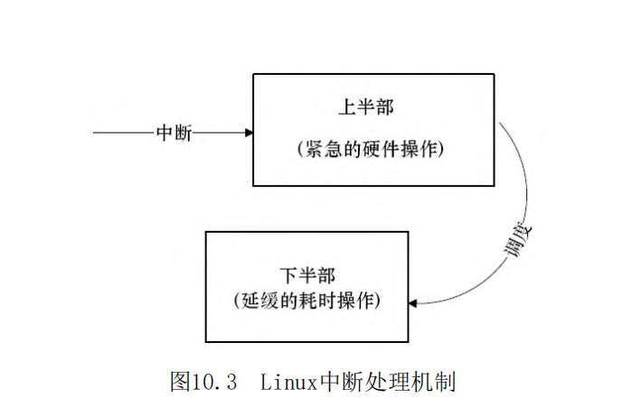

# 第10章 中断与时钟

- P707
- 中断控制器（PIC）
- GIC（Generic Interrupt Controller）
- SGI（Software Generated Interrupt）
- Linux中断处理程序架构
- /proc/interrupts
- request_irq（）和free_irq（）函数
- 
-
-
-
-
- 
-
-
-
-
- 
-
-
-
-

## 中断与定时器

所谓中断是指CPU在执行程序的过程中，出现了某
些突发事件急待处理，CPU必须暂停当前程序的执行，
转去处理突发事件，处理完毕后又返回原程序被中断
的位置继续执行。

根据中断的来源，中断可分为内部中断和外部中
断，内部中断的中断源来自CPU内部（软件中断指令、
溢出、除法错误等，例如，操作系统从用户态切换到
内核态需借助CPU内部的软件中断），外部中断的中断
源来自CPU外部，由外设提出请求。

根据中断是否可以屏蔽，中断可分为可屏蔽中断
与不可屏蔽中断（NMI），可屏蔽中断可以通过设置中
断控制器寄存器等方法被屏蔽，屏蔽后，该中断不再
得到响应，而不可屏蔽中断不能被屏蔽。

根据中断入口跳转方法的不同，中断可分为向量
中断和非向量中断。采用向量中断的CPU通常为不同的
中断分配不同的中断号，当检测到某中断号的中断到
来后，就自动跳转到与该中断号对应的地址执行。不
同中断号的中断有不同的入口地址。非向量中断的多
个中断共享一个入口地址，进入该入口地址后，再通
过软件判断中断标志来识别具体是哪个中断。也就是
说，向量中断由硬件提供中断服务程序入口地址，非
向量中断由软件提供中断服务程序入口地址。

## PIC

嵌入式系统以及x86PC中大多包含可编程中断控制
器（PIC），许多MCU内部就集成了PIC。如在80386
中，PIC是两片i8259A芯片的级联。通过读写PIC的寄
存器，程序员可以屏蔽/使能某中断及获得中断状态，
前者一般通过中断MASK寄存器完成，后者一般通过中
断PEND寄存器完成。

SGI（Software Generated Interrupt）：软件产
生的中断，可以用于多核的核间通信，一个CPU可以通
过写GIC的寄存器给另外一个CPU产生中断。多核调度
用的IPI_WAKEUP、IPI_TIMER、IPI_RESCHEDULE、
IPI_CALL_FUNC、IPI_CALL_FUNC_SINGLE、
IPI_CPU_STOP、IPI_IRQ_WORK、IPI_COMPLETION都是
由SGI产生的。

PPI（Private Peripheral Interrupt）：某个
CPU私有外设的中断，这类外设的中断只能发给绑定的
那个CPU。
SPI（Shared Peripheral Interrupt）：共享外
设的中断，这类外设的中断可以路由到任何一个CPU。

## Linux中断处理程序架构

设备的中断会打断内核进程中的正常调度和运
行，系统对更高吞吐率的追求势必要求中断服务程序
尽量短小精悍。但是，这个良好的愿望往往与现实并
不吻合。在大多数真实的系统中，当中断到来时，要
完成的工作往往并不会是短小的，它可能要进行较大
量的耗时处理。

## top half

顶半部用于完成尽量少的比较紧急的功能，它往
往只是简单地读取寄存器中的中断状态，并在清除中
断标志后就进行“登记中断”的工作。“登记中断”
意味着将底半部处理程序挂到该设备的底半部执行队
列中去。这样，顶半部执行的速度就会很快，从而可
以服务更多的中断请求。

现在，中断处理工作的重心就落在了底半部的头
上，需用它来完成中断事件的绝大多数任务。底半部
几乎做了中断处理程序所有的事情，而且可以被新的
中断打断，这也是底半部和顶半部的最大不同，因为
顶半部往往被设计成不可中断。底半部相对来说并不
是非常紧急的，而且相对比较耗时，不在硬件中断服
务程序中执行。
尽管顶半部、底半部的结合能够改善系统的响应
能力，但是，僵化地认为Linux设备驱动中的中断处理
一定要分两个半部则是不对的。如果中断要处理的工
作本身很少，则完全可以直接在顶半部全部完成。

其他操作系统中对中断的处理也采用了类
似于Linux的方法，真正的硬件中断服务程序都应该尽
量短。因此，许多操作系统都提供了中断上下文和非
中断上下文相结合的机制，将中断的耗时工作保留到
非中断上下文去执行。例如，在VxWorks中，网络设备
包接收中断到来后，中断服务程序会通过
netJobAdd（）函数将耗时的包接收和上传工作交给
tNetTask任务去执行。

在Linux中，查看/proc/interrupts文件可以获得
系统中中断的统计信息，并能统计出每一个中断号上
的中断在每个CPU上发生的次数

