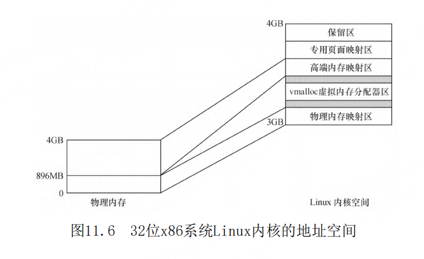

# 第11章 内存与I/O访问

- 常规内存、高端内存、虚拟地址、逻辑地址、总线地址、物理地址、I/O内存、设备内存、预留内存等概念
- 内存空间、I/O空间和MMU
- Linux的内存管理、内存区域的分布、常规内存与高端内存的区别。
- Linux内存存取的方法
- 内存动态申请以及通过虚拟地址存取物理地址的方法
- 设备I/O端口和I/O内存的访问流程
- 解I/O内存静态映射
- 设备驱动中的DMA与Cache一致性问题以及DMA的编程方法。
- 内存空间是必需的，而I/O空间是可选的
- 内存管理单元 MMU
- TLB（Translation Lookaside Buffer）
- TTW（Translation Table walk）
- pin_page_for_write
- PAGE_OFFSET
- FIXADDR_TOP-4GB 保留区
- vmalloc
- GFP_DMA标记
- DMA区域
- 硬件的DMA引擎
- Buddy算法
- /proc/buddyinfo
- virt_to_phys
- phys_to_virt
- 内存 DMA和常规区域，高端内存
- malloc free
- brk（）和mmap（）
- mallopt   
- 按需调页（Demand Paging）
- kmalloc（）、__get_free_pages（）和vmalloc（）kmalloc（）和__get_free_pages（）
- GFP_KERNEL
- __get_free_pages 分配标志的前缀GFP正好是这个底层函数的缩写
- kmalloc
- kfree
- vmalloc
- vfree
- slab与内存池
- *kmem_cache_create
- kmem_cache_alloc
- kmem_cache_free
- kmem_cache_destroy
- /proc/slabinfo
- mempool_create
- __GFP_WAIT
- *mempool_alloc
- mempool_free
- mempool_destroy
- 设备I/O端口和I/O内存的访问
- Linux I/O端口和I/O内存访问接口
- unsigned inb(unsigned port)
- void outb(unsigned char byte, unsigned port)
- ioremap
- iounmap
- devm_ioremap
- 申请与释放设备的I/O端口和I/O内存
- request_region
- release_region
- request_mem_region
- release_mem_region
- devm_request_region
- devm_request_mem_region
- 设备I/O端口和I/O内存访问流程
- 将设备地址映射到用户空间
- 内存映射与VMA
- mmap
- int(*mmap)(struct file *, struct vm_area_struct*)
-
-
-
-
-
-
-
-
-
-
-
-
-
-
-
-
-
-
-
-
-
-
-
-
-
-
-

## 内存空间是必需的，而I/O空间是可选的


## 内存管理单元

高性能处理器一般会提供一个内存管理单元
（MMU），该单元辅助操作系统进行内存管理，提供虚
拟地址和物理地址的映射、内存访问权限保护和Cache
缓存控制等硬件支持。操作系统内核借助MMU可以让用
户感觉到程序好像可以使用非常大的内存空间，从而
使得编程人员在写程序时不用考虑计算机中物理内存
的实际容量。

1）TLB（Translation Lookaside Buffer）：即
转换旁路缓存，TLB是MMU的核心部件，它缓存少量的
虚拟地址与物理地址的转换关系，是转换表的Cache，
因此也经常被称为“快表”。


2）TTW（Translation Table walk）：即转换表
漫游，当TLB中没有缓冲对应的地址转换关系时，需要
通过对内存中转换表（大多数处理器的转换表为多级
页表，如图11.2所示）的访问来获得虚拟地址和物理
地址的对应关系。TTW成功后，结果应写入TLB中


## ARM处理器的MMU


MMU具有虚拟地址和物理地址转换、内存访问权限
保护等功能，这将使得Linux操作系统能单独为系统的
每个用户进程分配独立的内存空间并保证用户空间不
能访问内核空间的地址，为操作系统的虚拟内存管理
模块提供硬件基础。


在Linux 2.6.11之前，Linux内核硬件无关层使用
了三级页表PGD、PMD和PTE；从Linux 2.6.11开始，为
了配合64位CPU的体系结构，硬件无关层则使用了4级
页表目录管理的方式，即PGD、PUD、PMD和PTE。注意
这仅仅是一种软件意义上的抽象，实际硬件的页表级
数可能少于4。代码清单11.1给出了一个典型的从虚拟
地址得到PTE的页表查询（Page Table Walk）过程，
它取自arch/arm/lib/uaccess_with_memcpy.c。

## Linux内存管理

对于包含MMU的处理器而言，Linux系统提供了复
杂的存储管理系统，使得进程所能访问的内存达到
4GB。
在Linux系统中，进程的4GB内存空间被分为两个
部分——用户空间与内核空间。用户空间的地址一般
分布为0-3GB（即PAGE_OFFSET，在0x86中它等于
0xC0000000），这样，剩下的3-4GB为内核空间，如图
11.5所示。用户进程通常只能访问用户空间的虚拟地
址，不能访问内核空间的虚拟地址。用户进程只有通
过系统调用（代表用户进程在内核态执行）等方式才
可以访问到内核空间。


每个进程的用户空间都是`完全独立`、`互不相干`
的，用户进程各自有不同的页表。而内核空间是由内
核负责映射，它并不会跟着进程改变，是固定的。内
核空间的虚拟地址到物理地址映射是被所有进程共享
的，内核的虚拟空间独立于其他程序。

Linux中1GB的内核地址空间又被划分为物理内存
映射区、虚拟内存分配区、高端页面映射区、专用页
面映射区和系统保留映射区这几个区域，如图11.6所
示。



对于x86系统而言，一般情况下，物理内存映射区
最大长度为896MB，系统的物理内存被顺序映射在内核
空间的这个区域中。当系统物理内存大于896MB时，超
过物理内存映射区的那部分内存称为高端内存（而未
超过物理内存映射区的内存通常被称为常规内存），
内核在存取高端内存时必须将它们映射到高端页面映
射区。

Linux保留内核空间最顶部FIXADDR_TOP-4GB的区
域作为保留区。
紧接着最顶端的保留区以下的一段区域为专用页
面映射区（FIXADDR_START-FIXADDR_TOP），它的总尺
寸和每一页的用途由fixed_address枚举结构在编译时
预定义，用__fix_to_virt（index）可获取专用区内
预定义页面的逻辑地址。


在物理区和高端映射区之间为虚拟内存分配器区
（VMALLOC_START-VMALLOC_END），用于vmalloc（）
函数，它的前部与物理内存映射区有一个隔离带，后
部与高端映射区也有一个隔离带

当系统物理内存超过4GB时，必须使用CPU的扩展
分页（PAE）模式所提供的64位页目录项才能存取到
4GB以上的物理内存，这需要CPU的支持。加入了PAE功
能的Intel Pentium Pro及以后的CPU允许内存最大可
配置到64GB，它们具备36位物理地址空间寻址能力。

由此可见，对于32位的x86而言，在3-4GB之间的
内核空间中，从低地址到高地址依次为：物理内存映
射区→隔离带→vmalloc虚拟内存分配器区→隔离带→
高端内存映射区→专用页面映射区→保留区。

直接进行映射的896MB物理内存其实又分为两个区
域，在低于16MB的区域，ISA设备可以做DMA，所以该
区域为DMA区域（内核为了保证ISA驱动在申请DMA缓冲
区的时候，通过GFP_DMA标记可以确保申请到16MB以内
的内存，所以必须把这个区域列为一个单独的区域管
理）；16MB-896MB之间的为常规区域。高于896MB的就
称为高端内存区域了。

32位ARM Linux的内核空间地址映射与x86不太一
样，内核文档Documentation/arm/memory.txt给出了
ARM Linux的内存映射情况。0xffff0000-0xffff0fff
是“CPU vector page”
，即向量表的地址。
0xffc00000-0xffefffff是DMA内存映射区域，
dma_alloc_xxx族函数把DMA缓冲区映射在这一段，
VMALLOC_START-VMALLOC_END-1是vmalloc和ioremap区
域（在vmalloc区域的大小可以配置，通过
“
vmalloc=”这个启动参数可以指定），
PAGE_OFFSET-high_memory-1是DMA和正常区域的映射
区域，MODULES_VADDR-MODULES_END-1是内核模块区
域，PKMAP_BASE-PAGE_OFFSET-1是高端内存映射区。
假设我们把PAGE_OFFSET定义为3GB，实际上Linux内核
模块位于3GB-16MB-3GB-2MB，高端内存映射区则通常
位于3GB-2MB-3GB

图11.7给出了32位ARM系统Linux内核地址空间中
的内核模块区域、高端内存映射区、vmalloc、向量表
区域等。我们假定编译内核的时候选择的是
VMSPLIT_3G（3G/1G user/kernel split）。如果用户
选择的是VMSPLIT_2G（2G/2G user/kernel split），
则图11.7中的内核模块开始于2GB-16MB，DMA和常规内
存区域映射区也开始于2GB。


ARM系统的Linux之所以把内核模块安置在3GB或者
2GB附近的16MB范围内，主要是为了实现内核模块和内
核本身的代码段之间的短跳转。


## virt_to_phys（）和 phys_to_virt（）

virt_to_phys（）和 phys_to_virt（）方法仅适用于DMA和常规区域，高端
内存的虚拟地址与物理地址之间不存在如此简单的换
算关系。


## 按需调页（Demand Paging）

另外，Linux内核总是采用按需调页（Demand
Paging），因此当malloc（）返回的时候，虽然是成
功返回，但是内核并没有真正给这个进程内存，这个
时候如果去读申请的内存，内容全部是0，这个页面的
映射是只读的。只有当写到某个页面的时候，内核才
在页错误后，真正把这个页面给这个进程。

## 内核空间内存动态申请

在Linux内核空间中申请内存涉及的函数主要包括
kmalloc（）、__get_free_pages（）和vmalloc（）
等。kmalloc（）和__get_free_pages（）（及其类似
函数）申请的内存位于DMA和常规区域的映射区，而且
在物理上也是连续的，它们与真实的物理地址只有一
个固定的偏移，因此存在较简单的转换关系。而
vmalloc（）在虚拟内存空间给出一块连续的内存区，
实质上，这片连续的虚拟内存在物理内存中并不一定
连续，而vmalloc（）申请的虚拟内存和物理内存之间
也没有简单的换算关系。

## get_free_pages

最常用的分配标志是GFP_KERNEL，其含义是在内
核空间的进程中申请内存。kmalloc（）的底层依赖于
__get_free_pages（）来实现，分配标志的前缀GFP正
好是这个底层函数的缩写。使用GFP_KERNEL标志申请
内存时，若暂时不能满足，则进程会睡眠等待页，即
会引起阻塞，因此不能在中断上下文或持有自旋锁的
时候使用GFP_KERNE申请内存。

由于在中断处理函数、tasklet和内核定时器等非
进程上下文中不能阻塞，所以此时驱动应当使用
GFP_ATOMIC标志来申请内存。当使用GFP_ATOMIC标志
申请内存时，若不存在空闲页，则不等待，直接返
回。

## vmalloc

vmalloc（）一般只为存在于软件中（没有对应的
硬件意义）的较大的顺序缓冲区分配内存，

vmalloc（）远大于__get_free_pages（）的开销，为
了完成vmalloc（），新的页表项需要被建立。因此，
只是调用vmalloc（）来分配少量的内存（如1页以内
的内存）是不妥的。

vmalloc（）不能用在原子上下文中，因为它的内
部实现使用了标志为GFP_KERNEL的kmalloc（）。

vmalloc（）在申请内存时，会进行内存的映射，
改变页表项，不像kmalloc（）实际用的是开机过程中
就映射好的DMA和常规区域的页表项。因此
vmalloc（）的虚拟地址和物理地址不是一个简单的线
性映射。

## slab算法

slab算法就是针对上述特点设计的。实际上
kmalloc（）就是使用slab机制实现的。

slab是建立在buddy算法之上的，它从buddy算法
拿到2n页面后再次进行二次管理，这一点和用户空间
的C库很像。slab申请的内存以及基于slab的
kmalloc（）申请的内存，与物理内存之间也是一个简
单的线性偏移。

注意： slab不是要代替__get_free_pages（），
其在最底层仍然依赖于__get_free_pages（），slab
在底层每次申请1页或多页，之后再分隔这些页为更小
的单元进行管理，从而节省了内存，也提高了slab缓
冲对象的访问效率。

除了slab以外，在Linux内核中还包含对内存池的
支持，内存池技术也是一种非常经典的用于分配大量
小对象的后备缓存技术。

## mempool_create

```c

mempool_t *mempool_create(int min_nr, mempool_alloc_t
*alloc_fn,
mempool_free_t *free_fn, void *pool_data);

typedef void *(mempool_alloc_t)(int gfp_mask, void
*pool_data);

typedef void (mempool_free_t)(void *element, void
*pool_data);

void *mempool_alloc(mempool_t *pool, int gfp_mask);
void mempool_free(void *element, mempool_t *pool);
```

## 设备I/O端口和I/O内存的访问

设备通常会提供一组寄存器来控制设备、读写设
备和获取设备状态，即控制寄存器、数据寄存器和状
态寄存器。这些寄存器可能位于I/O空间中，也可能位
于内存空间中。当位于I/O空间时，通常被称为I/O端
口；当位于内存空间时，对应的内存空间被称为I/O内
存。


## Linux I/O端口和I/O内存访问接口


## ioremap

在内核中访问I/O内存（通常是芯片内部的各个I2C、
SPI、USB等控制器的寄存器或者外部内存总线上的
设备）之前，需首先使用ioremap（）函数将设备所处
的物理地址映射到虚拟地址上。ioremap（）的原型如
下：

```c
void *ioremap(unsigned long offset, unsigned long size);
```

ioremap（）与vmalloc（）类似，也需要建立新
的页表，但是它并不进行vmalloc（）中所执行的内存
分配行为。ioremap（）返回一个特殊的虚拟地址，该
地址可用来存取特定的物理地址范围，这个虚拟地址
位于vmalloc映射区域。通过ioremap（）获得的虚拟
地址应该被iounmap（）函数释放，其原型如下：

```c
void iounmap(void * addr);
```

在设备的物理地址（一般都是寄存器）被映射到
虚拟地址之后，尽管可以直接通过指针访问这些地
址，但是Linux内核推荐用一组标准的API来完成设备
内存映射的虚拟地址的读写。

读寄存器用readb_relaxed（）、
readw_relaxed（）、readl_relaxed（）、
readb（）、readw（）、readl（）这一组API，以分
别读8bit、16bit、32bit的寄存器，没有_relaxed后
缀的版本与有_relaxed后缀的版本的区别是没有
_relaxed后缀的版本包含一个内存屏障。

## 设备I/O端口和I/O内存访问流程

I/O端口访问的一种途径是直接使用I/O端口操作
函数：在设备打开或驱动模块被加载时申请I/O端口区
域，之后使用inb（）、outb（）等进行端口访问，最
后，在设备关闭或驱动被卸载时释放I/O端口范围。整
个流程如图11.10所示。


I/O内存的访问步骤如图11.11所示，首先是调用
request_mem_region（）申请资源，接着将寄存器地
址通过ioremap（）映射到内核空间虚拟地址，之后就
可以通过Linux设备访问编程接口访问这些设备的寄存
器了。访问完成后，应对ioremap（）申请的虚拟地址
进行释放，并释放release_mem_region（）申请的I/O
内存资源。


## 内存映射与VMA

一般情况下，用户空间是不可能也不应该直接访
问设备的，但是，设备驱动程序中可实现mmap（）函
数，这个函数可使得用户空间能直接访问设备的物理
地址。实际上，mmap（）实现了这样的一个映射过
程：它将用户空间的一段内存与设备内存关联，当用
户访问用户空间的这段地址范围时，实际上会转化为
对设备的访问。


这种能力对于显示适配器一类的设备非常有意
义，如果用户空间可直接通过内存映射访问显存的
话，屏幕帧的各点像素将不再需要一个从用户空间到
内核空间的复制的过程。

mmap（）必须以PAGE_SIZE为单位进行映射，实际
上，内存只能以页为单位进行映射，若要映射非
PAGE_SIZE整数倍的地址范围，要先进行页对齐，强行
以PAGE_SIZE的倍数大小进行映射。

驱动中的mmap（）函数将在用户进行mmap（）系
统调用时最终被调用，mmap（）系统调用的原型与
file_operations中mmap（）的原型区别很大，

```c
caddr_t mmap (caddr_t addr, size_t len, int prot, int
flags, int fd, off_t offset);
```

参数fd为文件描述符，一般由open（）返回，fd
也可以指定为-1，此时需指定flags参数中的
MAP_ANON，表明进行的是匿名映射。

len是映射到调用用户空间的字节数，它从被映射
文件开头offset个字节开始算起，offset参数一般设
为0，表示从文件头开始映射。

prot参数指定访问权限，可取如下几个值的
“或”：PROT_READ（可读）、PROT_WRITE（可写）、
PROT_EXEC（可执行）和PROT_NONE（不可访问）。
参数addr指定文件应被映射到用户空间的起始地
址，一般被指定为NULL，这样，选择起始地址的任务
将由内核完成，而函数的返回值就是映射到用户空间
的地址。其类型caddr_t实际上就是void*。

当用户调用mmap（）的时候，内核会进行如下处
理。
1）在进程的虚拟空间查找一块VMA。
2）将这块VMA进行映射。
3）如果设备驱动程序或者文件系统的
file_operations定义了mmap（）操作，则调用它。
4）将这个VMA插入进程的VMA链表中。
file_operations中mmap（）函数的第一个参数就
是步骤1）找到的VMA。
由mmap（）系统调用映射的内存可由munmap（）
解除映射，这个函数的原型如下：

```c
int munmap(caddr_t addr, size_t len );
```

驱动程序中mmap（）的实现机制是建立页表，并
填充VMA结构体中vm_operations_struct指针。VMA就
是vm_area_struct，用于描述一个虚拟内存区域

```c
struct vm_area_struct {
    struct mm_struct *vm_mm;          // 指向所属进程的内存描述符（即内存空间）
    unsigned long vm_start;          // 该 VMA 的起始虚拟地址（包含）
    unsigned long vm_end;            // 该 VMA 的结束虚拟地址（不包含）

    // 红黑树/链表结构，用于在 mm_struct 中管理所有 VMA
    struct vm_area_struct *vm_next;  // 指向下一个 VMA（按地址升序排列的链表）
    struct vm_area_struct *vm_prev;  // 指向上一个 VMA（某些版本中已废弃）
    struct rb_node vm_rb;            // 红黑树节点（用于快速查找地址所属的 VMA）

    // 权限标志：VM_READ、VM_WRITE、VM_EXEC、VM_GROWSDOWN 等
    unsigned long vm_flags;

    // 匿名内存或文件映射相关
    struct rb_node shared_rb;        // 用于共享内存的红黑树（部分架构使用）
    struct file *vm_file;            // 如果是文件映射，则指向对应文件对象
    void *vm_private_data;           // 驱动或文件系统用来自定义的数据

    // 用于 mmap 操作的一组回调函数（如 open、close、fault）
    const struct vm_operations_struct *vm_ops;

    // 页面偏移量（相对于文件起始处），单位是页
    unsigned long vm_pgoff;

    // 用于管理内存区域的内存策略（NUMA 相关）
    struct mempolicy *vm_policy;

#ifdef CONFIG_NUMA
    // NUMA 优化相关数据
    struct vm_userfaultfd_ctx vm_userfaultfd_ctx;
#endif
};

```