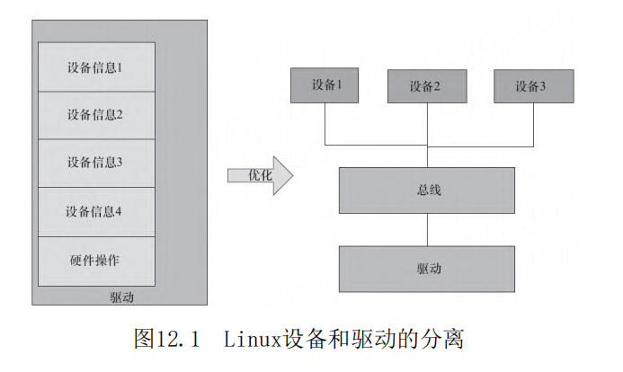
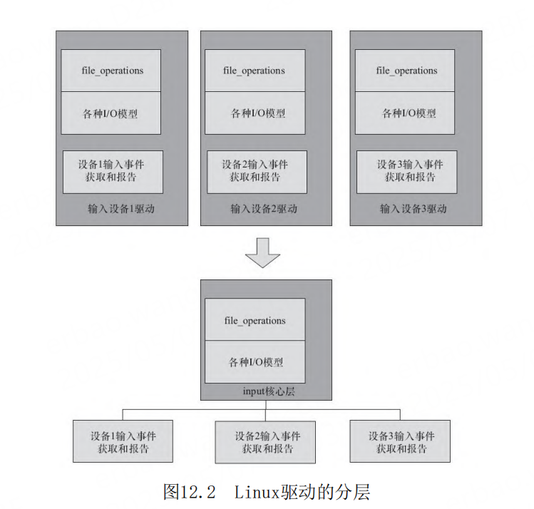

# 第12章 Linux设备驱动的软件架构思想

- P875
- platform设备
- RTC、Framebuffer、input、tty、混杂设备驱动
- SPI主机和外设驱动
- 于make menuconfig
- platform总线
- device_driver结构体
- i2c_driver、spi_driver、usb_driver、pci_driver
- 板文件
- platform_add_devices
- platform设备
- platform_device和platform_driver 匹配
- 设备树
- 挂接到了platform总线上
-
-
-
-
-
-
-
-
-
-
-
-
-
-
-
-
-
-
-
-
-
-
-
-
-

## 导读

在前面几章我们看到了globalmem、globalfifo这
样类型的简单的字符设备驱动，但是，纵观Linux内核
的源代码，读者几乎找不到有如此简单形式的驱动。

在实际的Linux驱动中，Linux内核尽量做得更
多，以便于底层的驱动可以做得更少。而且，也特别
强调了驱动的跨平台特性。因此，Linux内核势必会为
不同的驱动子系统设计不同的框架。

## Linux驱动的软件架构

Linux不是为了某单一电路板而设计的操作系统，
它可以支持约30种体系结构下一定数量的硬件，因
此，它的驱动架构很显然不能像RTOS下或者无操作系
统下那么小儿科的做法。

Linux设备驱动非常重视软件的可重用和跨平台能
力。譬如，如果我们写下一个DM9000网卡的驱动，
Linux的想法是这个驱动应该最好一行都不要改就可以
在任何一个平台上跑起来。为了做到这一点（看似很
难，因为每个板子连接DM9000的基地址，中断号什么
的都可能不一样），驱动中势必会有类似这样的代
码。

我们有没有办法把设备端的信息从驱动里面剥离出
来，让驱动以某种标准方法拿到这些平台信息呢Linux
总线、设备和驱动模型实际上可以做到这一点，驱动
只管驱动，设备只管设备，总线则负责匹配设备和驱
动，而驱动则以标准途径拿到板级信息，这样，驱动
就可以放之四海而皆准了。

Linux的字符设备驱动需要编写file_operations
成员函数，并负责处理阻塞、非组塞、多路复用、
SIGIO等复杂事物。但是，当我们面对一个真实的硬件
驱动时，假如要编写一个按键的驱动，作为一个“懒
惰”的程序员，你真的只想做最简单的工作，譬如，
收到一个按键中断、汇报一个按键值，至于什么
file_operations、几种I/O模型，那是Linux的事情，
为什么要我管Linux也是程序员写出来的，因此，程序
员怎么想，它必然要怎么做。于是，这里就衍生出来
了一个软件分层的想法，尽管file_operations、I/O
模型不可或缺，但是关于此部分的代码，全世界恐怕
所有的输入设备都是一样的，为什么不提炼一个中间
层出来，把这些事情搞定，也就是在底层编写驱动的
时候，搞定具体的硬件操作呢？

> Linux驱动的分层

主机控制器驱动不
关心外设，而外设驱动也不关心主机，外设只是访问
核心层的通用API进行数据传输，主机和外设之间可以
进行任意组合

## platform_device

在Linux 2.6以后的设备驱动模型中，需关心总
线、设备和驱动这3个实体，总线将设备和驱动绑定。
在系统每注册一个设备的时候，会寻找与之匹配的驱
动；相反的，在系统每注册一个驱动的时候，会寻找
与之匹配的设备，而匹配由总线完成。

一个现实的Linux设备和驱动通常都需要挂接在一
种总线上，对于本身依附于PCI、USB、I2C、SPI等的
设备而言，这自然不是问题，但是在嵌入式系统里
面，在SoC系统中集成的独立外设控制器、挂接在SoC
内存空间的外设等却不依附于此类总线。基于这一背
景，Linux发明了一种虚拟的总线，称为platform总
线，相应的设备称为platform_device，而驱动成为
platform_driver。

所谓的platform_device并不是与字符设
备、块设备和网络设备并列的概念，而是Linux系统提
供的一种附加手段，例如，我们通常把在SoC内部集成
的I2C、RTC、LCD、看门狗等控制器都归纳为
platform_device，而它们本身就是字符设备。

platform_driver 这个结构体中包含probe（）、
remove（）、一个device_driver实例、电源管理函数
suspend（）、resume（）

与platform_driver地位对等的i2c_driver、
spi_driver、usb_driver、pci_driver中都包含了
device_driver结构体实例成员。它其实描述了各种
xxx_driver（xxx是总线名）在驱动意义上的一些共性。

