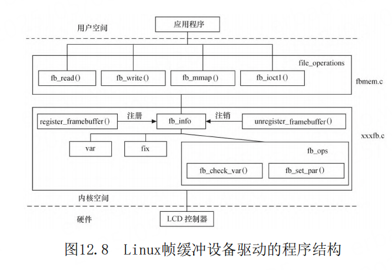
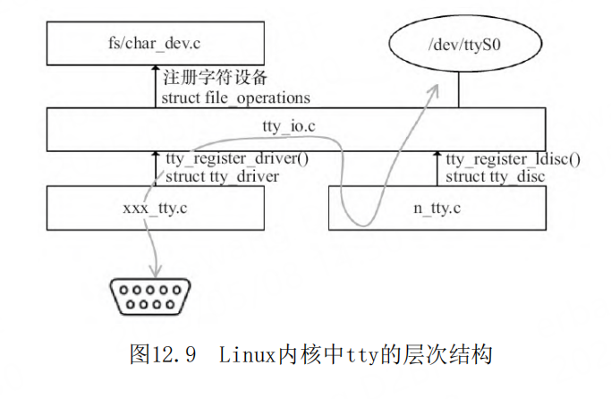

# 第12章 Linux设备驱动的软件架构思想

- P875
- platform设备
- RTC、Framebuffer、input、tty、混杂设备驱动
- SPI主机和外设驱动
- 于make menuconfig
- platform总线
- device_driver结构体
- i2c_driver、spi_driver、usb_driver、pci_driver
- 板文件
- platform_add_devices
- platform设备
- platform_device和platform_driver 匹配
- 设备树
- 挂接到了platform总线上
- /sys/bus/platform/drivers
- /sys/devices/platform
- platform设备资源和数据
- IORESOURCE_IO、IORESOURCE_MEM、IORESOURCE_IRQ、IORE-SOURCE_DMA
- input、RTC、Framebuffer
- 输入设备驱动
- input_event结构体
- input_event
- input_report_key
- input_report_rel
- input_report_abs
- input_sync
- gpio_keys.c
- drivers/input/keyboard/gpio_keys.c基于input架构实现了一个通用的GPIO按键驱动。
- RTC设备驱动
- Framebuffer设备驱动
- drivers/video/fbdev/core/fbmem.c
- 终端设备驱动 tty
- tty_operations
- tty_driver
- misc设备驱动
- Linux SPI主机和设备驱动
-
-
-

## 导读

在前面几章我们看到了globalmem、globalfifo这
样类型的简单的字符设备驱动，但是，纵观Linux内核
的源代码，读者几乎找不到有如此简单形式的驱动。

在实际的Linux驱动中，Linux内核尽量做得更
多，以便于底层的驱动可以做得更少。而且，也特别
强调了驱动的跨平台特性。因此，Linux内核势必会为
不同的驱动子系统设计不同的框架。

## Linux驱动的软件架构

Linux不是为了某单一电路板而设计的操作系统，
它可以支持约30种体系结构下一定数量的硬件，因
此，它的驱动架构很显然不能像RTOS下或者无操作系
统下那么小儿科的做法。

Linux设备驱动非常重视软件的可重用和跨平台能
力。譬如，如果我们写下一个DM9000网卡的驱动，
Linux的想法是这个驱动应该最好一行都不要改就可以
在任何一个平台上跑起来。为了做到这一点（看似很
难，因为每个板子连接DM9000的基地址，中断号什么
的都可能不一样），驱动中势必会有类似这样的代
码。

我们有没有办法把设备端的信息从驱动里面剥离出
来，让驱动以某种标准方法拿到这些平台信息呢Linux
总线、设备和驱动模型实际上可以做到这一点，驱动
只管驱动，设备只管设备，总线则负责匹配设备和驱
动，而驱动则以标准途径拿到板级信息，这样，驱动
就可以放之四海而皆准了。

Linux的字符设备驱动需要编写file_operations
成员函数，并负责处理阻塞、非组塞、多路复用、
SIGIO等复杂事物。但是，当我们面对一个真实的硬件
驱动时，假如要编写一个按键的驱动，作为一个“懒
惰”的程序员，你真的只想做最简单的工作，譬如，
收到一个按键中断、汇报一个按键值，至于什么
file_operations、几种I/O模型，那是Linux的事情，
为什么要我管Linux也是程序员写出来的，因此，程序
员怎么想，它必然要怎么做。于是，这里就衍生出来
了一个软件分层的想法，尽管file_operations、I/O
模型不可或缺，但是关于此部分的代码，全世界恐怕
所有的输入设备都是一样的，为什么不提炼一个中间
层出来，把这些事情搞定，也就是在底层编写驱动的
时候，搞定具体的硬件操作呢？

> Linux驱动的分层

主机控制器驱动不
关心外设，而外设驱动也不关心主机，外设只是访问
核心层的通用API进行数据传输，主机和外设之间可以
进行任意组合

## platform_device

在Linux 2.6以后的设备驱动模型中，需关心总
线、设备和驱动这3个实体，总线将设备和驱动绑定。
在系统每注册一个设备的时候，会寻找与之匹配的驱
动；相反的，在系统每注册一个驱动的时候，会寻找
与之匹配的设备，而匹配由总线完成。

一个现实的Linux设备和驱动通常都需要挂接在一
种总线上，对于本身依附于PCI、USB、I2C、SPI等的
设备而言，这自然不是问题，但是在嵌入式系统里
面，在SoC系统中集成的独立外设控制器、挂接在SoC
内存空间的外设等却不依附于此类总线。基于这一背
景，Linux发明了一种虚拟的总线，称为platform总
线，相应的设备称为platform_device，而驱动成为
platform_driver。

所谓的platform_device并不是与字符设
备、块设备和网络设备并列的概念，而是Linux系统提
供的一种附加手段，例如，我们通常把在SoC内部集成
的I2C、RTC、LCD、看门狗等控制器都归纳为
platform_device，而它们本身就是字符设备。

platform_driver 这个结构体中包含probe（）、
remove（）、一个device_driver实例、电源管理函数
suspend（）、resume（）

与platform_driver地位对等的i2c_driver、
spi_driver、usb_driver、pci_driver中都包含了
device_driver结构体实例成员。它其实描述了各种
xxx_driver（xxx是总线名）在驱动意义上的一些共性。

## 在设备驱动中引入platform的概念至少有如下好处

1）使得设备被挂接在一个总线上，符合Linux
2.6以后内核的设备模型。其结果是使配套的sysfs节
点、设备电源管理都成为可能。
2）隔离BSP和驱动。在BSP中定义platform设备和
设备使用的资源、设备的具体配置信息，而在驱动
中，只需要通过通用API去获取资源和数据，做到了板
相关代码和驱动代码的分离，使得驱动具有更好的可
扩展性和跨平台性。
3）让一个驱动支持多个设备实例。譬如DM9000的
驱动只有一份，但是我们可以在板级添加多份DM9000
的platform_device，它们都可以与唯一的驱动匹配。

## 设备驱动的分层思想

Linux内核完全是由C语言和汇编语言写成，但是
却频繁地用到了面向对象的设计思想。在设备驱动方
面，往往为同类的设备设计了一个框架，而框架中的
核心层则实现了该设备通用的一些功能。同样的，如
果具体的设备不想使用核心层的函数，也可以重写。

## 输入设备驱动

输入设备（如按键、键盘、触摸屏、鼠标等）是
典型的字符设备，其一般的工作机理是底层在按键、
触摸等动作发送时产生一个中断（或驱动通过Timer定
时查询），然后CPU通过SPI、I
2 C或外部存储器总线
读取键值、坐标等数据，并将它们放入一个缓冲区，
字符设备驱动管理该缓冲区，而驱动的read（）接口
让用户可以读取键值、坐标等数据。

显然，在这些工作中，只是中断、读键值/坐标值
是与设备相关的，而输入事件的缓冲区管理以及字符
设备驱动的file_operations接口则对输入设备是通用
的。基于此，内核设计了输入子系统，由核心层处理
公共的工作。

## RTC设备驱动

RTC（实时钟）借助电池供电，在系统掉电的情况
下依然可以正常计时。它通常还具有产生周期性中断
以及闹钟（Alarm）中断的能力，是一种典型的字符设
备。作为一种字符设备驱动，RTC需要有
file_operations中接口函数的实现，如open（）、
release（）、read（）、poll（）、ioctl（）等，
而典型的IOCTL包括RTC_SET_TIME、RTC_ALM_READ、
RTC_ALM_SET、RTC_IRQP_SET、RTC_IRQP_READ等，这
些对于所有的RTC是通用的，只有底层的具体实现是与
设备相关的。

## Framebuffer设备驱动

Framebuffer（帧缓冲）是Linux系统为显示设备
提供的一个接口，它将显示缓冲区抽象，屏蔽图像硬
件的底层差异，允许上层应用程序在图形模式下直接
对显示缓冲区进行读写操作。对于帧缓冲设备而言，
只要在显示缓冲区中与显示点对应的区域内写入颜色
值，对应的颜色会自动在屏幕上显示。

## 终端设备驱动

在Linux系统中，终端是一种字符型设备，它有多
种类型，通常使用tty（Teletype）来简称各种类型的
终端设备。对于嵌入式系统而言，最普遍采用的是
UART（Universal Asynchronous
Receiver/Transmitter）串行端口，日常生活中简称
串口。

Linux内核中tty的层次结构如图12.9所示，它包
含tty核心tty_io.c、tty线路规程n_tty.c（实现
N_TTY线路规程）和tty驱动实例xxx_tty.c，tty线路
规程的工作是以特殊的方式格式化从一个用户或者硬
件收到的数据，这种格式化常常采用一个协议转换的
形式。

tty设备发送数据的流程为：tty
核心从一个用户获取将要发送给一个tty设备的数据，
tty核心将数据传递给tty线路规程驱动，接着数据被
传递到tty驱动，tty驱动将数据转换为可以发送给硬
件的格式。接收数据的流程为：从tty硬件接收到的数
据向上交给tty驱动，接着进入tty线路规程驱动，再
进入tty核心，在这里它被一个用户获取。

## 驱动核心层

分析了上述多个实例，我们可以归纳出核心层肩
负的3大职责：
1）对上提供接口。file_operations的读、写、
ioctl都被中间层搞定，各种I/O模型也被处理掉了。
2）中间层实现通用逻辑。可以被底层各种实例共
享的代码都被中间层搞定，避免底层重复实现。
3）对下定义框架。底层的驱动不再需要关心
Linux内核VFS的接口和各种可能的I/O模型，而只需处
理与具体硬件相关的访问。

## 主机驱动与外设驱动分离

Linux中的SPI、I2C、USB等子系统都利用了典型
的把主机驱动和外设驱动分离的想法，让主机端只负
责产生总线上的传输波形，而外设端只是通过标准的
API来让主机端以适当的波形访问自身。因此这里面就
涉及了4个软件模块：
1）主机端的驱动。根据具体的I2C、SPI、USB等
控制器的硬件手册，操作具体的I2C、SPI、USB等控
制器，产生总线的各种波形。

2）连接主机和外设的纽带。外设不直接调用主机
端的驱动来产生波形，而是调一个标准的API。由这个
标准的API把这个波形的传输请求间接“转发”给了具
体的主机端驱动。当然，在这里，最好把关于波形的
描述也以某种数据结构标准化。

3）外设端的驱动。外设接在I2C、SPI、USB这样
的总线上，但是它们本身可以是触摸屏、网卡、声卡
或者任意一种类型的设备。我们在相关的
i2c_driver、spi_driver、usb_driver这种
xxx_driver的probe（）函数中去注册它具体的类型。
当这些外设要求I2C、SPI、USB等去访问它的时候，
它调用“连接主机和外设的纽带”模块的标准API。

4）板级逻辑。板级逻辑用来描述主机和外设是如
何互联的，它相当于一个“路由表”。假设板子上有
多个SPI控制器和多个SPI外设，那究竟谁接在谁上面
管理互联关系，既不是主机端的责任，也不是外设端
的责任，这属于板级逻辑的责任。这部分通常出现在
arch/arm/mach-xxx下面或者arch/arm/boot/dts下
面。

什么叫良好的软件设计一言以蔽之，让正确的代
码出现在正确的位置。不要在错误的时间、错误的地
点，编写一段错误的代码。在LKML中，关于代码出现
在错误的位置，常见的台词是代码“out of
place”。

Linux通过上述的设计方法，把一堆杂乱不友好的
代码变成了4个轻量级的小模块，每个模块都各得其
所。每个模块都觉得很“爽”
，站在主机端想一想，
它其实也是很“爽”的，因为它的职责本来就是产生
波形，而现在我们就让它只产生波形不干别的；站在
外设端想一想，它也变得一身轻松，因为它根本就不
需要知道自己接在主机的哪个控制器上，根本不关心
对方是张三、李四、王五还是六麻子；站在板级逻辑
的角度上，你做了一个板子，自己自然要知道谁接在
谁上面了。

