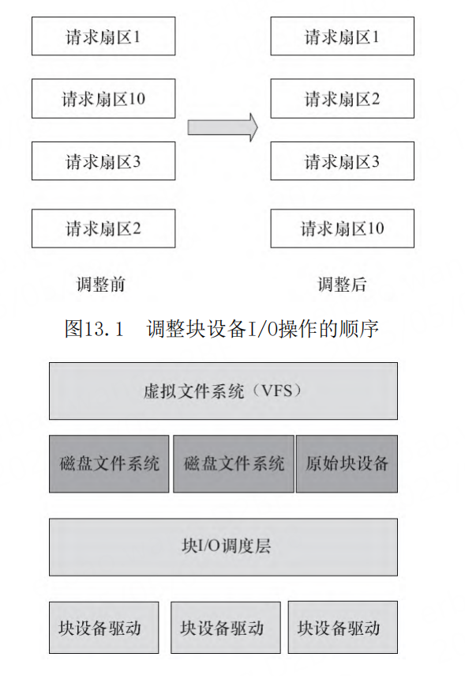

# 第13章 Linux块设备驱动

- P981
- block_device_operations结构体
- *open
- *release
- *ioctl
- *compat_ioctl
- *media_changed
- *check_events
- *revalidate_disk
- *getgeo
- gendisk结构体
- gendisk（通用磁盘）
- add_disk
- del_gendisk
- bio、request和request_queue
- bio_vec结构
-

## 导读

块设备是与字符设备并列的概念，这两类设备在
Linux中的驱动结构有较大差异，总体而言，块设备驱
动比字符设备驱动要复杂得多，在I/O操作上也表现出
极大的不同。缓冲、I/O调度、请求队列等都是与块设
备驱动相关的概念。本章将详细讲解Linux块设备驱动
的编程方法。

## 块设备的I/O操作特点

字符设备与块设备I/O操作的不同如下。

1）块设备只能以块为单位接收输入和返回输出，
而字符设备则以字节为单位。大多数设备是字符设
备，因为它们不需要缓冲而且不以固定块大小进行操
作。

2）块设备对于I/O请求有对应的缓冲区，因此它
们可以选择以什么顺序进行响应，字符设备无须缓冲
且被直接读写。对于存储设备而言，调整读写的顺序
作用巨大，因为在读写连续的扇区的存储速度比分离
的扇区更快。

3）字符设备只能被顺序读写，而块设备可以随机
访问。

虽然块设备可随机访问，但是对于磁盘这类机械
设备而言，顺序地组织块设备的访问可以提高性能，
如图13.1所示，对扇区1、10、3、2的请求被调整为对
扇区1、2、3、10的请求。

在Linux中，我们通常通过磁盘文件系统EXT4、
UBIFS等访问磁盘，但是磁盘也有一种原始设备的访问
方式，如直接访问/dev/sdb1等。所有的EXT4、
UBIFS、原始块设备又都工作于VFS之下，而EXT4、
UBIFS、原始块设备之下又包含块I/O调度层以进行排
序和合并（见图13.2）。

I/O调度层的基本目的是将请求按照它们对应在块
设备上的扇区号进行排列，以减少磁头的移动，提高
效率。

图13.2 Linux块设备子系统

