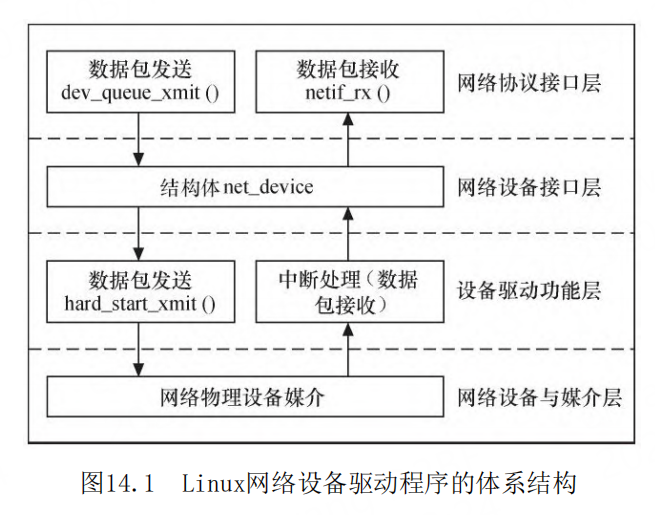
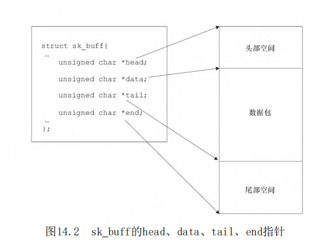

# 第14章 Linux网络设备驱动

- P1055
- Linux网络设备驱动的结构
- dev_queue_xmit
- 网络协议接口层
- int dev_queue_xmit(struct sk_buff *skb);
- netif_rx
- int netif_rx(struct sk_buff *skb);
- 套接字缓冲区 sk_buff
- skbuff.h
- alloc_skb
- dev_alloc_skb
- void kfree_skb(struct sk_buff *skb);
- void dev_kfree_skb(struct sk_buff *skb);
- void dev_kfree_skb_irq(struct sk_buff *skb);
- void dev_kfree_skb_any(struct sk_buff *skb);
- *skb_put
- skb_reserve
- net_device结构体
- base_addr为网络设备I/O基地址。
- irq为设备使用的中断号。
- if_port指定多端口设备使用哪一个端口，该字段仅针对多端口设备
- ETH_HLEN
- IFF _Interface Flags
- netdevice.h
- netdev_ops ethtool_ops、header_ops
- poll_controller
- NAPI（New API）
- register_netdev（）和 unregister_netdev（）
- net_device
- alloc_netdev_mqs  
- free_netdev alloc_enetdev
- 
- 
- 
- 
- 
- 
- 
- 
- 
- 
- 
- 
- 
- 
- 

## 网络设备

网络设备是完成用户数据包在网络媒介上发送和
接收的设备，它将上层协议传递下来的数据包以特定
的媒介访问控制方式进行发送，并将接收到的数据包
传递给上层协议。
与字符设备和块设备不同，网络设备并不对应
于/dev目录下的文件，应用程序最终使用套接字完成
与网络设备的接口。因而在网络设备身上并不能体现
出“一切都是文件”的思想。
Linux系统对网络设备驱动定义了4个层次，这4个
层次为网络协议接口层、网络设备接口层、提供实际
功能的设备驱动功能层和网络设备与媒介层。

## Linux网络设备驱动的结构



Linux网络设备驱动程序的体系结构如图14.1所
示，从上到下可以划分为4层，依次为网络协议接口
层、网络设备接口层、提供实际功能的设备驱动功能
层以及网络设备与媒介层，这4层的作用如下所示。

1）网络协议接口层向网络层协议提供统一的数据
包收发接口，不论上层协议是ARP，还是IP，都通过
dev_queue_xmit（）函数发送数据，并通过
netif_rx（）函数接收数据。这一层的存在使得上层
协议独立于具体的设备。

2）网络设备接口层向协议接口层提供统一的用于
描述具体网络设备属性和操作的结构体net_device，
该结构体是设备驱动功能层中各函数的容器。实际
上，网络设备接口层从宏观上规划了具体操作硬件的
设备驱动功能层的结构。

3）设备驱动功能层的各函数是网络设备接口层
net_device数据结构的具体成员，是驱使网络设备硬
件完成相应动作的程序，它通过hard_start_xmit（）
函数启动发送操作，并通过网络设备上的中断触发接
收操作。

4）网络设备与媒介层是完成数据包发送和接收的
物理实体，包括网络适配器和具体的传输媒介，网络
适配器被设备驱动功能层中的函数在物理上驱动。对
于Linux系统而言，网络设备和媒介都可以是虚拟的。

在设计具体的网络设备驱动程序时，我们需要完
成的主要工作是编写设备驱动功能层的相关函数以填
充net_device数据结构的内容并将net_device注册入
内核。

## sk_buff结构体

sk_buff结构体非常重要，它定义于
include/linux/skbuff.h文件中，含义为“套接字缓
冲区”，用于在Linux网络子系统中的各层之间传递数
据，是Linux网络子系统数据传递的“中枢神经”。

当发送数据包时，Linux内核的网络处理模块必须
建立一个包含要传输的数据包的sk_buff，然后将
sk_buff递交给下层，各层在sk_buff中添加不同的协
议头直至交给网络设备发送。同样地，当网络设备从
网络媒介上接收到数据包后，它必须将接收到的数据
转换为sk_buff数据结构并传递给上层，各层剥去相应
的协议头直至交给用户。

尤其值得注意的是head和end指向
缓冲区的头部和尾部，而data和tail指向实际数据的
头部和尾部。每一层会在head和data之间填充协议
头，或者在tail和end之间添加新的协议数据。


- [sk_buff结构体 资料来自cnblogs](https://www.cnblogs.com/ink-white/p/16814624.html)




```c
skb=alloc_skb(len+headspace, GFP_KERNEL);
skb_reserve(skb, headspace);
skb_put(skb,len);
memcpy_fromfs(skb->data,data,len);
pass_to_m_protocol(skb);
```
