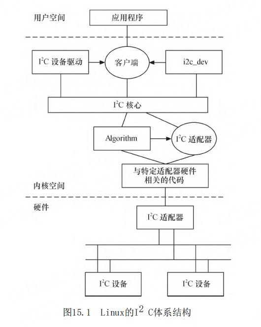

# 第15章 Linux I2C核心、总线与设备驱动

- P1138
- I2C核心
- I2C总线驱动
- i2c_adapter
- i2c_algorithm
- 探测设备、检测设备地址
- 适配器产生通信信号的函数
- i2c_driver
- i2c_client
- /sys/bus/i2c/
- 适配器地址和芯片地址
- i2c-core.c
- i2c-dev.c
- i2c-%d
- open（）、write（）、read（）、ioctl（）和close（）
- 内核中的i2c.h头文件对i2c_adapter、i2c_algorithm、i2c_driver和i2c_client
- I2C驱动的各种数据结构的关系
- platform_driver和platform_device
- i2cdev_read（） i2cdev_write（）
- I2C_RDWR IOCTL
- i2cdev_ioctl
- I2C_SLAVE 、I2C_RETRIES I2C_TIMEOU I2C_RDWR
- Tegra I2C总线驱动实例
- 
- 
- 
- 
- 
- 
- 
- 
- 
- 
- 
- 
- 
- 
- 
- 
- 
- 
- 
- 
- 
- 
- 

## 导读

I2 C总线仅仅使用SCL、SDA这两根信号线就实现
了设备之间的数据交互，极大地简化了对硬件资源和
PCB板布线空间的占用。因此，I2 C总线非常广泛地应
用在EEPROM、实时钟、小型LCD等设备与CPU的接口
中。
Linux系统定义了I2 C驱动体系结构。在Linux系
统中，I2 C驱动由3部分组成，即I2 C核心、I2 C总线
驱动和I2 C设备驱动。这3部分相互协作，形成了非常
通用、可适应性很强的I2 C框架。

## I2C

i2c-dev.c并不是针对特定的设备而设计的，只是
提供了通用的read（）、write（）和ioctl（）等接
口，应用层可以借用这些接口访问挂接在适配器上的
I2C设备的存储空间或寄存器，并控制I2 C设备的工作方式。

## i2c_adapter与i2c_algorithm

i2c_adapter与i2c_algorithm
i2c_adapter对应于物理上的一个适配器，而
i2c_algorithm对应一套通信方法。一个I2C适配器需
要i2c_algorithm提供的通信函数来控制适配器产生特
定的访问周期。缺少i2c_algorithm的i2c_adapter什
么也做不了，因此i2c_adapter中包含所使用的
i2c_algorithm的指针。

i2c_algorithm中的关键函数master_xfer（）用
于产生I2C访问周期需要的信号，以i2c_msg（即I2C
消息）为单位。i2c_msg结构体也是非常重要的，它定
义于include/uapi/linux/i2c.h（在uapi目录下，证
明用户空间的应用也可能使用这个结构体）中，代码
清单15.5给出了它的定义，其中的成员表明了I2C
的传输地址、方向、缓冲区、缓冲区长度等信息。

i2c_driver对应于一套驱动方法，其主要成员函
数是probe（）、remove（）、suspend（）、
resume（）等，另外，struct i2c_device_id形式的
id_table是该驱动所支持的I2C设备的ID表。
i2c_client对应于真实的物理设备，每个I2C设备都
需要一个i2c_client来描述。i2c_driver与
i2c_client的关系是一对多，一个i2c_driver可以支
持多个同类型的i2c_client。
i2c_client的信息通常在BSP的板文件中通过
i2c_board_info填充，如下面的代码就定义了一个I
2C设备的ID为“ad7142_joystick”
、地址为0x2C、中断号为IRQ_PF5的i2c_client

## i2c_adapter_xxx_readbytes i2c_adapter_xxx_writebytes

i2c_adapter_xxx_readbytes（）用于从从设备上
接收一串数据，i2c_adapter_xxx_writebytes（）用
于向从设备写入一串数据，这两个函数的内部也会涉
及I2C总线协议中的ACK应答。

