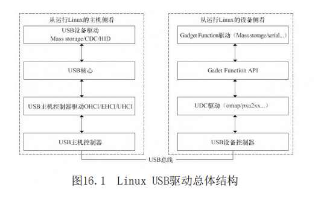
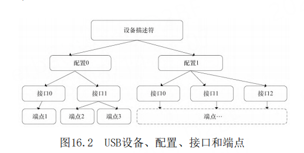

# 第16章 USB主机、设备与Gadget驱动

- P1204
- Chipidea USB主机
- 设备、配置、接口、端点
- 设备描述符
- 端点描述符
- 字符串描述符
- USB主机控制器驱动
- 
- 
- 
- 
- 
- 
- 
- 
- 
- 
- 
- 
- 
- 
- 
- 
- 
- 
- 
- 
- 
- 
- 
- 
- 
- 
- 
- 
- 
- 
- 
- 
- 
- 
- 
- 
- 
- 

## 导读

从主机侧的角度来看，需要编写的USB驱动程序包
括主机控制器驱动和设备驱动两类，USB主机控制器驱
动程序控制插入其中的USB设备，而USB设备驱动程序
控制该设备如何作为从设备与主机通信。

从设备侧的角度来看，包含编写USB设备控制器
（UDC）驱动和Gadget Function驱动两类

## Linux USB驱动总体结构

如图16.1的左侧所示，从主机侧去看，在Linux驱
动中，处于USB驱动最底层的是USB主机控制器硬件，
在其上运行的是USB主机控制器驱动，在主机控制器上
的为USB核心层，再上层为USB设备驱动层（插入主机
上的U盘、鼠标、USB转串口等设备驱动）。因此，在
主机侧的层次结构中，要实现的USB驱动包括两类：
USB主机控制器驱动和USB设备驱动，前者控制插入其
中的USB设备，后者控制USB设备如何与主机通信。

Linux内核中的USB核心负责USB驱动管理和协议处理的
主要工作。主机控制器驱动和设备驱动之间的USB核心
非常重要，其功能包括：通过定义一些数据结构、宏
和功能函数，向上为设备驱动提供编程接口，向下为
USB主机控制器驱动提供编程接口；维护整个系统的
USB设备信息；完成设备热插拔控制、总线数据传输控
制等。

如图16.1的右侧所示，Linux内核中USB设备侧驱
动程序分为3个层次：UDC驱动程序、Gadget Function
API和Gadget Function驱动程序。UDC驱动程序直接访
问硬件，控制USB设备和主机间的底层通信，向上层提
供与硬件相关操作的回调函数。当前Gadget Function
API是UDC驱动程序回调函数的简单包装。Gadget
Function驱动程序具体控制USB设备功能的实现，使设
备表现出“网络连接”、“打印机”或“USB Mass
Storage”等特性，它使用Gadget Function API控制
UDC实现上述功能。Gadget Function API把下层的UDC
驱动程序和上层的Gadget Function驱动程序隔离开，
使得在Linux系统中编写USB设备侧驱动程序时能够把
功能的实现和底层通信分离。

## 设备、配置、接口、端点

在USB设备的逻辑组织中，包含设备、配置、接口
和端点4个层次。

每个USB设备都提供不同级别的配置信息，可以包
含一个或多个配置，不同的配置使设备表现出不同的
功能组合（在探测/连接期间需从其中选定一个），配
置由多个接口组成。

在USB协议中，接口由多个端点组成，代表一个基
本的功能，是USB设备驱动程序控制的对象，一个功能
复杂的USB设备可以具有多个接口。每个配置中可以有
多个接口，而设备接口是端点的汇集
（Collection）。例如，USB扬声器可以包含一个音频
接口以及对旋钮和按钮的接口。一个配置中的所有接
口可以同时有效，并可被不同的驱动程序连接。每个
接口可以有备用接口，以提供不同质量的服务参数。

端点是USB通信的最基本形式，每一个USB设备接
口在主机看来就是一个端点的集合。主机只能通过端
点与设备进行通信，以使用设备的功能。在USB系统中
每一个端点都有唯一的地址，这是由设备地址和端点
号给出的。每个端点都有一定的属性，其中包括传输
方式、总线访问频率、带宽、端点号和数据包的最大
容量等。一个USB端点只能在一个方向上承载数据，从
主机到设备（称为输出端点）或者从设备到主机（称
为输入端点），因此端点可看作是一个单向的管道。
端点0通常为控制端点，用于设备初始化参数等。只要
设备连接到USB上并且上电，端点0就可以被访问。端
点1、2等一般用作数据端点，存放主机与设备间往来
的数据。

- 设备通常有一个或多个配置；
- 配置通常有一个或多个接口；
- 接口通常有一个或多个设置；
- 接口有零个或多个端点。

## 设备描述符

·设备描述符：关于设备的通用信息，如供应商
ID、产品ID和修订ID，支持的设备类、子类和适用的
协议以及默认端点的最大包大小等。在Linux内核中，
USB设备用usb_device结构体来描述，USB设备描述符
定义为usb_device_descriptor结构体，位于
include/uapi/linux/usb/ch9.h文件中

## 端点描述符

端点描述符：端点地址、方向和类型，支持的
最大包大小，如果是中断类型的端点则还包括轮询频
率。在Linux内核中，USB端点使用usb_host_endpoint
结构体来描述，而USB端点描述符定义为
usb_endpoint_descriptor结构体，

## 字符串描述符

字符串描述符：在其他描述符中会为某些字段
提供字符串索引，它们可被用来检索描述性字符串，
可以以多种语言形式提供。字符串描述符是可选的，
有的设备有，有的设备没有，字符串描述符对应于
usb_string_descriptor结构体，