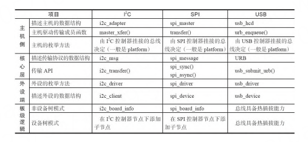

# 第17章 I2C、SPI、USB驱动架构类比

## I2C、SPI、USB驱动架构的类比

对于USB、PCI等总线而言，由于它们具备热插拔
能力，所以实际上不存在类似I
2 C、SPI这样的板级描
述信息。换句话说，即便是有这类信息，其实也没有
什么用，因为如果写了板子上有个U盘，但实际上没
有，其实反而是制造了麻烦；相反，如果没有写，U盘
一旦插入，Linux USB子系统会自动探测到一个U盘。
同时我们注意到，I
2 C、SPI、USB控制器虽然给
别人提供了总线，但是其实自己也是由它自身依附的
总线枚举出来的。比如，对于SoC而言，这些控制器一
般是直接集成在芯片内部，通过内存访问指令来访问
的，因此它们自身是通过platform_driver、
platform_device这种模型枚举进来的。

