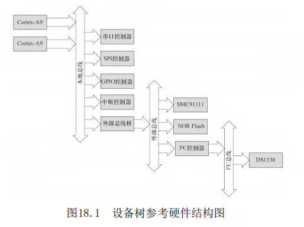

# 第18章 ARM Linux设备树


- P1311
- Linux设备树（Device Tree）
- OpenFirmware
- 节点（Node）和属性（Property）组成
- 设备树的组成和结构
- DTS、DTC和DTB等
- arch/arm/boot/dts/
- .dtsi
- 设备树参考硬件结构图
- DTC（Device Tree Compiler）
- DTB（Device Tree Blob）
- Bootloader
- Uboot设备
- fdt的其他命令就变得可以使用，如fdt resize、fdt print等。
- 根节点兼容性
- <manufacturer>，<model>。
- compatible = "acme，coyotes-revenge"
- compatible = "arm,vexpress,v2p-ca9", "arm,vexpress";
- 
- 
- 
- 
- 
- 
- 
- 
- 
- 
- 
- 
- 
- 
- 
- 
- 


## 设备树

设备树由一系列被命名的节点（Node）和属性
（Property）组成，而节点本身可包含子节点。所谓
属性，其实就是成对出现的名称和值。在设备树中，
可描述的信息包括（原先这些信息大多被硬编码在内
核中）：

- CPU的数量和类别。
- 内存基地址和大小。
- 总线和桥。
- 外设连接。
- 中断控制器和中断使用情况。
- GPIO控制器和GPIO使用情况。
- 时钟控制器和时钟使用情况。

它基本上就是画一棵电路板上CPU、总线、设备组
成的树，Bootloader会将这棵树传递给内核，然后内
核可以识别这棵树，并根据它展开出Linux内核中的
platform_device、i2c_client、spi_device等设备，
而这些设备用到的内存、IRQ等资源，也被传递给了内
核，内核会将这些资源绑定给展开的相应的设备。

## 设备树的组成和结构

```dts
/ {
    node1 {
        a-string-property = "A string";
        a-string-list-property = "first string", "second string";
        a-byte-data-property = [0x01 0x23 0x34 0x56];

        child-node1 {
            first-child-property;
            second-child-property = <1>;
            a-string-property = "Hello, world";
        };

        child-node2 {
        };
    };

    node2 {
        an-empty-property;
        a-cell-property = <1 2 3 4>; /* each number (cell) is a uint32 */

        child-node1 {
        };
    };
};
```

1个root节点"/"；root节点下面含一系列子节
点，本例中为node1和node2；节点node1下又含有一系
列子节点，本例中为child-node1和child-node2；各
节点都有一系列属性。这些属性可能为空，如anempty-property；
可能为字符串，如a-string￾property；可能为字符串数组，
如a-string-list￾property；可能为Cells（由u32整数组成），
如second-child-property；可能为二进制数，如abyte-data-property

## 设备树参考硬件结构图



1个双核ARM Cortex-A932位处理器；ARM本地总线
上的内存映射区域分布有两个串口（分别位于
0x101F1000和0x101F2000）、GPIO控制器（位于
0x101F3000）、SPI控制器（位于0x10170000）、中断
控制器（位于0x10140000）和一个外部总线桥；外部
总线桥上又连接了SMC SMC91111以太网（位于
0x10100000）、I2C控制器（位于0x10160000）、
64MB NOR Flash（位于0x30000000）；外部总线桥上
连接的I2C控制器所对应的I
2C总线上又连接了Maxim
DS1338实时钟（I2C地址为0x58）。

```dts
/ {
    compatible = "acme,coyotes-revenge";
    #address-cells = <1>;
    #size-cells = <1>;
    interrupt-parent = <&intc>;

    cpus {
        #address-cells = <1>;
        #size-cells = <0>;

        cpu@0 {
            compatible = "arm,cortex-a9";
            reg = <0>;
        };

        cpu@1 {
            compatible = "arm,cortex-a9";
            reg = <1>;
        };
    };

    serial@101f0000 {
        compatible = "arm,pl011";
        reg = <0x101f0000 0x1000>;
        interrupts = <1 0>;
    };

    serial@101f2000 {
        compatible = "arm,pl011";
        reg = <0x101f2000 0x1000>;
        interrupts = <2 0>;
    };

    gpio@101f3000 {
        compatible = "arm,pl061";
        reg = <0x101f3000 0x1000
               0x101f4000 0x0010>;
        interrupts = <3 0>;
    };

    intc: interrupt-controller@10140000 {
        compatible = "arm,pl190";
        reg = <0x10140000 0x1000>;
        interrupt-controller;
        #interrupt-cells = <2>;
    };

    spi@10115000 {
        compatible = "arm,pl022";
        reg = <0x10115000 0x1000>;
        interrupts = <4 0>;
    };

    external-bus {
        #address-cells = <2>;
        #size-cells = <1>;
        ranges = <
            0 0 0x10100000 0x10000     // Chipselect 1, Ethernet
            1 0 0x10160000 0x10000     // Chipselect 2, i2c controller
            2 0 0x30000000 0x1000000   // Chipselect 3, NOR Flash
        >;

        ethernet@0,0 {
            compatible = "smc,smc91c111";
            reg = <0 0 0x1000>;
            interrupts = <5 2>;
        };

        i2c@1,0 {
            compatible = "acme,a1234-i2c-bus";
            #address-cells = <1>;
            #size-cells = <0>;
            reg = <1 0 0x1000>;
            interrupts = <6 2>;

            rtc@58 {
                compatible = "maxim,ds1338";
                reg = <58>;
                interrupts = <7 3>;
            };
        };

        flash@2,0 {
            compatible = "samsung,k8f1315ebm", "cfi-flash";
            reg = <2 0 0x4000000>;
        };
    };
};

```

在上述.dts文件中，可以看出external-bus是根
节点的子节点，而I2C又是external-bus的子节点，
RTC又进一步是I2C的子节点。每一级节点都有一些属
性信息

## compatible

这个顶层设备的
兼容属性一般包括两个或者两个以上的兼容性字符
串，首个兼容性字符串是板子级别的名字，后面一个
兼容性是芯片级别（或者芯片系列级别）的名字


ARM Linux 3.x在引入设备树之后，
MACHINE_START变更为DT_MACHINE_START，其中含有一
个.dt_compat成员，用于表明相关的设备与.dts中根
节点的兼容属性兼容关系。如果Bootloader传递给内
核的设备树中根节点的兼容属性出现在某设备
的.dt_compat表中，相关的设备就与对应的兼容匹
配，从而引发这一设备的一系列初始化函数被执行


Linux倡导针对多个SoC、多个电路板的通用DT设
备，即一个DT设备的.dt_compat包含多个电路板.dts
文件的根节点兼容属性字符串。之后，如果这多个电
路板的初始化序列不一样，可以通过int
of_machine_is_compatible（const char*compat）
API判断具体的电路板是什么。在Linux内核中，常常
使用如下API来判断根节点的兼容性：

```c
int of_machine_is_compatible(const char *compat);
```


此API判断目前运行的板子或者SoC的兼容性，它
匹配的是设备树根节点下的兼容属性。例如
drivers/cpufreq/exynos-cpufreq.c中就有判断运行
的CPU类型是exynos4210、exynos4212、exynos4412还
是exynos5250的代码，进而分别处理，如代码清单
18.5所示。

