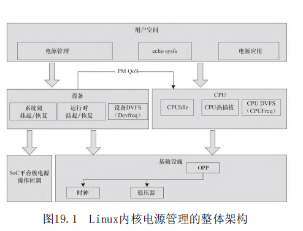

第19章 Linux电源管理的系统架构和驱动

- P1417
- CPUFreq、CPUIdle、CPU热插拔
- 底层的基础设施Regulator、OPP以及电源管理的调试工具PowerTop
- CPUFreq驱动
- DVFSDynamic Voltage Frequency Scaling，动态电压频率调整
- SoC的CPUFreq驱动实现
- intcpufreq_register_driver(struct cpufreq_driver *driver_data);
- cpufreq_driver结构体指针
- loops_per_jiffy
- target policy、target_freq和 relation
- regulator_set_voltage（）和clk_set_rate
- 
- 
- 
- 
- 
- 
- 
- 
- 
- 
- 
- 
- 
- 
- 
- 
- 
- 
- 
- 
- 
- 
- 
- 
- 
- 
- 
- 
- 
- 
- 
- 
- 
- 
- 
- 
- 
- 
- 
- 
- 
- 
- 
- 
- 
- 
- 

## 导读

1）CPU在运行时根据系统负载进行动态电压和频
率变换的CPUFreq。
2）CPU在系统空闲时根据空闲的情况进行低功耗
模式的CPUIdle。
3）多核系统下CPU的热插拔支持。
4）系统和设备针对延迟的特别需求而提出申请的
PM QoS，它会作用于CPUIdle的具体策略。
5）设备驱动针对系统挂起到RAM/硬盘的一系列入
口函数。
6）SoC进入挂起状态、SDRAM自刷新的入口。
7）设备的运行时动态电源管理，根据使用情况动
态开关设备。
8）底层的时钟、稳压器、频率/电压表（OPP模块
完成）支撑，各驱动子系统都可能用到。



## CPUFreq

CPUFreq子系统位于drivers/cpufreq目录下，负
责进行运行过程中CPU频率和电压的动态调整，即
DVFS（Dynamic Voltage Frequency Scaling，动态电
压频率调整）。运行时进行CPU电压和频率调整的原因
是：CMOS电路中的功耗与电压的平方成正比、与频率
成正比（P∝fV
2 ），因此降低电压和频率可降低功
耗。
CPUFreq的核心层位于
drivers/cpufreq/cpufreq.c下，它为各个SoC的
CPUFreq驱动的实现提供了一套统一的接口，并实现了
一套notifier机制，可以在CPUFreq的策略和频率改变
的时候向其他模块发出通知。另外，在CPU运行频率发
生变化的时候，内核的loops_per_jiffy常数也会发生
相应变化。

## SoC的CPUFreq驱动实现

每个SoC的具体CPUFreq驱动实例只需要实现电
压、频率表，以及从硬件层面完成这些变化

CPUFreq核心层提供了如下API以供SoC注册自身的
CPUFreq驱动

## cpufreq_driver结构体

```c
struct cpufreq_driver {
    struct module *owner;
    char name[CPUFREQ_NAME_LEN];
    u8 flags;

    /* needed by all drivers */
    int (*init)(struct cpufreq_policy *policy);
    int (*verify)(struct cpufreq_policy *policy);

    /* define one out of two */
    int (*setpolicy)(struct cpufreq_policy *policy);
    int (*target)(struct cpufreq_policy *policy,
                  unsigned int target_freq,
                  unsigned int relation);

    /* should be defined, if possible */
    unsigned int (*get)(unsigned int cpu);

    /* optional */
    unsigned int (*getavg)(struct cpufreq_policy *policy,
                           unsigned int cpu);
    int (*bios_limit)(int cpu, unsigned int *limit);

    int (*exit)(struct cpufreq_policy *policy);
    int (*suspend)(struct cpufreq_policy *policy);
    int (*resume)(struct cpufreq_policy *policy);
    
    struct freq_attr **attr;
};
```

根据芯片内部PLL和分频器的关系，ARM SoC一般
不具备独立调整频率的能力，往往SoC的CPUFreq驱动
会提供一个频率表，频率在该表的范围内进行变更，
因此一般实现target（）成员函数。

