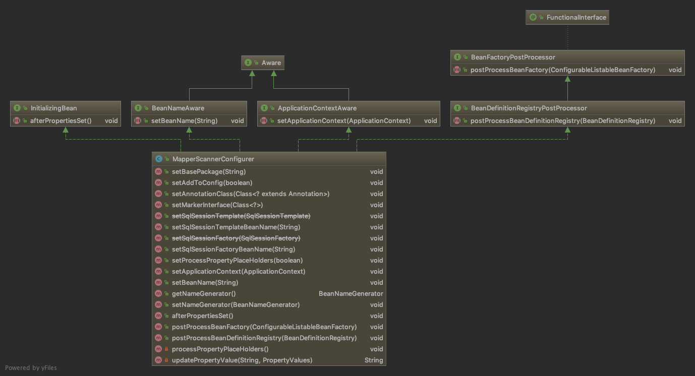

# mybatis spring config

> `mybatis` 与 `Spring` 的整合相关的类

- [mybatis spring config](#mybatis-spring-config)
  - [MapperScannerConfigurer](#mapperscannerconfigurer)
    - [MapperScannerConfigurer UML](#mapperscannerconfigurer-uml)
    - [postProcessBeanDefinitionRegistry](#postprocessbeandefinitionregistry)
    - [basePackage markerInterface annotationClass](#basepackage-markerinterface-annotationclass)
  - [ClassPathMapperScanner](#classpathmapperscanner)
    - [doScan](#doscan)
  - [MapperFactoryBean](#mapperfactorybean)
    - [MapperFactoryBean UML](#mapperfactorybean-uml)
    - [getObject](#getobject)

## MapperScannerConfigurer

### MapperScannerConfigurer UML



```java
public class MapperScannerConfigurer
implements
BeanDefinitionRegistryPostProcessor,
InitializingBean,
ApplicationContextAware,
BeanNameAware {
  // ...
}
```

| spring interface                      | 主要实现的方法                    |
| ------------------------------------- | --------------------------------- |
| `BeanDefinitionRegistryPostProcessor` | postProcessBeanDefinitionRegistry |
| `InitializingBean`                    | afterPropertiesSet                |
| `ApplicationContextAware`             | setApplicationContext             |
| `BeanNameAware`                       | setBeanName                       |

### postProcessBeanDefinitionRegistry

`postProcessBeanDefinitionRegistry` 是最重要的方法，用来注册 `bean`

```java
public void postProcessBeanDefinitionRegistry(BeanDefinitionRegistry registry) throws BeansException {
  if (this.processPropertyPlaceHolders) {
    processPropertyPlaceHolders();
  }
  ClassPathMapperScanner scanner = new ClassPathMapperScanner(registry);
  scanner.setAddToConfig(this.addToConfig);
  scanner.setAnnotationClass(this.annotationClass);
  scanner.setMarkerInterface(this.markerInterface);
  scanner.setSqlSessionFactory(this.sqlSessionFactory);
  scanner.setSqlSessionTemplate(this.sqlSessionTemplate);
  scanner.setSqlSessionFactoryBeanName(this.sqlSessionFactoryBeanName);
  scanner.setSqlSessionTemplateBeanName(this.sqlSessionTemplateBeanName);
  scanner.setResourceLoader(this.applicationContext);
  scanner.setBeanNameGenerator(this.nameGenerator);
  scanner.registerFilters();
  // 执行scan 方法
  scanner.scan(StringUtils.tokenizeToStringArray(this.basePackage, ConfigurableApplicationContext.CONFIG_LOCATION_DELIMITERS));
}
```

### basePackage markerInterface annotationClass

`basePackage` 参数

`annotationClass` 和 `markerInterface` 来控制 `basePackage` 那些类需要被当做 `mapper`

如果都为空，那么 `basePackage` 下面所以的 `interface` 都被当做 `mapper`

## ClassPathMapperScanner

### doScan

```java
// basePackages="cn.web1992.mybatiss.dal.dao","..."
public Set<BeanDefinitionHolder> doScan(String... basePackages) {
  Set<BeanDefinitionHolder> beanDefinitions = super.doScan(basePackages);
  if (beanDefinitions.isEmpty()) {
    logger.warn("No MyBatis mapper was found in '" + Arrays.toString(basePackages) + "' package. Please check your configuration.");
  } else {
    for (BeanDefinitionHolder holder : beanDefinitions) {
      GenericBeanDefinition definition = (GenericBeanDefinition) holder.getBeanDefinition();
      if (logger.isDebugEnabled()) {
        logger.debug("Creating MapperFactoryBean with name '" + holder.getBeanName() 
            + "' and '" + definition.getBeanClassName() + "' mapperInterface");
      }
      // the mapper interface is the original class of the bean
      // but, the actual class of the bean is MapperFactoryBean
      definition.getPropertyValues().add("mapperInterface", definition.getBeanClassName());
      definition.setBeanClass(MapperFactoryBean.class);
      definition.getPropertyValues().add("addToConfig", this.addToConfig);
      boolean explicitFactoryUsed = false;
      if (StringUtils.hasText(this.sqlSessionFactoryBeanName)) {
        definition.getPropertyValues().add("sqlSessionFactory", new RuntimeBeanReference(this.sqlSessionFactoryBeanName));
        explicitFactoryUsed = true;
      } else if (this.sqlSessionFactory != null) {
        definition.getPropertyValues().add("sqlSessionFactory", this.sqlSessionFactory);
        explicitFactoryUsed = true;
      }
      if (StringUtils.hasText(this.sqlSessionTemplateBeanName)) {
        if (explicitFactoryUsed) {
          logger.warn("Cannot use both: sqlSessionTemplate and sqlSessionFactory together. sqlSessionFactory is ignored.");
        }
        definition.getPropertyValues().add("sqlSessionTemplate", new RuntimeBeanReference(this.sqlSessionTemplateBeanName));
        explicitFactoryUsed = true;
      } else if (this.sqlSessionTemplate != null) {
        if (explicitFactoryUsed) {
          logger.warn("Cannot use both: sqlSessionTemplate and sqlSessionFactory together. sqlSessionFactory is ignored.");
        }
        definition.getPropertyValues().add("sqlSessionTemplate", this.sqlSessionTemplate);
        explicitFactoryUsed = true;
      }
      if (!explicitFactoryUsed) {
        if (logger.isDebugEnabled()) {
          logger.debug("Enabling autowire by type for MapperFactoryBean with name '" + holder.getBeanName() + "'.");
        }
        definition.setAutowireMode(AbstractBeanDefinition.AUTOWIRE_BY_TYPE);
      }
    }
  }
  return beanDefinitions;
}
```

## MapperFactoryBean

### MapperFactoryBean UML


### getObject

```java
public T getObject() throws Exception {
    return getSqlSession().getMapper(this.mapperInterface);
}
```
