# 第7章 事物

- ACID
- 原子性(atomicity)
- 一致性(consistency)
- 隔离性(isolation)
- 持久性(durability)
- 扁平事务(Flat Transactions)
- 带有保存点的扁平事务( Flat Transactions with Savepoints )
- 链事务(Chained Transactions )
- 嵌套事务(Nested Transactions )
- 分布式事务(Distributed Transactions )
- 重做日志缓冲(redo log buffer)
- 重做日志文件(redo log file)
- fsync 操作
- log block
- redo log 格式
- log group
- LSN Log Sequence Number (日志序列号)
- undo log 格式
- insert undo log
- update undo log
- purge 操作
- MVCC 事物引用 undo log
- 两阶段提交： 二进制日志+undo log 
- Binary Log Group Commit (BLGC)
- 事物中出现异常，事物并不会自动回滚，需要明确的执行 ROLLBACK 动作进行回滚
- 隐式提交的SQL语句
- 事物隔离级别
- LOCK IN SHARE MODE，每个读取操作加一个共享锁。
- STATEMENT 基于SQL 的日志（不建议使用）
- ROW格式的二进制 （建议使用） 
- XA 事物
- 长事物

## BLGC Binary Log Group Commit

在MySQL数据库上层进行提交时首先按顺序将其放人一个队列中，队列中的第一
个事务称为leader,其他事务称为follower, leader 控制着follower 的行为。BLGC的步

骤分为以下三个阶段:
- Flush阶段，将每个事务的二进制日志写人内存中。
- Sync阶段，将内存中的二进制日志刷新到磁盘，若队列中有多个事务，那么仅一次fsync操作就完成了二进制日志的写人，这就是BLGC。
- Commit阶段，leader 根据顺序调用存储引擎层事务的提交，InnoDB存储引擎本就支持group commit， 因此修复了原先由于锁prepare_commit_mutex 导致 group commit失效的问题。

当有一组事务在进行Commit阶段时，其他新事物可以进行Flush阶段，从而使
group commit不断生效。当然group commit的效果由队列中事务的数量决定，若每次
队列中仅有一个事务，那么可能效果和之前差不多，甚至会更差。但当提交的事务越多
时，group commit的效果越明显，数据库性能的提升也就越大。

> 🐶备注🐶
> 本质解决的问题： 二进制日志与InnoDB存储引擎undo log的顺序问题。

## 隐式提交的SQL语句

以下这些SQL语句会产生一个隐式的提交操作，即执行完这些语句后，会有一个隐式的COMMIT操作。
DDL语句: ALTER DATABASE...UPGRADE DATA DIRECTORY NAME,
ALTER EVENT, ALTER PROCEDURE, ALTER TABLE, ALTER VIEW,
CREATE DATABASE, CREATE EVENT, CREATE INDEX, CREATE
PROCEDURE, CREATE TABLE, CREATE TRIGGER, CREATE VIEW ,
DROP DATABASE, DROP EVENT, DROP INDEX, DROP PROCEDURE,
DROP TABLE, DROP TRIGGER, DROP VIEW, RENAME TABLE,
TRUNCATE TABLE.

用来隐式地修改MySQL架构的操作: CREATE USER、DROP USER、GRANT、ENAME USER、 REVOKE SET PASSWORD.

管理语句: ANALYZE TABLE、 CACHE INDEX、 CHECK TABLE、 LOAD INDEX INTO CACHE、 OPTIMIZE TABLE、 REPAIR TABLE.

## 事物隔离级别

InnoDB存储引擎默认支持的隔离级别是REPEATABLE READ，但是与标准SQL不同的是，InnoDB 存储引擎在REPEATABLE READ事务隔离级别下，
使用Next-Key Lock锁的算法，因此避免幻读的产生。这与其他数据库系统(如Microsoft SQL Server数据库)是不同的。
所以说，InnoDB 存储引擎在默认的REPEATABLE READ的事务隔离级别下已经能完全保证事务的隔离性要求，即达到SQL标准的SERIALIZABLE隔离级别。

## XA

最为常见的内部XA事务存在于binlog与InnoDB存储引擎之间。由于复制的需要，因此目前绝大多数的数据库都开启了binlog 功能。在事务提交时，先写二进制日志，再写InnoDB存储引擎的重做日志。对上述两个操作的要求也是原子的，即二进制日志和重做日志必须同时写人。若二进制日志先写了，而在写人InnoDB存储引擎时发生了宕机，那么slave可能会接收到master传过去的二进制日志并执行，最终导致了主从不一致的情况。

在图7-23中，如果执行完①、②后在步骤③之前MySQL数据库发生了宕机，则会发生主从不一致的情况。为了解决这个问题，MySQL数据库在binlog与InnoDB存储引擎之间采用XA事务。
当事务提交时，InnoDB存储引擎会先做一个PREPARE操作，将事务的xid写入，接着进行二进制日志的写人，如图7-24所示。
如果在InnoDB存储引擎提交前，MySQL数据库宕机了，那么MySQL数据库在重启后会先检查准备的UXID事务是否已经提交，若没有，则在存储引擎层再进行一次提交操作。

图7-23宕机导致 replication主从不一致的情况

图7-24 MySQL数据库通过内部XA事务保证主从数据一致

> XA 此处主要解决 binlog 与 redo log 的不一致

## 不好的事物习惯

- 在循环中提交
- 使用自动提交
- 使用自动回滚