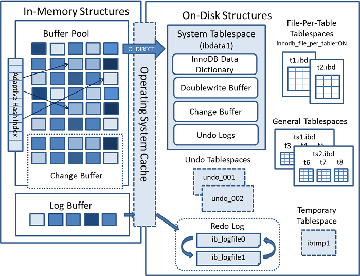

# 第8章 数据的家-MySQL的数据目录

- 存储引擎
- 文件系统
- 数据目录
- `SHOW VARIABLES LIKE 'datadir';`
- db.opt
- 系统表空间（system tablespace）
- 表名.frm 用于描述表结构的文件
- 系统表空间（system tablespace）
- 索引即数据，数据即索引
- 表空间 / 文件空间
- ibdata 自扩展文件
- innodb_data_file_path 和 innodb_data_home_dir
- 独立表空间(file-per-table tablespace)
- 表名.ibd (数据+索引)
- （general tablespace）、undo表空间（undo tablespace）、临时表空间（temporary tablespace）
- test.MYD 代表表的数据文件，也就是我们插入的用户记录； test.MYI 代表表的索引文件
- 视图  视图名.frm
- 查询日志、错误日志、二进制日志、redo日志

> Mysql innodb 架构

## MySQL 自带的数据库

- mysql
- information_schema
- performance_schema
- sys