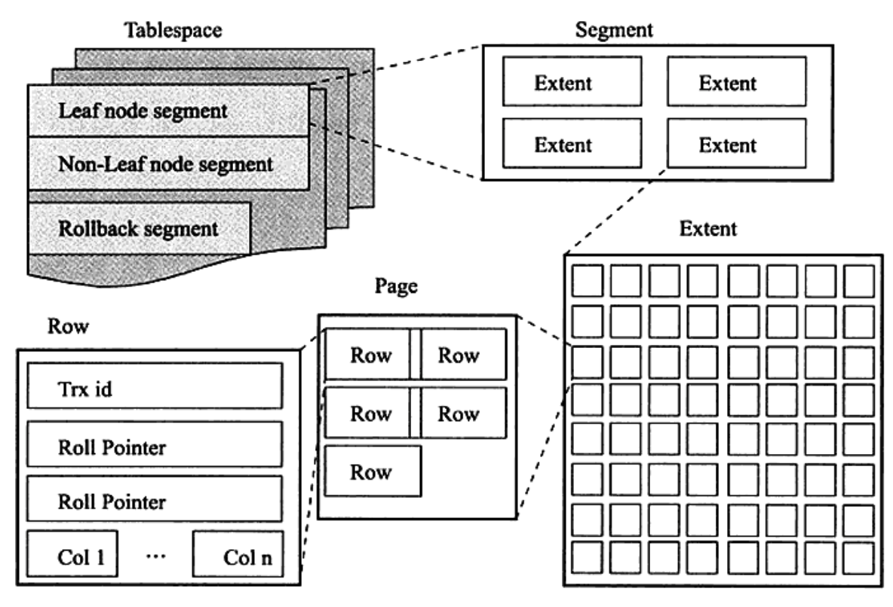

# InnoDB

## innodb-data-struct

## innodb-architecture

## Buffer Pool

## Links

- [https://dev.mysql.com/doc/refman/5.7/en/innodb-architecture.html](https://dev.mysql.com/doc/refman/5.7/en/innodb-architecture.html)
