# MySQL 锁的概述

## 提出问题

> 为什么需要锁？

数据库系统使用锁是为了支持对共享资源进行并发访问,提供数据的`完整性`和`一致性`。

## 锁的分类

InnoDB存储引擎实现了如下两种标准的行级锁:

- 共享锁(S Lock)，允许事务读一行数据。
- 排他锁(X Lock)，允许事务删除或更新一行数据。

> 意向锁

此外，InnoDB 存储引擎支持多粒度(granular)锁定，这种锁定允许事务在行级上的
锁和表级上的锁同时存在。为了支持在不同粒度上进行加锁操作，InnoDB 存储引擎支持
一种额外的锁方式，称之为意向锁(Intention Lock)。意向锁是将锁定的对象分为多个层
次，意向锁意味着事务希望在更细粒度(fine granularity)上进行加锁，如图所示。

> 锁对象

表、页、行



> 意向共享锁 意向排他锁

- 1)意向共享锁(IS Lock),事务想要获得一张表中某几行的共享锁
- 2)意向排他锁(IX Lock)，事务想要获得一张表中某几行的排他锁

当我们在对使用 InnoDB 存储引擎的表的某些记录加 S锁 之前，那就需要先在表级别加一个 IS锁 ，当我们
在对使用 InnoDB 存储引擎的表的某些记录加 X锁 之前，那就需要先在表级别加一个 IX锁 。 IS锁 和 IX锁
的使命只是为了后续在加表级别的 S锁 和 X锁 时判断表中是否有已经被加锁的记录，以避免用遍历的方式来
查看表中有没有上锁的记录


## 锁的实现 (3种算法)

- Record Lock: 单个行记录上的锁
- Gap Lock: 间隙锁，锁定一个范围，但不包含记录本身
- Next-Key Lock : Gap Lock + Record Lock, 锁定一个范围，并且锁定记录本身

Next-Key Lock降级为Record Lock仅在查询的列是唯一索引的情况下。

## 锁解决的问题

SQL标准 规定不同隔离级别下可能发生的问题不一样：
- 在 READ UNCOMMITTED 隔离级别下， 脏读 、 不可重复读 、 幻读 都可能发生。
- 在 READ COMMITTED 隔离级别下， 不可重复读 、 幻读 可能发生， 脏读 不可以发生。
- 在 REPEATABLE READ 隔离级别下， 幻读 可能发生， 脏读 和 不可重复读 不可以发生。
- 在 SERIALIZABLE 隔离级别下，上述问题都不可以发生。

不过各个数据库厂商对 SQL标准 的支持都可能不一样，与 SQL标准 不同的一点就是， MySQL 在REPEATABLE READ 隔离级别实际上就已经解决了幻读 问题。

- 幻读 (Phantom Problem) 是指在同一事务下，连续执行两次同样的SQL语句可能导致不同的结果，第二次的SQL语句可能会返回之前不存在的行。
- 脏度 (Dirty Read) 即一个事务可以读到另外一个事务中未提交的数据，则显然违反了数据库的隔离性。
- 不可重复度

> 不可重复读

不可重复读是指在一个事务内多次读取同一数据集合。在这个事务还没有结束时，另外一个事务也访问该同一数据集合，并做了一些DML操作。因此，在第一个事务中的两次读数据之间，
由于第二个事务的修改，那么第一个事务两次读到的数据可能是不一样的。这样就发生了在一个事务内两次读到的数据是不一样的情况，这种情况称为不可重复读。

不可重复读和脏读的区别是:脏读是读到未提交的数据，而不可重复读读到的却是已经提交的数据，但是其违反了数据库事务一致性的要求。

一般来说，不可重复读的问题是可以接受的，因为其读到的是已经提交的数据，本身并不会带来很大的问题。
很多数据库将其数据库事务的默认隔离级别设置为READ COMMITTED,在这种隔离级别下允许不可重复读的现象。

在InnoDB存储引擎中，通过使用Next-Key Lock算法来避免不可重复读的问题。在MySQL官方文档中将不可重复读的问题定义为Phantom Problem，即幻像问题。
在Next-Key Lock算法下，对于索引的扫描，不仅是锁住扫描到的索引，而且还锁住这些索引覆盖的范围(gap)。
因此在这个范围内的插人都是不允许的。这样就避免了另外的事务在这个范围内插人数据导致的不可重复读的问题。
因此，InnoDB 存储引擎的默认事务隔离级别是READ REPEATABLE,采用Next-Key Lock算法，避免了不可重复读的现象。

怎么解决 脏读 、 不可重复读 、 幻读 这些问题呢？其实有两种可选的解决方案：

- 方案一：读操作利用多版本并发控制（MVCC），写操作进行加锁 。
- 方案二：读、写操作都采用加锁的方式

> MVCC

我们说过普通的SELECT语句在READ COMMITTED和REPEATABLE READ隔离级别下会使用到MVCC
读取记录。在READ COMMITTED隔离级别下，一个事务在执行过程中每次执行SELECT操作时都会
生成一个ReadView，ReadView的存在本身就保证了事务不可以读取到未提交的事务所做的更
改，也就是避免了脏读现象；REPEATABLE READ隔离级别下，一个事务在执行过程中只有第一
次执行SELECT操作才会生成一个ReadView，之后的SELECT操作都复用这个ReadView，这样也就
避免了不可重复读和幻读的问题。

## 锁SQL

- SELECT ... FOR UPDATE (X锁)
- SELECT ... LOCK IN SHARE MODE (S锁)

> 一致性读（Consistent Reads）

事务利用 MVCC 进行的读取操作称之为 一致性读 ，或者 一致性无锁读 ，有的地方也称之为`快照读`

> 锁定读（Locking Reads）

我们前边说在采用 加锁 方式解决 脏读 、 不可重复读 、 幻读 这些问题时，读取一条记录时需要获取一下该记录的 S锁 ，其实这是不严谨的，有时候想在读取记录时就获取记录的 X锁 ，来禁止别的事务读写该记录，为此设计 MySQL 的提出了两种比较特殊的 SELECT 语句格式：

对读取的记录加 S锁 ：
```sql
SELECT ... LOCK IN SHARE MODE
```
也就是在普通的 SELECT 语句后边加 LOCK IN SHARE MODE ，如果当前事务执行了该语句，那么它会为读取到
的记录加 S锁 ，这样允许别的事务继续获取这些记录的 S锁 （比方说别的事务也使用 SELECT ... LOCK IN
SHARE MODE 语句来读取这些记录），但是不能获取这些记录的 X锁 （比方说使用 SELECT ... FOR UPDATE
语句来读取这些记录，或者直接修改这些记录）。如果别的事务想要获取这些记录的 X锁 ，那么它们会阻
塞，直到当前事务提交之后将这些记录上的 S锁 释放掉。

对读取的记录加 X锁 ：
```sql
SELECT ... FOR UPDATE;
```
也就是在普通的 SELECT 语句后边加 FOR UPDATE ，如果当前事务执行了该语句，那么它会为读取到的记录
加 X锁 ，这样既不允许别的事务获取这些记录的 S锁 （比方说别的事务使用 SELECT ... LOCK IN SHARE
MODE 语句来读取这些记录），也不允许获取这些记录的 X锁 （比方也说使用 SELECT ... FOR UPDATE 语句
来读取这些记录，或者直接修改这些记录）。如果别的事务想要获取这些记录的 S锁 或者 X锁 ，那么它们会
阻塞，直到当前事务提交之后将这些记录上的 X锁 释放掉。

> 阻塞

在InnoDB存储引擎中，参数innodb_lock_wait_timeout 用来控制等待的时间(默认是50秒)，`innodb_rollback_on_timeout`用来设定是否在等待超时时对进行中的事务进行
回滚操作( 默认是OFF，代表不回滚)。参数innodb_lock_wait_timeout 是动态的，可以再运行时调整。

需要牢记的是，在默认情况下InnoDB存储引擎不会回滚超时引发的错误异常。其实InnoDB存储引擎在大部分情况下都不会对异常进行回滚。


> 死锁

死锁是指两个或两个以上的事务在执行过程中，因争夺锁资源而造成的一种互相等待的现象。若无外力作用，事务都将无法推进下去。

可通过 `show engine innodb status;` 命令查询死锁信息。

## Links

- [死锁问题分析](https://mp.weixin.qq.com/s/DnCc5NIrMzvJuTF_xN6RYQ)
