# NACOS 阿里云

> 关键字

- AP 系统
- 配置推送（3秒以内，大规模集群）
- 服务注册、服务发现与配置管理（配置中心）
- NACOS设计，架构，实现
- 服务发下与管理
- 动态DNS服务
- 动态配置服务
- Nacos 2.0 长链接协议
- 配置(Configuration)
- 配置管理 (Configuration Management)
- 配置服务 (Configuration Service)
- 配置项（Configuration Item）
- 配置集（Configuration Set）
- 命名空间（Namespace）用于进行租户粒度的配置隔离。 例如开发测试环境和生产环境的资源 （如数据库配置、限流阈值、降级开关）隔离等
- 配置组（Group）
- 配置 ID（Data ID） Data ID 通常用于划分系统的配 置集
- 配置快照（Configuration Snapshot）
- Nacos ⼀致性协议
- 共识算法
- 为什么 Nacos 选择了 Raft 以及 Distro
- AP、CP 协议下沉到
- ⼀致性协议抽象
- Response getData(ReadRequest request) throws Exception;
- Response write(WriteRequest request) throws Exception;
- —数据存储抽象
- KvStorage
- Nacos 长链接
- 低成本快速感知
- 服务-集群-实例的三层模型
- 分临时实例 持久化实例
- 服务端的负载均衡 VS 客户端的负载均衡
- 双机房容灾
- 异地多活
- 多数据中心
- 用户扩展性
- Nacos 支持的 DNS 协议
- 服务（Service）和服务实例（Instance）
- 服务元数据
- 定义实例
- 实例定义（临时）和实例元数据（可持久，可临时）
- 集群（Cluster）

## Nacos 优势

- 易⽤：简单的数据模型，标准的 restfulAPI，易用的控制台，丰富的使用文档。 
- 稳定：99.9% 高可用，脱胎于历经阿里巴巴 10 年生产验证的内部产品，支持具有数百万服务的大 规模场景，具备企业级 SLA 的开源产品。 
- 实时：数据变更毫秒级推送生效；1w 级，SLA 承诺 1w 实例上下线 1s，99.9% 推送完成；10w 级，SLA 承诺 1w 实例上下线 3s，99.9% 推送完成；100w 级别，SLA 承诺 1w 实例上下线 9s 99.9% 推送完成。
- 规模：十万级服务/配置，百万级连接，具备强大扩展性。

## 设计原则

-  极简原则，简单才好用，简单才稳定，简单才易协作。
-  架构⼀致性，⼀套架构要能适应开源、内部、商业化（公有云及专有云）3 个场景。
-  扩展性，以开源为内核，商业化做基础，充分扩展，方便用户扩展。
-  模块化，将通用部分抽象下沉，提升代码复用和健壮性。
-  长期主义，不是要⼀个能支撑未来 3 年的架构，而是要能够支撑 10 年的架构。
-  开放性，设计和讨论保持社区互动和透明，方便大家协作。

## 业务层 

-  服务管理：实现服务 CRUD，域名 CRUD，服务健康状态检查，服务权重管理等功能。 
-  配置管理：实现配置管 CRUD，版本管理，灰度管理，监听管理，推送轨迹，聚合数据等功能。
-  元数据管理：提供元数据 CURD 和打标能力，为实现上层流量和服务灰度非常关键。

## 内核层 

-  插件机制：实现三个模块可分可合能力，实现扩展点 SPI 机制，用于扩展自己公司定制。 
-  事件机制：实现异步化事件通知，SDK 数据变化异步通知等逻辑，是 Nacos 高性能的关键部分。 
-  日志模块：管理日志分类，日志级别，日志可移植性（尤其避免冲突），日志格式，异常码+帮 助文档。 
-  回调机制：SDK 通知数据，通过统⼀的模式回调用户处理。接口和数据结构需要具备可扩展性。 
-  寻址模式：解决 Server IP 直连，域名访问，Nameserver 寻址、广播等多种寻址模式，需要可 扩展。 
-  推送通道：解决 Server 与存储、Server 间、Server 与 SDK 间高效通信问题。 
-  容量管理：管理每个租户，分组下的容量，防止存储被写爆，影响服务可用性。 
-  流量管理：按照租户，分组等多个维度对请求频率，长链接个数，报文大小，请求流控进行控制。 
-  缓存机制：容灾目录，本地缓存，Server 缓存机制，是 Nacos 高可用的关键。 
-  启动模式：按照单机模式，配置模式，服务模式，DNS 模式模式，启动不同的模块。 
-  ⼀致性协议：解决不同数据，不同⼀致性要求情况下，不同⼀致性要求，是 Nacos 做到 AP 协 议的关键。 
-  存储模块：解决数据持久化、非持久化存储，解决数据分片问题。

## Nacos 配置管理的基础模型

1. Nacos 提供可视化的控制台，可以对配置进行发布、更新、删除、灰度、版本管理等功能。
2. SDK 可以提供发布配置、更新配置、监听配置等功能。
3. SDK 通过 GRPC 长连接监听配置变更，Server 端对比 Client 端配置的 MD5 和本地 MD5 是否相等，不相等推送配置变更。
4. SDK 会保存配置的快照，当服务端出现问题的时候从本地获取。

## Nacos ⼀致性协议

> 为什么 Nacos 需要⼀致性协议

 Nacos 在开源支持就定下了⼀个目标，尽可能的减少用户部署以及运维成本，做到用户只需要⼀个 程序包，就可以快速以单机模式启动 Nacos 或者以集群模式启动 Nacos。而 Nacos 是⼀个需要 存储数据的⼀个组件，因此，为了实现这个目标，就需要在 Nacos 内部实现数据存储。单机下其 实问题不大，简单的内嵌关系型数据库即可；但是集群模式下，就需要考虑如何保障各个节点之间 的数据⼀致性以及数据同步，而要解决这个问题，就不得不引入共识算法，通过算法来保障各个节 点之间的数据的⼀致性。

 ## 为什么 Nacos 选择了 Raft 以及 Distro

 为什么 Nacos 会在单个集群中同时运行 CP 协议以及 AP 协议呢？这其实要从 Nacos 的场景出 发的：Nacos 是⼀个集服务注册发现以及配置管理于⼀体的组件，因此对于集群下，各个节点之间 的数据⼀致性保障问题，需要拆分成两个方面 
 
 - 从服务注册发现来看

服务发现注册中心，在当前微服务体系下，是十分重要的组件，服务之间感知对方服务的当前可正 常提供服务的实例信息，必须从服务发现注册中心进行获取，因此对于服务注册发现中心组件的可 用性，提出了很高的要求，需要在任何场景下，尽最大可能保证服务注册发现能力可以对外提供服 务；同时 Nacos 的服务注册发现设计，采取了心跳可自动完成服务数据补偿的机制。如果数据丢 失的话，是可以通过该机制快速弥补数据丢失。

因此，为了满足服务发现注册中心的可用性，强⼀致性的共识算法这里就不太合适了，因为强⼀致 性共识算法能否对外提供服务是有要求的，如果当前集群可用的节点数没有过半的话，整个算法直 接`罢工`，而最终⼀致共识算法的话，更多保障服务的可用性，并且能够保证在⼀定的时间内各个节点之间的数据能够达成⼀致。上述的都是针对于 Nacos 服务发现注册中的非持久化服务而言（即需要客户端上报心跳进行服务实 例续约）。而对于 Nacos 服务发现注册中的持久化服务，因为所有的数据都是直接使用调用 Nacos 服务端直接创建，因此需要由 Nacos 保障数据在各个节点之间的强⼀致性，故而针对此类型的服务数据，选择了强⼀致性共识算法来保障数据的⼀致性。

- 从配置管理来看
 配置数据，是直接在 Nacos 服务端进行创建并进行管理的，必须保证大部分的节点都保存了此配 置数据才能认为配置被成功保存了，否则就会丢失配置的变更，如果出现这种情况，问题是很严重的，如果是发布重要配置变更出现了丢失变更动作的情况，那多半就要引起严重的现网故障了，因此对于配置数据的管理，是必须要求集群中大部分的节点是强⼀致的，而这里的话只能使用`强⼀致 性共识算法`。

> 核心：是否能容忍数据丢失，如果不能就是使用 `强⼀致 性共识算法`。

为什么是 Raft 和 Distro 呢 对于强⼀致性共识算法，当前工业生产中，最多使用的就是 Raft 协议，Raft 协议更容易让人理解， 并且有很多成熟的工业算法实现，比如蚂蚁金服的 JRaft、Zookeeper 的 ZAB、Consul 的 Raft、 百度的 braft、Apache Ratis；因为 Nacos 是 Java 技术栈，因此只能在 JRaft、ZAB、Apache Ratis 中选择，但是 ZAB 因为和 Zookeeper 强绑定，再加上希望可以和 Raft 算法库的支持团队 随时沟通交流，因此选择了 JRaft，选择 JRaft 也是因为 JRaft 支持多 RaftGroup，为 Nacos 后 面的多数据分片带来了可能。

而 Distro 协议是阿里巴巴自研的⼀个最终⼀致性协议，而最终⼀致性协议有很多，比如 Gossip、 Eureka 内的数据同步算法。而 Distro 算法是集 Gossip 以及 Eureka 协议的优点并加以优化而出 来的，对于原生的 Gossip，由于随机选取发送消息的节点，也就不可避免的存在消息重复发送给同 ⼀节点的情况，增加了网络的传输的压力，也给消息节点带来额外的处理负载，而 Distro 算法引入 了权威 Server 的概念，每个节点负责⼀部分数据以及将自己的数据同步给其他节点，有效的降低 了消息冗余的问题。

## Distro 协议的主要设计思想

- Nacos 每个节点是平等的都可以处理写请求，同时把新数据同步到其他节点。 
- 每个节点只负责部分数据，定时发送自己负责数据的校验值到其他节点来保持数据⼀致性。 
- 每个节点独立处理读请求，及时从本地发出响应。

## 网络问题

- 低成本快速感知：客户端需要在服务端不可用时尽快地切换到新的服务节点，降低不可用时间， 并且能够感知底层连接切换事件，重置上下文；服务端需要在客户端断开连接时剔除客户端连接 对应的上下文，包括配置监听，服务订阅上下文，并且处理客户端连接对应的实例上下线。 ○ 客户端正常重启：客户端主动关闭连接，服务端实时感知 ○ 服务端正常重启 : 服务端主动关闭连接，客户端实时感知 
-  防抖： ○ 网络短暂不可用: 客户端需要能接受短暂网络抖动，需要⼀定重试机制，防止集群抖动，超过 阈值后需要自动切换 server，但要防止请求风暴。 
-  断网演练：断网场景下，以合理的频率进行重试，断网结束时可以快速重连恢复

## 服务模型

## ⼀致性协议

不过从协议层面上看，⼀致性的选型已经很长时间没有新的成员加入了。目前来看基本 可以归为两家：⼀种是基于 Leader 的非对等部署的单点写⼀致性，⼀种是对等部署的多写⼀致性。

当我们选用服务注册中心的时候，并没有⼀种协议能够覆盖所有场景，例如当注册的服务节点不会 定时发送心跳到注册中心时，强⼀致协议看起来是唯⼀的选择，因为无法通过心跳来进行数据的补 偿注册，第⼀次注册就必须保证数据不会丢失。而当客户端会定时发送心跳来汇报健康状态时，第 ⼀次的注册的成功率并不是非常关键（当然也很关键，只是相对来说我们容忍数据的少量写失败）， 因为后续还可以通过心跳再把数据补偿上来，此时 Paxos 协议的单点瓶颈就会不太划算了，这也是 Eureka 为什么不采用 Paxos 协议而采用自定义的 Renew 机制的原因。

> ZK & ZAB

这两种数据⼀致性协议有各自的使用场景，对服务注册的需求不同，就会导致使用不同的协议。在 这里可以发现，Zookeeper 在 Dubbo 体系下表现出的行为，其实采用 Eureka 的 Renew 机制更 加合适，因为 Dubbo 服务往 Zookeeper 注册的就是临时节点，需要定时发心跳到 Zookeeper 来续约节点，并允许服务下线时，将 Zookeeper 上相应的节点摘除。Zookeeper 使用 ZAB 协议 虽然保证了数据的强⼀致，但是它的机房容灾能力的缺乏，无法适应⼀些大型场景

- Zookee per 使用的 ZAB 协议，由于是单点写，在集群扩展性上不具备优势。
- 基于 Leader 写的协议不做改造是无法支持的，这意味着 Zookeeper 不能在 没有人工干预的情况下做到双机房容灾

> Distro & Raft

目前的⼀致性协议实现，⼀个是基于简化的 Raft 的 CP ⼀致性，⼀个是基于自研协议 Distro 的 AP ⼀致性。Raft 协议不必多言，基于 Leader 进行写入，其 CP 也并不是严格的，只是能保证⼀ 半所见⼀致，以及数据的丢失概率较小。Distro 协议则是参考了内部 ConfigServer 和开源 Eureka， 在不借助第三方存储的情况下，实现基本大同小异。Distro 重点是做了⼀些逻辑的优化和性能的调 优。

## Nacos ⼀致性协议

## 客户端健康检查和服务端健康检查

客户端健康检查和服务端健康检查有⼀些不同的关注点。客户端健康检查主要关注客户端上报心跳 的方式、服务端摘除不健康客户端的机制。而服务端健康检查，则关注探测客户端的方式、灵敏度 及设置客户端健康状态的机制。从实现复杂性来说，服务端探测肯定是要更加复杂的，因为需要服 务端根据注册服务配置的健康检查方式，去执行相应的接口，判断相应的返回结果，并做好重试机 制和线程池的管理。这与客户端探测，只需要等待心跳，然后刷新 TTL 是不⼀样的。同时服务端健 康检查无法摘除不健康实例，这意味着只要注册过的服务实例，如果不调用接口主动注销，这些服 务实例都需要去维持健康检查的探测任务，而客户端则可以随时摘除不健康实例，减轻服务端的压力。

## 性能

影响读写性能的因素很多：⼀致性协议、机器的配置、集群的规模、存量数据的规模、数据结构及读写逻辑的设计等等

在服务发现的场景中，我们认为读写性能都是非常关键的，但是并非性能越高就越好，因为 追求性能往往需要其他方面做出牺牲。Zookeeper 在写性能上似乎能达到上万的 TPS，这得益于 Zookeeper 精巧的设计，不过这显然是因为有⼀系列的前提存在。首先 Zookeeper 的写逻辑就是 进行 K-V 的写入，内部没有聚合；其次 Zookeeper 舍弃了服务发现的基本功能如健康检查、友好 的查询接口，它在支持这些功能的时候，显然需要增加⼀些逻辑，甚至弃用现有的数据结构；最后， Paxos 协议本身就限制了 Zookeeper 集群的规模，3、5 个节点是不能应对大规模的服务订阅和查询的。

## 双机房容灾

首先是双机房容灾，基于 Leader 写的协议不做改造是无法支持的，这意味着 Zookeeper 不能在 没有人工干预的情况下做到双机房容灾。在单机房断网情况下，使机房内服务可用并不难，难的是 如何在断网恢复后做数据聚合，Zookeeper 的单点写模式就会有断网恢复后的数据对账问题。Eure ka 的部署模式天然支持多机房容灾，因为 Eureka 采用的是纯临时实例的注册模式：不持久化、所 有数据都可以通过客户端心跳上报进行补偿。上面说到，临时实例和持久化实例都有它的应用场景， 为了能够兼容这两种场景，Nacos 支持两种模式的部署，⼀种是和 Eureka ⼀样的 AP 协议的部署， 这种模式只支持临时实例，可以完美替代当前的 Zookeeper、Eureka，并支持机房容灾。另⼀种是 支持持久化实例的 CP 模式，这种情况下不支持双机房容灾。

## 异地多活

在谈到异地多活时，很巧的是，很多业务组件的异地多活正是依靠服务注册中心和配置中心来实现 的，这其中包含流量的调度和集群的访问规则的修改等。机房容灾是异地多活的⼀部分，但是要让 业务能够在访问服务注册中心时，动态调整访问的集群节点，这需要第三方的组件来做路由。异地 多活往往是⼀个包含所有产品线的总体方案，很难说单个产品是否支持异地多活。

## 多数据中心

多数据中心其实也算是异地多活的⼀部分。从单个产品的维度上，Zookeeper 和 Eureka 没有给出 官方的多数据中心方案。Nacos 基于阿里巴巴内部的使用经验，提供的解决方案是采用 Nacos-Sync 组件来做数据中心之间的数据同步，这意味着每个数据中心的 Nacos 集群都会有多个数据中心 的全量数据。Nacos-Sync 是 Nacos 生态组件里的重要⼀环，不仅会承担 Nacos 集群与 Nacos 集群之间的数据同步，也会承担 Nacos 集群与 Eureka、Zookeeper、Kubernetes 及 Consul 之间的数据同步。

## Links 

- [ZK](https://www.cnblogs.com/Jacian/p/14212401.html)