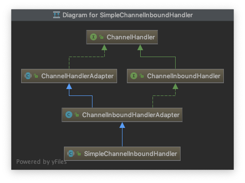

# ChannelHandler

Handles an `I/O` event or intercepts an I/O operation, and forwards it to its next handler in
its `ChannelPipeline`.

- 接受 IO 事件
- 拦截 IO 操作
- 在 `ChannelPipeline` 中进行转发

`ChannelHandler`在添加到`ChannelPipeline`中的时候，可以选择共享或者每个连接（Channel）单独一个

## ChannelInboundHandler

## ChannelOutboundHandler

## ChannelInboundHandlerAdapter

## ChannelOutboundHandlerAdapter

## ChannelDuplexHandler

## SimpleChannelInboundHandler

在处理接受(`read`)到的数据时，可以继承此类

