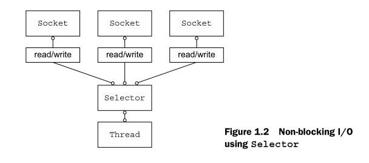

# CHAPTER 1

This chapter covers

- Networking in Java
- Introducing Netty
- Netty’s core components

## java nio

- Using `setsockopt()` you can configure socket s so that read/write calls will return immediately if there is no data; that is, if a blocking call would haveblocked.
- You can register a set of non-blocking sockets using the system’s event notification API 2 to determine whether any of them have data ready for reading or writing.

## java nio selectors



## Asynchronous and event-driven

What is the connection between asynchrony and scalability?

- Non-blocking network calls free us from having to wait for the completion of an operation. Fully asynchronous I/O builds on this feature and carries it a step further: an asynchronous method returns immediately and notifies the user when it is complete, directly or at a later time.

- Selectors allow us to monitor many connections for events with many fewer threads.

## Nettry Channels

A `Channel` is a basic construct of Java NIO . It represents
an open connection to an entity such as a hardware device, a file, a
network socket, or a program component that is capable of performing
one or more distinct I/O operations, for example reading or writing.
For now, think of a `Channel` as a vehicle for incoming (inbound) and outgoing (out-
bound) data. As such, it can be open or closed, connected or disconnected

## Nettry Callbacks

## Nettry Futures

A Future provides another way to notify an application when an operation has completed.
This object acts as a placeholder for the result of an asynchronous operation;
it will complete at some point in the future and provide access to the result.

`ChannelFutureListener`

```java
ChannelFutureListener CLOSE = new ChannelFutureListener() {
        @Override
        public void operationComplete(ChannelFuture future) {
            future.channel().close();
        }
    };
```

## Nettry Events and handlers

## Putting it all together
