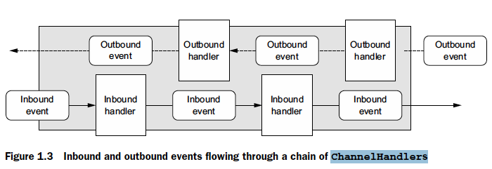

# CHAPTER 1

This chapter covers

- Networking in Java
- Introducing Netty
- Netty’s core components

- [CHAPTER 1](#chapter-1)
  - [java nio](#java-nio)
  - [java nio selectors](#java-nio-selectors)
  - [Asynchronous and event-driven](#asynchronous-and-event-driven)
  - [Netty’s core components](#nettys-core-components)
    - [Netty Channels](#netty-channels)
    - [Netty Callbacks](#netty-callbacks)
    - [Netty Futures](#netty-futures)
    - [ChannelFutureListener](#channelfuturelistener)
    - [Netty Events and handlers](#netty-events-and-handlers)
  - [Putting it all together](#putting-it-all-together)

## java nio

- Using `setsockopt()` you can configure sockets so that read/write calls will return immediately if there is no data; that is, if a blocking call would haveblocked.
- You can register a set of non-blocking sockets using the system’s event notification API 2 to determine whether any of them have data ready for reading or writing.

## java nio selectors


## Asynchronous and event-driven

What is the connection between asynchrony and scalability?

- Non-blocking network calls free us from having to wait for the completion of an operation. Fully asynchronous I/O builds on this feature and carries it a step further: an asynchronous method returns immediately and notifies the user when it is complete, directly or at a later time.
- Selectors allow us to monitor many connections for events with many fewer threads.

## Netty’s core components

In this section we’ll discuss Netty’s primary building blocks:

- Channels
- Callbacks
- Futures
- Events and handlers

### Netty Channels

A `Channel` is a basic construct of Java NIO . It represents
an open connection to an entity such as a hardware device, a file, a
network socket, or a program component that is capable of performing
one or more distinct I/O operations, for example reading or writing.
For now, think of a `Channel` as a vehicle for incoming (inbound) and outgoing (out-
bound) data. As such, it can be open or closed, connected or disconnected

### Netty Callbacks

`ChannelHandler`

```java
public class ConnectHandler extends ChannelInboundHandlerAdapter {
@Override
public void channelActive(ChannelHandlerContext ctx)
throws Exception {
System.out.println("Client " + ctx.channel().remoteAddress() +"connected");
}
}
```

### Netty Futures

A `Future` provides another way to notify an application when an operation has completed.
This object acts as a placeholder for the result of an asynchronous operation;
it will complete at some point in the future and provide access to the result.

### ChannelFutureListener

```java
ChannelFutureListener CLOSE = new ChannelFutureListener() {
        @Override
        public void operationComplete(ChannelFuture future) {
            future.channel().close();
        }
    };
```

### Netty Events and handlers

Netty uses distinct events to notify us about changes of state or the status of operations.
This allows us to trigger the appropriate action based on the event that has
occurred. Such actions might include

- Logging
- Data transformation
- Flow-control
- Application logic

Netty is a networking framework, so events are categorized by theirrelevance to inbound or outbound data flow. Events that may be triggered by inbounddata or an associated change of state include

- Active or inactive connections
- Data reads
- User events
- Error events

An outbound event is the result of an operation that will trigger an action in the future, which may be

- Opening or closing a connection to a remote peer
- Writing or flushing data to a socket



## Putting it all together

Netty’s asynchronous programming model is built on the concepts of Futures and callbacks, with the dispatching of events to handler methods happening at a deeper level. Taken together, these elements provide a processing environment that allows the logic of your application to evolve independently of any concerns with network operations. This is a key goal of Netty’s design approach.
