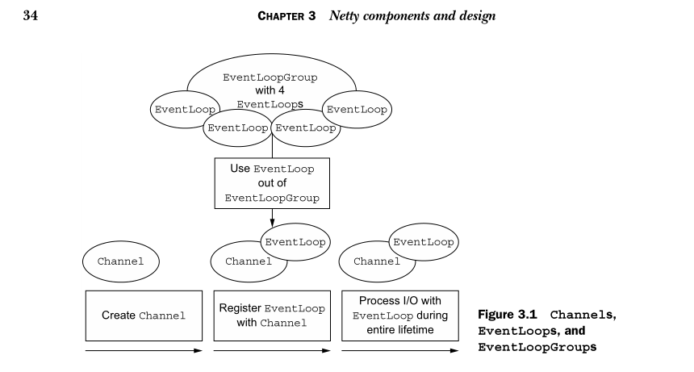
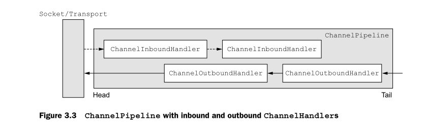

# CHAPTER 3

- Technical and architectural aspects of Netty
- `Channel` , `EventLoop` , and `ChannelFuture`
- `ChannelHandler` and `ChannelPipeline`
- `Bootstrapping`

- [CHAPTER 3](#chapter-3)
  - [technical and architectural](#technical-and-architectural)
  - [Component](#component)
  - [EventLoop](#eventloop)
  - [ChannelFuture](#channelfuture)
  - [ChannelHandler](#channelhandler)
  - [ChannelPipeline](#channelpipeline)
  - [Encoders and decoders](#encoders-and-decoders)
  - [SimpleChannelInboundHandler](#simplechannelinboundhandler)
  - [Bootstrapping](#bootstrapping)

## technical and architectural

First, its asynchronous and event-driven implementation, built on Java NIO, guarantees maximum
application performance and scalability under heavy load.

Second, Netty embodies a set of design patterns that decouple application logic from the network layer, simplifying
development while maximizing the testability, modularity, and reusability of code.

## Component

The following sections will add detail to our discussion of the `Channel` , `EventLoop` ,
and `ChannelFuture` classes which, taken together, can be thought of as representing
Netty’s networking abstraction:

- `Channel` —> Sockets
- `EventLoop` —> Control flow, multithreading, concurrency
- `ChannelFuture` —> Asynchronous notification

predefined, specialized implementations

- EmbeddedChannel
- LocalServerChannel
- NioDatagramChannel
- NioSctpChannel
- NioSocketChannel

## EventLoop

These relationships are:

- An `EventLoopGroup` contains one or more EventLoops.
- An `EventLoop` is bound to a single Thread for its lifetime.
- All I/O events processed by an `EventLoop` are handled on its dedicated Thread.
- A `Channel` is registered for its lifetime with a single `EventLoop`.
- A single `EventLoop` may be assigned to one or more Channels.

## ChannelFuture

`ChannelFutureListener`

As we’ve explained, all I/O operations in Netty are asynchronous. Because an operation
may not return immediately, we need a way to determine its result at a later time.
For this purpose, Netty provides ChannelFuture, whose addListener() method registers
a `ChannelFutureListener`

## ChannelHandler

- `ChannelHandlerAdapter`
- `ChannelInboundHandlerAdapter`
- `ChannelOutboundHandlerAdapter`
- `ChannelDuplexHandlerAdapter`

## ChannelPipeline

## Encoders and decoders

When you send or receive a message with Netty, a data conversion takes place. An
inbound message will be decoded; that is, converted from bytes to another format, typically
a Java object. If the message is outbound, the reverse will happen: it will be
encoded to bytes from its current format. The reason for both conversions is simple:
network data is always a series of bytes.

- `ByteToMessageDecoder`
- `MessageToByteEncoder`

## SimpleChannelInboundHandler

## Bootstrapping

| Category                 | `Bootstrap`                        | `ServerBootstrap`     |
| ------------------------ | ---------------------------------- | --------------------- |
| Networking function      | Connects to a remote host and port | Binds to a local port |
| Number of EventLoopGroup | 1                                  | 2                     |

The first difference between the two types of bootstraps has been discussed: a `ServerBootstrap`
binds to a port, because servers must listen for connections, while a `Bootstrap`
is used by client applications that want to connect to a remote peer.

The second difference is perhaps more significant. Bootstrapping a client requires
only a single EventLoopGroup, but a `ServerBootstrap` requires two (which can be the
same instance). Why?

A server needs two distinct sets of Channels. The first set will contain a single
ServerChannel representing the server’s own listening socket, bound to a local port.
The second set will contain all of the Channels that have been created to handle incoming
client connections—one for each connection the server has accepted.

The EventLoopGroup associated with the ServerChannel assigns an EventLoop
that is responsible for creating Channels for incoming connection requests. Once a
connection has been accepted, the second EventLoopGroup assigns an EventLoop to
its Channel.