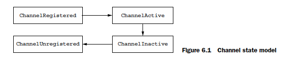
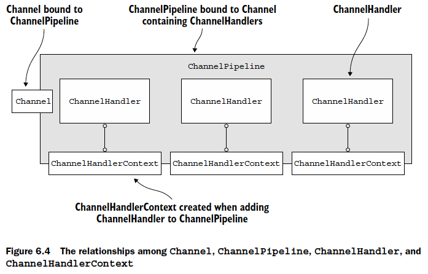

# CHAPTER 6

This chapter covers

- The ChannelHandler and ChannelPipeline APIs
- Detecting resource leaks
- Exception handling

- ChannelHandlers
- ChannelPipeline
- ChannelHandlerContext

## Channel lifecycle

| State               | Description                                                                                       |
| ------------------- | ------------------------------------------------------------------------------------------------- |
| ChannelUnregistered | The Channel was created, but isn’t registered to an EventLoop.                                    |
| ChannelRegistered   | The Channel is registered to an EventLoop.                                                        |
| ChannelActive       | The Channel is active (connected to its remote peer). It’s now possible to receive and send data. |
| ChannelInactive     | The Channel isn’t connected to the remote peer.                                                   |



## SimpleChannelInboundHandler

```java
@Sharable
public class SimpleDiscardHandler
extends SimpleChannelInboundHandler<Object> {
@Override
public void channelRead0(ChannelHandlerContext ctx,
Object msg) {
// No need to do anything special
}
}
```

## ChannelOutboundHandler

Because `SimpleChannelInboundHandler` releases resources automatically, you shouldn’t
store references to any messages for later use, as these will become invalid.

## ChannelHandler adapters


## Resource management

Whenever you act on data by calling ChannelInboundHandler.channelRead() or
ChannelOutboundHandler.write(), you need to ensure that there are no resource
leaks. As you may remember from the previous chapter, Netty uses reference counting
to handle pooled ByteBufs. So it’s important to adjust the reference count after you
have finished using a ByteBuf.

In sum, it is the responsibility of the user to call ReferenceCountUtil.release() if
a message is consumed or discarded and not passed to the next ChannelOutbound-
Handler in the ChannelPipeline. If the message reaches the actual transport layer, it
will be released automatically when it’s written or the Channel is closed.

## ChannelPipeline

In summary,

- A ChannelPipeline holds the ChannelHandlers associated with a Channel.
- A ChannelPipeline can be modified dynamically by adding and removing ChannelHandlers as needed.
- ChannelPipeline has a rich API for invoking actions in response to inbound and outbound events.

## ChannelHandlerContext

A ChannelHandlerContext represents an association between a ChannelHandler and
a ChannelPipeline and is created whenever a ChannelHandler is added to a Channel-
Pipeline. The primary function of a ChannelHandlerContext is to manage the interaction
of its associated ChannelHandler with others in the same ChannelPipeline.

ChannelHandlerContext, Channel, and ChannelPipeline. Figure 6.4 shows the relationships among them



- Accessing the Channel from a ChannelHandlerContext
- Accessing the ChannelPipeline from a ChannelHandlerContext

Why would you want to propagate an event starting at a specific point in the Channel-
Pipeline?

- To reduce the overhead of passing the event through ChannelHandlers that are not interested in it
- To prevent processing of the event by handlers that would be interested in the event

## Handling inbound exceptions

To summarize

- The default implementation of ChannelHandler.exceptionCaught() forwards the current exception to the next handler in the pipeline.
- If an exception reaches the end of the pipeline, it’s logged as unhandled.
- To define custom handling, you override exceptionCaught(). It’s then your decision whether to propagate the exception beyond that point.

## Handling outbound exceptions

Adding a ChannelFutureListener to a ChannelFuture

```java
ChannelFuture future = channel.write(someMessage);
future.addListener(new ChannelFutureListener() {
@Override
public void operationComplete(ChannelFuture f) {
    if (!f.isSuccess()) {
        f.cause().printStackTrace();
        f.channel().close();
    }
}
});
```
